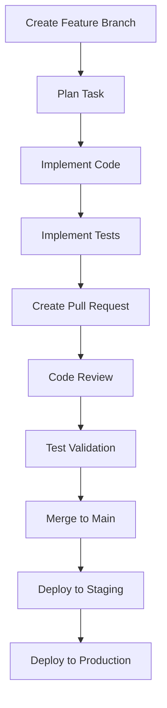

# Git Workflow - AlgoTrading System

## Development Workflow Overview

### **Feature Branch Workflow**

Each task follows a structured workflow with specialized roles and proper Git practices:



## Branch Strategy

### **Branch Types**

- **Main Branch**: `main` - Production-ready code
- **Feature Branches**: `feature/task-name` - New features
- **Bug Fix Branches**: `bugfix/issue-description` - Bug fixes
- **Hotfix Branches**: `hotfix/critical-issue` - Critical fixes
- **Release Branches**: `release/version-number` - Release preparation

### **Branch Naming Convention**

```bash
# Feature branches
feature/docker-compose-setup
feature/oauth2-implementation
feature/customer-management
feature/order-processing

# Bug fix branches
bugfix/authentication-token-expiry
bugfix/database-connection-timeout
bugfix/order-validation-error

# Hotfix branches
hotfix/security-vulnerability
hotfix/critical-performance-issue
hotfix/production-database-error

# Release branches
release/v1.0.0
release/v1.1.0
release/v2.0.0
```

## Task Workflow Process

### **1. Task Planning Phase**

**Role**: Planner
**Branch**: `feature/task-name`

```bash
# Create feature branch
git checkout -b feature/task-name

# Create planning documents
mkdir docs/tasks/task-name
touch docs/tasks/task-name/plan.md
touch docs/tasks/task-name/requirements.md
touch docs/tasks/task-name/architecture.md

# Commit planning documents
git add docs/tasks/task-name/
git commit -m "feat: add task planning documents for task-name"
```

**Deliverables**:

- Task requirements document
- Architecture design
- Implementation plan
- Acceptance criteria

### **2. Code Implementation Phase**

**Role**: Implementer
**Branch**: `feature/task-name`

```bash
# Implement code changes
# - Create/modify source files
# - Add new features
# - Update existing code
# - Add configuration files

# Commit code changes
git add .
git commit -m "feat: implement task-name functionality

- Add new feature implementation
- Update existing code
- Add configuration files
- Implement business logic"

# Push changes
git push origin feature/task-name
```

**Deliverables**:

- Working code implementation
- Configuration files
- Business logic
- API endpoints (if applicable)

### **3. Test Implementation Phase**

**Role**: Tester
**Branch**: `feature/task-name`

```bash
# Implement tests
# - Unit tests
# - Integration tests
# - End-to-end tests
# - Performance tests

# Commit test changes
git add tests/
git commit -m "test: add comprehensive tests for task-name

- Add unit tests for new functionality
- Add integration tests
- Add end-to-end tests
- Add performance tests"

# Push test changes
git push origin feature/task-name
```

**Deliverables**:

- Unit tests (>90% coverage)
- Integration tests
- End-to-end tests
- Performance tests

### **4. Pull Request Creation**

**Role**: Implementer/Tester
**Branch**: `feature/task-name`

```bash
# Create pull request
gh pr create --title "feat: implement task-name" \
  --body "## Description
  Implements task-name functionality with comprehensive testing.

  ## Changes Made
  - Add new feature implementation
  - Add comprehensive test suite
  - Update documentation
  - Add configuration files

  ## Testing
  - [x] Unit tests pass
  - [x] Integration tests pass
  - [x] End-to-end tests pass
  - [x] Performance tests pass

  ## Checklist
  - [x] Code follows project standards
  - [x] Tests are comprehensive
  - [x] Documentation is updated
  - [x] Security considerations addressed
  - [x] Performance impact assessed"
```

**PR Requirements**:

- Clear description of changes
- Comprehensive test coverage
- Updated documentation
- Security considerations
- Performance impact assessment

### **5. Code Review Phase**

**Role**: Reviewer
**Branch**: `feature/task-name`

```bash
# Review pull request
# - Check code quality
# - Validate architecture
# - Review security implementation
# - Check performance considerations
# - Validate test coverage

# Add review comments
gh pr review --approve --body "Code review completed successfully.

## Review Summary
- ✅ Code quality meets standards
- ✅ Architecture is sound
- ✅ Security implementation is correct
- ✅ Performance considerations addressed
- ✅ Test coverage is comprehensive

## Approvals
- [x] Code quality
- [x] Architecture
- [x] Security
- [x] Performance
- [x] Testing

Ready for merge."
```

**Review Criteria**:

- Code quality and standards
- Architecture and design patterns
- Security implementation
- Performance considerations
- Test coverage and quality
- Documentation completeness

### **6. Test Validation Phase**

**Role**: QA
**Branch**: `feature/task-name`

```bash
# Run comprehensive test suite
pytest tests/ --cov=app --cov-report=html
flake8 app/ tests/
mypy app/
black --check app/ tests/
bandit -r app/

# Validate test results
# - Check test coverage (>90%)
# - Validate code quality
# - Check security scan results
# - Verify performance metrics

# Add QA approval
gh pr review --approve --body "QA validation completed successfully.

## Test Results
- ✅ Unit tests: 95% coverage
- ✅ Integration tests: All pass
- ✅ End-to-end tests: All pass
- ✅ Performance tests: Within limits
- ✅ Security scan: No critical issues
- ✅ Code quality: A-grade

## Validation Summary
- [x] Test coverage >90%
- [x] Code quality standards met
- [x] Security scan passed
- [x] Performance within limits
- [x] All tests passing

Ready for merge."
```

**Validation Criteria**:

- Test coverage >90%
- All tests passing
- Code quality standards met
- Security scan passed
- Performance within limits
- No critical issues

### **7. Merge to Main Phase**

**Role**: DevOps
**Branch**: `feature/task-name` → `main`

```bash
# Merge pull request
gh pr merge --squash --delete-branch

# Tag release
git tag -a v1.0.0 -m "Release v1.0.0: Implement task-name"
git push origin v1.0.0

# Update documentation
# - Update CHANGELOG.md
# - Update API documentation
# - Update deployment guides

# Commit documentation updates
git add .
git commit -m "docs: update documentation for v1.0.0"
git push origin main
```

**Merge Requirements**:

- All reviewers approved
- All tests passing
- Security scan passed
- Performance validated
- Documentation updated

## Quality Gates

### **Pre-commit Hooks**

```bash
# .pre-commit-config.yaml
repos:
  - repo: https://github.com/psf/black
    rev: 23.3.0
    hooks:
      - id: black
        language_version: python3.11

  - repo: https://github.com/pycqa/flake8
    rev: 6.0.0
    hooks:
      - id: flake8

  - repo: https://github.com/pre-commit/mirrors-mypy
    rev: v1.3.0
    hooks:
      - id: mypy
        additional_dependencies: [types-all]

  - repo: https://github.com/PyCQA/bandit
    rev: 1.7.5
    hooks:
      - id: bandit
        args: ["-r", "app/"]
```

### **CI/CD Pipeline**

```yaml
# .github/workflows/ci.yml
name: CI/CD Pipeline

on:
  push:
    branches: [main, develop]
  pull_request:
    branches: [main, develop]

jobs:
  test:
    runs-on: ubuntu-latest
    steps:
      - uses: actions/checkout@v3

      - name: Set up Python
        uses: actions/setup-python@v4
        with:
          python-version: "3.11"

      - name: Install dependencies
        run: |
          pip install -r requirements-dev.txt

      - name: Run tests
        run: |
          pytest tests/ --cov=app --cov-report=xml

      - name: Check code quality
        run: |
          flake8 app/ tests/
          black --check app/ tests/
          mypy app/

      - name: Security scan
        run: |
          bandit -r app/ -f json -o bandit-report.json

      - name: Upload coverage
        uses: codecov/codecov-action@v3
        with:
          file: ./coverage.xml

  deploy:
    needs: test
    runs-on: ubuntu-latest
    if: github.ref == 'refs/heads/main'
    steps:
      - uses: actions/checkout@v3

      - name: Deploy to staging
        run: |
          # Deploy to staging environment

      - name: Deploy to production
        run: |
          # Deploy to production environment
```

## Role-Specific Workflows

### **Planner Role Workflow**

```bash
# 1. Create planning branch
git checkout -b feature/task-name-planning

# 2. Create planning documents
mkdir docs/planning/task-name
touch docs/planning/task-name/requirements.md
touch docs/planning/task-name/architecture.md
touch docs/planning/task-name/implementation-plan.md

# 3. Commit planning documents
git add docs/planning/task-name/
git commit -m "docs: add planning documents for task-name"

# 4. Create PR for planning review
gh pr create --title "docs: planning for task-name" \
  --body "Planning documents for task-name implementation"
```

### **Implementer Role Workflow**

```bash
# 1. Create implementation branch
git checkout -b feature/task-name-implementation

# 2. Implement code changes
# - Add new features
# - Update existing code
# - Add configuration files

# 3. Commit implementation
git add .
git commit -m "feat: implement task-name functionality"

# 4. Push changes
git push origin feature/task-name-implementation
```

### **Tester Role Workflow**

```bash
# 1. Create testing branch
git checkout -b feature/task-name-testing

# 2. Implement tests
# - Unit tests
# - Integration tests
# - End-to-end tests

# 3. Commit tests
git add tests/
git commit -m "test: add comprehensive tests for task-name"

# 4. Push test changes
git push origin feature/task-name-testing
```

### **Reviewer Role Workflow**

```bash
# 1. Review pull request
gh pr view <pr-number>

# 2. Check code quality
# - Review implementation
# - Check architecture
# - Validate security
# - Assess performance

# 3. Add review comments
gh pr review --approve --body "Code review completed"

# 4. Request changes if needed
gh pr review --request-changes --body "Changes requested"
```

### **QA Role Workflow**

```bash
# 1. Run test suite
pytest tests/ --cov=app --cov-report=html

# 2. Check code quality
flake8 app/ tests/
black --check app/ tests/
mypy app/

# 3. Security scan
bandit -r app/

# 4. Performance testing
# - Load testing
# - Stress testing
# - Performance profiling

# 5. Add QA approval
gh pr review --approve --body "QA validation completed"
```

### **DevOps Role Workflow**

```bash
# 1. Merge pull request
gh pr merge --squash --delete-branch

# 2. Tag release
git tag -a v1.0.0 -m "Release v1.0.0"
git push origin v1.0.0

# 3. Deploy to staging
# - Run deployment scripts
# - Validate deployment
# - Run smoke tests

# 4. Deploy to production
# - Run production deployment
# - Validate production deployment
# - Monitor system health

# 5. Update documentation
# - Update CHANGELOG.md
# - Update API documentation
# - Update deployment guides
```

## Branch Protection Rules

### **Main Branch Protection**

```yaml
# .github/branch-protection.yml
branch_protection:
  main:
    required_status_checks:
      strict: true
      contexts:
        - "test"
        - "code-quality"
        - "security-scan"
    enforce_admins: true
    required_pull_request_reviews:
      required_approving_review_count: 2
      dismiss_stale_reviews: true
      require_code_owner_reviews: true
    restrictions:
      users: []
      teams: ["developers", "reviewers"]
```

### **Feature Branch Rules**

- Must be created from main branch
- Must have descriptive names
- Must have associated PR
- Must pass all quality gates
- Must be reviewed by at least 2 reviewers

## Release Process

### **Release Branch Workflow**

```bash
# 1. Create release branch
git checkout -b release/v1.0.0

# 2. Update version numbers
# - Update __version__.py
# - Update package.json
# - Update docker-compose.yml

# 3. Update documentation
# - Update CHANGELOG.md
# - Update README.md
# - Update API documentation

# 4. Create release PR
gh pr create --title "release: v1.0.0" \
  --body "Release v1.0.0 with new features and bug fixes"

# 5. Merge release branch
gh pr merge --squash --delete-branch

# 6. Tag release
git tag -a v1.0.0 -m "Release v1.0.0"
git push origin v1.0.0

# 7. Deploy to production
# - Run deployment scripts
# - Validate deployment
# - Monitor system health
```

## Emergency Procedures

### **Hotfix Process**

```bash
# 1. Create hotfix branch from main
git checkout -b hotfix/critical-issue

# 2. Implement hotfix
# - Fix critical issue
# - Add minimal tests
# - Update documentation

# 3. Create hotfix PR
gh pr create --title "hotfix: critical-issue" \
  --body "Critical hotfix for production issue"

# 4. Expedited review process
# - Immediate review by senior developers
# - Minimal testing requirements
# - Fast-track merge process

# 5. Deploy hotfix
# - Immediate deployment to production
# - Monitor system health
# - Validate fix effectiveness
```

### **Rollback Process**

```bash
# 1. Identify last known good commit
git log --oneline -10

# 2. Create rollback branch
git checkout -b hotfix/rollback-v1.0.0

# 3. Revert problematic changes
git revert <commit-hash>

# 4. Create rollback PR
gh pr create --title "hotfix: rollback v1.0.0" \
  --body "Rollback problematic changes from v1.0.0"

# 5. Deploy rollback
# - Immediate deployment to production
# - Monitor system health
# - Validate rollback effectiveness
```

## Monitoring and Metrics

### **Development Metrics**

- **Code Quality**: A-grade code quality score
- **Test Coverage**: >90% test coverage
- **Security**: Zero critical vulnerabilities
- **Performance**: <1.5s response time
- **Deployment**: <5 minutes deployment time

### **Process Metrics**

- **PR Review Time**: <24 hours average
- **Test Execution Time**: <10 minutes
- **Deployment Success Rate**: >99%
- **Bug Fix Time**: <4 hours for critical issues
- **Feature Delivery Time**: On schedule

### **Team Metrics**

- **Planner**: Task planning completion rate
- **Implementer**: Code implementation quality
- **Tester**: Test coverage and quality
- **Reviewer**: Code review effectiveness
- **QA**: Quality assurance metrics
- **DevOps**: Deployment success rate
