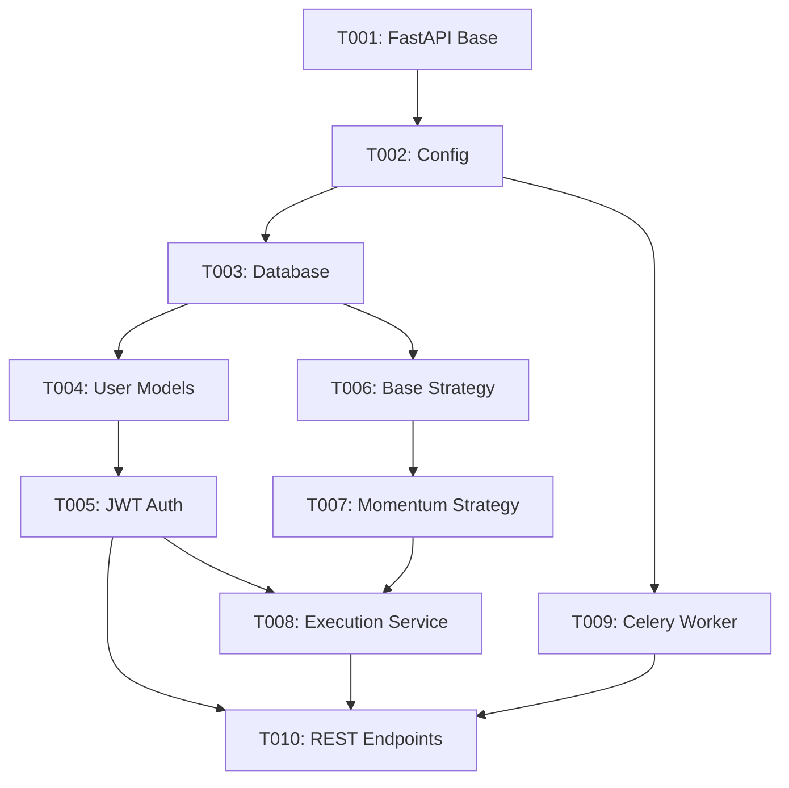

# Detailed Task Breakdown - AlgoTrading System

## Task Overview

**Total Tasks**: 10 (Phase 1) + 26 (Phases 2-4) = 36 tasks
**Current Phase**: Phase 1 - Foundation (Tasks T001-T010)
**Status**: Ready for implementation
**Estimated Duration**: 2 weeks per phase

## Phase 1: Foundation Tasks (T001-T010)

### T001: Inicializar estructura base del proyecto FastAPI

- **Archivo**: `app/main.py`
- **Descripción**: Crea el archivo principal de FastAPI con endpoints básicos de salud ('/health'), logging configurado y configuración de CORS.
- **Entrada**: Petición HTTP GET a /health
- **Output**: Respuesta JSON {'status': 'ok'}
- **Pruebas**: Test que verifique que /health devuelve 200 y 'ok'
- **Dependencias**: []
- **Stack**: Python 3.11, FastAPI
- **CI/CD**: false
- **Deploy Ready**: true

### T002: Configuración base del proyecto (config.py y .env)

- **Archivo**: `app/core/config.py`
- **Descripción**: Crea configuración de entorno usando pydantic.BaseSettings, cargando variables del archivo .env para DB, Redis y API keys.
- **Entrada**: .env
- **Output**: Instancia Config accesible vía import app.core.config
- **Pruebas**: Test que valide carga de variables y valores por defecto
- **Dependencias**: ["T001"]
- **Stack**: Python 3.11, FastAPI, Pydantic
- **CI/CD**: true
- **Deploy Ready**: true

### T003: Configurar base de datos PostgreSQL con SQLAlchemy

- **Archivo**: `app/core/database.py`
- **Descripción**: Crea la conexión a PostgreSQL usando SQLAlchemy y sessionmaker. Incluye función get_db() para inyección de dependencias.
- **Entrada**: config.DATABASE_URL
- **Output**: Sesión SQLAlchemy operativa
- **Pruebas**: Test de conexión a base de datos de prueba y commit rollback
- **Dependencias**: ["T002"]
- **Stack**: Python 3.11, SQLAlchemy, PostgreSQL
- **CI/CD**: false
- **Deploy Ready**: true

### T004: Definir modelo base de usuarios y cuentas

- **Archivo**: `app/models/user.py`
- **Descripción**: Crea los modelos User y Account en SQLAlchemy con relaciones y hashing de contraseñas (bcrypt).
- **Entrada**: Datos JSON de usuario
- **Output**: Filas persistidas en DB
- **Pruebas**: Crear y recuperar usuario desde la DB
- **Dependencias**: ["T003"]
- **Stack**: SQLAlchemy, bcrypt
- **CI/CD**: false
- **Deploy Ready**: true

### T005: Servicio de autenticación JWT

- **Archivo**: `app/services/auth_service.py`
- **Descripción**: Implementa generación y validación de tokens JWT. Incluye login endpoint y middleware para verificar autenticación.
- **Entrada**: username/password
- **Output**: JWT token válido
- **Pruebas**: Verificar generación y expiración del token
- **Dependencias**: ["T004"]
- **Stack**: FastAPI, PyJWT, bcrypt
- **CI/CD**: false
- **Deploy Ready**: true

### T006: Implementar sistema de estrategias base

- **Archivo**: `app/strategies/base_strategy.py`
- **Descripción**: Define clase abstracta Strategy con métodos evaluate_signals(), execute_orders() y backtest().
- **Entrada**: market_data (DataFrame)
- **Output**: Signal {BUY, SELL, HOLD}
- **Pruebas**: Mock de datos con señales de ejemplo
- **Dependencias**: ["T003"]
- **Stack**: pandas, numpy
- **CI/CD**: false
- **Deploy Ready**: true

### T007: Implementar estrategia Momentum + Liquidez

- **Archivo**: `app/strategies/momentum_liquidity.py`
- **Descripción**: Extiende base_strategy e implementa lógica combinada de momentum (RSI/EMA) y liquidez (volumen).
- **Entrada**: market_data
- **Output**: Signal BUY/SELL/HOLD
- **Pruebas**: Test con dataset simulado y señales esperadas
- **Dependencias**: ["T006"]
- **Stack**: pandas, numpy
- **CI/CD**: false
- **Deploy Ready**: true

### T008: Servicio de ejecución de órdenes (broker API)

- **Archivo**: `app/services/execution_service.py`
- **Descripción**: Implementa conexión a Interactive Brokers y Binance (demo) para ejecutar órdenes simuladas o reales según entorno.
- **Entrada**: Signal + Config API Keys
- **Output**: Order response JSON
- **Pruebas**: Mock de orden BUY y verificar respuesta
- **Dependencias**: ["T005", "T007"]
- **Stack**: ib_insync, requests, Binance API
- **CI/CD**: false
- **Deploy Ready**: true

### T009: Crear worker Celery para tareas asíncronas

- **Archivo**: `app/core/celery_app.py`
- **Descripción**: Configura Celery con Redis como broker, define worker y task ejemplo para ejecución asíncrona de estrategias.
- **Entrada**: Celery config
- **Output**: Celery instance
- **Pruebas**: Ejecutar task de ejemplo y verificar resultado
- **Dependencias**: ["T002"]
- **Stack**: Celery, Redis
- **CI/CD**: false
- **Deploy Ready**: true

### T010: Definir endpoints REST principales

- **Archivo**: `app/api/routes/trading_routes.py`
- **Descripción**: Crea endpoints /strategies, /orders, /backtest con integración a los servicios y workers.
- **Entrada**: Peticiones REST
- **Output**: JSON con resultado de operaciones
- **Pruebas**: Test de endpoints con cliente de FastAPI
- **Dependencias**: ["T005", "T008", "T009"]
- **Stack**: FastAPI
- **CI/CD**: false
- **Deploy Ready**: true

## Task Dependencies Graph

## Implementation Priority

### High Priority (Week 1)

1. **T001-T003**: Foundation setup (FastAPI, Config, Database)
2. **T004-T005**: Authentication system (User models, JWT)

### Medium Priority (Week 2)

3. **T006-T007**: Strategy system (Base strategy, Momentum strategy)
4. **T008-T009**: Execution and async processing
5. **T010**: REST API endpoints

## Success Criteria

### Phase 1 Completion

- [ ] All 10 tasks implemented and tested
- [ ] Authentication system fully functional
- [ ] Basic trading strategy operational
- [ ] REST API endpoints working
- [ ] Async task processing configured
- [ ] > 90% test coverage achieved

### Quality Gates

- **Code Quality**: A-grade code quality score
- **Test Coverage**: >90% for all new code
- **Security**: Zero security vulnerabilities
- **Performance**: <1.5s response time for all endpoints
- **Documentation**: Complete and up-to-date documentation

## Next Phases Preview

### Phase 2: Advanced Features (T011-T020)

- Backtesting engine
- Advanced strategies
- Risk management
- Portfolio management
- Performance analytics

### Phase 3: Integration & Testing (T021-T030)

- External API integrations
- Comprehensive testing suite
- CI/CD pipeline
- Monitoring and logging
- Security hardening

### Phase 4: Deployment & Operations (T031-T036)

- AWS infrastructure
- Production deployment
- Monitoring and alerting
- Documentation
- Maintenance procedures

## Notes

- All tasks are designed to be deploy-ready
- Dependencies are clearly defined
- Each task includes comprehensive testing requirements
- Stack technologies are specified for each task
- CI/CD integration is planned for appropriate tasks
