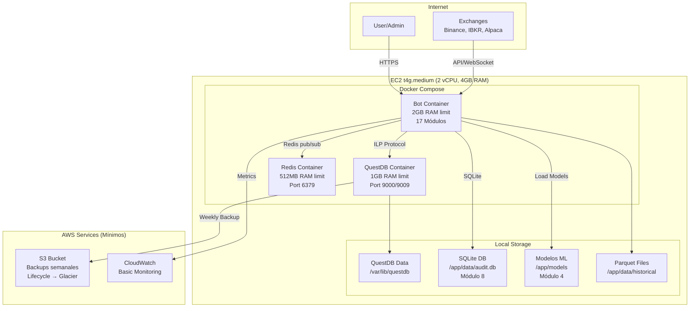
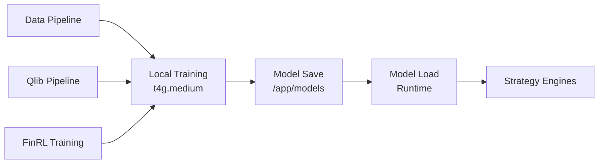

# 🏗️ AWS Infrastructure Design - AlgoTrading Platform (Single Instance)

**Versión**: 2.0 - Single Instance Architecture  
**Fecha**: 2025-12-19  
**Autor**: Cloud Solutions Architect  
**Objetivo**: Infraestructura optimizada para presupuesto limitado ($25/mes) en instancia única

---

## 📋 Resumen Ejecutivo

Este documento define la arquitectura AWS optimizada para **instancia única** (t4g.medium) para el sistema de AlgoTrading de 17 módulos:

- **Presupuesto**: $25/mes máximo
- **Instancia**: t4g.medium (2 vCPU, 4GB RAM)
- **Arquitectura**: Todo en Docker Compose (QuestDB, Redis, Bot)
- **Messaging**: Redis pub/sub local (sin MSK/Kafka)
- **Storage**: QuestDB Docker + SQLite para Audit
- **ML**: Modelos locales desde `/models` (sin SageMaker)
- **Optimización**: Multiprocessing eficiente para 2 vCPUs

---

## 🎯 Arquitectura Lógica (Single Instance)



---

## 1. COMPUTE STRATEGY (Single Instance)

### 1.1 Instancia Única

**Decisión**: **EC2 t4g.medium (Graviton2) - Single Instance**

**Justificación**:

- **Presupuesto limitado**: $25/mes máximo
- **Graviton2**: Mejor precio/performance vs x86
- **Docker Compose**: Todo en contenedores para fácil gestión

**Configuración**:

```yaml
Instance Type: t4g.medium
- vCPUs: 2
- Memory: 4 GiB
- Network: Up to 5 Gbps
- EBS Bandwidth: Up to 2,085 Mbps
- Price: ~$0.0336/hour (~$25/mes)

Docker Compose:
- QuestDB: 1GB RAM limit, 0.5 CPU
- Redis: 512MB RAM limit, 0.3 CPU
- Bot: 2GB RAM limit, 1.5 CPU (17 módulos)
```

**Módulos Desplegados (todos en Bot container)**:

- **Módulo 1-17**: Todos los módulos en un solo proceso con multiprocessing

**Optimizaciones**:

- Multiprocessing con 2 workers (1 por vCPU)
- Memory limits estrictos por contenedor
- CPU affinity para evitar context switching
- Swap deshabilitado (solo RAM)

### 1.2 Learning Engine (Módulo 4)

**Decisión**: **Modelos locales desde `/models` (sin SageMaker)**

**Arquitectura**:



**Configuración Local**:

```yaml
Training:
  - Local: t4g.medium (2 vCPU)
  - Models: /app/models directory
  - Format: Pickle/Joblib for scikit-learn, PyTorch .pt for neural networks
  - Versioning: Manual (filename with timestamp)

Inference:
  - Runtime: In-process loading
  - Memory: Shared with bot process (2GB limit)
  - Lazy Loading: Models cargados solo cuando se necesitan

Model Storage:
  - Path: /app/models/
  - Structure: {model_type}/{symbol}/{model_name}_{timestamp}.{ext}
  - Backup: Weekly to S3
```

**Integración Qlib**:

- Training local con Qlib pipeline
- Modelos guardados en `/app/models/qlib/`
- Inference in-process

**Integración FinRL**:

- Training local con stable-baselines3
- Modelos guardados en `/app/models/finrl/`
- Inference in-process

### 1.3 Orchestration (Módulo 16)

**Decisión**: **Dagster local (Docker container opcional) o Python multiprocessing**

**Arquitectura**:

```yaml
Opción 1: Dagster Local (Docker)
  Container: dagster/dagster:latest
  Memory: 256MB (compartido con bot)
  CPU: 0.2
  Storage: SQLite para run storage

Opción 2: Python Multiprocessing (Recomendado)
  - Process Pool: 2 workers (1 por vCPU)
  - Queue: multiprocessing.Queue para comunicación
  - Manager: multiprocessing.Manager para estado compartido
  - Sin overhead de Dagster
```

**Orquestación con Multiprocessing**:

- Worker Pool: 2 procesos (uno por vCPU)
- Task Queue: multiprocessing.Queue
- Dependencies: Resueltas con graph de dependencias
- Monitoring: Logs a archivo, métricas básicas

---

## 2. DATA STORAGE & STREAMING

### 2.1 Hot Data: QuestDB

**Decisión**: **QuestDB en Docker (local)**

**Justificación**:

- Presupuesto limitado: Docker local es gratis
- Suficiente para paper trading personal
- Baja latencia localhost (<1ms)

**Configuración**:

```yaml
QuestDB Docker:
  Image: questdb/questdb:7.4.1
  Memory Limit: 1GB
  CPU Limit: 0.5 vCPU
  Ports: 9000 (HTTP), 9009 (ILP), 8812 (PostgreSQL wire)
  Volume: /var/lib/questdb (persistente)
  Health Check: HTTP /ping endpoint

Storage:
  - Local: EBS gp3 volume (20GB, 3000 IOPS)
  - Backup: Weekly snapshot to S3
  - Retention: 30 days local, 90 days S3
```

**Conexión desde Aplicación**:

- Host: `questdb` (Docker network)
- Port: 9009 (ILP) para ingestion
- Port: 8812 (PostgreSQL) para queries
- Sin TLS (red interna Docker)

### 2.2 Cold Data: Local + S3 Backup

**Arquitectura**:

```yaml
Local Storage:
  - Path: /app/data/historical/
  - Format: Parquet files
  - Structure: {symbol}/{symbol}_{year}_{month}.parquet
  - Size Limit: 10GB local (rotación automática)

S3 Backup:
  - Bucket: algo-trading-backup (único bucket)
  - Storage Class: Standard-IA (Infrequent Access)
  - Lifecycle:
    - After 90 days: Glacier Flexible Retrieval
    - After 365 days: Glacier Deep Archive
  - Backup Frequency: Weekly (automated)
  - Cost: ~$0.50-1/mes (depende de tamaño)
```

**Módulo 8 (Audit)**: SQLite local

- Path: `/app/data/audit.db`
- Sin PostgreSQL (ahorra RAM)
- Backup: Incluido en backup semanal a S3

### 2.3 Real-time Messaging: Redis pub/sub

**Decisión**: **Redis local (Docker) para pub/sub**

**Justificación**:

- Sin costo adicional (ya está en Docker)
- Latencia localhost <1ms
- Suficiente throughput para paper trading
- ZeroMQ opcional para alta frecuencia (si necesario)

**Configuración**:

```yaml
Redis Docker:
  Image: redis:7-alpine
  Memory Limit: 512MB
  CPU Limit: 0.3 vCPU
  Port: 6379
  Config:
    - maxmemory: 512mb
    - maxmemory-policy: allkeys-lru
    - save: 60 1000 (persistencia mínima)

Channels:
  market-ticks: High frequency (ZeroMQ opcional)
  signals: Medium frequency (Redis pub/sub)
  orders: Low frequency (Redis pub/sub)
  risk-alerts: Low frequency (Redis pub/sub)
```

**Flujo de Datos**:

- Data Engine → Redis PUB (channel: market-ticks)
- Strategy Engines → Redis SUB (channel: market-ticks) → PUB (channel: signals)
- Execution Engine → Redis SUB (channel: signals) → PUB (channel: orders)
- Risk Engine → Redis SUB (channel: signals) → PUB (channel: risk-alerts)

---

## 3. RELIABILITY & MONITORING

### 3.1 Observabilidad: CloudWatch Básico

**CloudWatch Metrics** (Básico - Free Tier):

```yaml
EC2 Metrics (Free):
  - CPUUtilization
  - NetworkIn/Out
  - StatusCheckFailed

Custom Metrics (Limitado):
  - TickToTradeLatency: 1 custom metric (free tier)
  - MemoryUsage: Log-based metric
  - ErrorRate: Log-based metric

Logs:
  - Application Logs: CloudWatch Logs (5GB free/mes)
    - Retention: 7 days (gratis)
    - Log Groups:
      - /algo-trading/bot
      - /algo-trading/questdb
      - /algo-trading/redis

Alarms:
  - CPU > 80%: Email alert (SNS free tier)
  - Memory > 90%: Email alert
  - StatusCheckFailed: Email alert
```

**Sin X-Ray** (costo adicional, no necesario para single instance)

### 3.2 Security: Secrets Manager (Básico)

**Gestión de Secretos**:

```yaml
Secrets:
  - binance-api-key: Secrets Manager (1 secret free)
  - ibkr-api-key: Secrets Manager
  - Rotation: Manual (costo adicional si automático)

IAM Role:
  - EC2InstanceRole:
      - SecretsManager: GetSecretValue
      - S3: PutObject (backups)
      - CloudWatch: PutMetricData
```

**Alternativa más económica**: Variables de entorno en Docker Compose (menos seguro pero gratis)

### 3.3 Connectivity: Internet Estándar

**Sin Direct Connect** (costo adicional no justificado):

- Latencia aceptable para paper trading
- Internet estándar suficiente
- Optimización: Usar región AWS cercana a exchanges

---

## 4. COST OPTIMIZATION

### 4.1 Presupuesto Total: $25/mes

**Desglose de Costos**:

```yaml
EC2 t4g.medium:
  - On-Demand: $0.0336/hour × 730 hours = $24.53/mes
  - Reserved (1 year, All Upfront): ~$15/mes (40% discount)
  - EBS gp3 (20GB): $2/mes
  - Data Transfer: ~$1/mes

S3 Backup:
  - Storage (10GB): $0.23/mes
  - Requests: ~$0.10/mes

CloudWatch:
  - Basic Monitoring: Free
  - Logs (5GB): Free
  - Custom Metrics: 1 free, rest ~$0.50/mes

Secrets Manager:
  - 1 secret: Free

Total On-Demand: ~$25/mes
Total Reserved: ~$18/mes (recomendado)
```

### 4.2 Optimizaciones Adicionales

**Estrategias**:

- Reserved Instance 1 año: Ahorro 40%
- EBS gp3 vs gp2: Ahorro 20%
- S3 Intelligent-Tiering: Ahorro automático
- CloudWatch Logs retention: 7 días (gratis)
- Sin servicios premium: No X-Ray, No Direct Connect, No MSK

### 4.3 Cost Monitoring

**CloudWatch Billing Alarm**:

```yaml
Alarm:
  - EstimatedCharges > $25/month → Email alert
  - Threshold: $25
  - Action: SNS → Email (free)
```

---

## 5. DOCKER COMPOSE CONFIGURATION

### 5.1 docker-compose.yml

**Estructura**:

```yaml
Services:
  - questdb: 1GB RAM, 0.5 CPU
  - redis: 512MB RAM, 0.3 CPU
  - bot: 2GB RAM, 1.5 CPU (17 módulos)

Volumes:
  - questdb_data: Persistente
  - redis_data: Persistente
  - ./data: Local para SQLite y Parquet
  - ./models: Local para modelos ML

Networks:
  - Default bridge network (Docker)

Health Checks:
  - Todos los servicios con health checks
  - Restart: unless-stopped
```

### 5.2 Multiprocessing Configuration

**Optimización para 2 vCPUs**:

```yaml
Worker Processes: 2 (1 por vCPU)
Worker Threads: 1 por proceso
Task Queue: multiprocessing.Queue
Memory Sharing: multiprocessing.Manager

Module Distribution:
  - Process 1: Módulos 1-8 (Data, Context, Strategy, Learning)
  - Process 2: Módulos 9-17 (Execution, Monitoring, etc.)

CPU Affinity:
  - Process 1: CPU 0
  - Process 2: CPU 1
  - Evita context switching
```

## 6. INFRASTRUCTURE AS CODE (IaC) - Simplificado

### 5.1 Terraform Structure

```
infrastructure/terraform/
├── main.tf                 # Provider, backend
├── variables.tf            # Variables
├── outputs.tf              # Outputs
├── vpc/
│   ├── main.tf            # VPC, Subnets, Internet Gateway
│   ├── security-groups.tf # Security Groups
│   └── nat-gateway.tf     # NAT Gateway
├── compute/
│   ├── ec2-core.tf        # Core Engine EC2
│   ├── ecs-fargate.tf     # ECS Services
│   └── autoscaling.tf     # Auto Scaling Groups
├── data/
│   ├── questdb.tf         # QuestDB EC2
│   ├── rds.tf             # RDS PostgreSQL
│   ├── redis.tf           # ElastiCache Redis
│   └── msk.tf             # MSK Cluster
├── storage/
│   └── s3.tf              # S3 Buckets
├── ml/
│   └── sagemaker.tf       # SageMaker
├── monitoring/
│   ├── cloudwatch.tf      # CloudWatch
│   └── xray.tf            # X-Ray
└── security/
    ├── secrets-manager.tf # Secrets Manager
    ├── iam.tf             # IAM Roles/Policies
    └── waf.tf             # WAF
```

### 6.2 Terraform Code (Simplificado)

**EC2 Instance** (`ec2.tf`):

```hcl
# VPC
resource "aws_vpc" "algo_trading" {
  cidr_block           = "10.0.0.0/16"
  enable_dns_hostnames = true
  enable_dns_support   = true

  tags = {
    Name = "algo-trading-vpc"
  }
}

# Public Subnet
resource "aws_subnet" "public" {
  count             = 3
  vpc_id            = aws_vpc.algo_trading.id
  cidr_block        = "10.0.${count.index + 1}.0/24"
  availability_zone = data.aws_availability_zones.available.names[count.index]

  map_public_ip_on_launch = true

  tags = {
    Name = "algo-trading-public-${count.index + 1}"
  }
}

# Private Subnet - Core Trading
resource "aws_subnet" "private_core" {
  count             = 3
  vpc_id            = aws_vpc.algo_trading.id
  cidr_block        = "10.0.${count.index + 10}.0/24"
  availability_zone = data.aws_availability_zones.available.names[count.index]

  tags = {
    Name = "algo-trading-private-core-${count.index + 1}"
  }
}

# Private Subnet - Data Layer
resource "aws_subnet" "private_data" {
  count             = 3
  vpc_id            = aws_vpc.algo_trading.id
  cidr_block        = "10.0.${count.index + 20}.0/24"
  availability_zone = data.aws_availability_zones.available.names[count.index]

  tags = {
    Name = "algo-trading-private-data-${count.index + 1}"
  }
}

# Internet Gateway
resource "aws_internet_gateway" "algo_trading" {
  vpc_id = aws_vpc.algo_trading.id

  tags = {
    Name = "algo-trading-igw"
  }
}

# NAT Gateway (High Availability)
resource "aws_nat_gateway" "algo_trading" {
  count         = 3
  allocation_id = aws_eip.nat[count.index].id
  subnet_id     = aws_subnet.public[count.index].id

  tags = {
    Name = "algo-trading-nat-${count.index + 1}"
  }
}

resource "aws_eip" "nat" {
  count  = 3
  domain = "vpc"

  tags = {
    Name = "algo-trading-nat-eip-${count.index + 1}"
  }
}
```

**S3 Backup** (`s3.tf`):

```hcl
# S3 Bucket para backups
resource "aws_s3_bucket" "backup" {
  bucket = "algo-trading-backup-${var.environment}"

  tags = {
    Name = "algo-trading-backup"
  }
}

resource "aws_s3_bucket_lifecycle_configuration" "backup" {
  bucket = aws_s3_bucket.backup.id

  rule {
    id     = "glacier-transition"
    status = "Enabled"

    transition {
      days          = 90
      storage_class = "GLACIER"
    }

    transition {
      days          = 365
      storage_class = "DEEP_ARCHIVE"
    }
  }
}
```

**QuestDB** (`data/questdb.tf`):

```hcl
# Billing Alarm
resource "aws_cloudwatch_metric_alarm" "billing" {
  alarm_name          = "algo-trading-billing-alarm"
  comparison_operator = "GreaterThanThreshold"
  evaluation_periods  = 1
  metric_name         = "EstimatedCharges"
  namespace           = "AWS/Billing"
  period              = 86400  # 24 hours
  statistic           = "Maximum"
  threshold           = 25
  alarm_description   = "Alert when monthly charges exceed $25"
  alarm_actions       = [aws_sns_topic.alerts.arn]

  dimensions = {
    Currency = "USD"
  }
}

# CPU Alarm
resource "aws_cloudwatch_metric_alarm" "cpu_high" {
  alarm_name          = "algo-trading-cpu-high"
  comparison_operator = "GreaterThanThreshold"
  evaluation_periods  = 2
  metric_name         = "CPUUtilization"
  namespace           = "AWS/EC2"
  period              = 300
  statistic           = "Average"
  threshold           = 80
  alarm_actions       = [aws_sns_topic.alerts.arn]

  dimensions = {
    InstanceId = aws_instance.algo_trading.id
  }
}
```

**MSK Cluster** (`data/msk.tf`):

```hcl
# MSK Cluster
resource "aws_msk_cluster" "algo_trading" {
  cluster_name           = "algo-trading-msk"
  kafka_version          = "3.5.1"
  number_of_broker_nodes = 3

  broker_node_group_info {
    instance_type   = "kafka.m7g.large"
    client_subnets  = aws_subnet.private_data[*].id
    security_groups = [aws_security_group.msk.id]

    storage_info {
      ebs_storage_info {
        provisioned_throughput {
          enabled           = true
          volume_throughput = 250
        }
        volume_size = 1000
      }
    }
  }

  encryption_info {
    encryption_at_rest_kms_key_id = aws_kms_key.msk.id
    encryption_in_transit {
      client_broker = "TLS"
      in_cluster    = true
    }
  }

  open_monitoring {
    prometheus {
      jmx_exporter {
        enabled_in_broker = true
      }
      node_exporter {
        enabled_in_broker = true
      }
    }
  }

  logging_info {
    broker_logs {
      cloudwatch_logs {
        enabled   = true
        log_group = aws_cloudwatch_log_group.msk.name
      }
    }
  }

  tags = {
    Name        = "algo-trading-msk"
    Module      = "data-streaming"
    Environment = var.environment
  }
}

# MSK Topics (via MSK Connect or Lambda)
resource "aws_msk_configuration" "algo_trading" {
  kafka_versions = ["3.5.1"]
  name           = "algo-trading-config"

  server_properties = <<PROPERTIES
auto.create.topics.enable=true
default.replication.factor=3
min.insync.replicas=2
compression.type=snappy
PROPERTIES
}
```

**S3 Buckets** (`storage/s3.tf`):

```hcl
# S3 Bucket - Hot Data
resource "aws_s3_bucket" "hot_data" {
  bucket = "algo-trading-hot-${var.environment}"

  tags = {
    Name        = "algo-trading-hot"
    Module      = "storage"
    Environment = var.environment
  }
}

resource "aws_s3_bucket_versioning" "hot_data" {
  bucket = aws_s3_bucket.hot_data.id
  versioning_configuration {
    status = "Enabled"
  }
}

resource "aws_s3_bucket_lifecycle_configuration" "hot_data" {
  bucket = aws_s3_bucket.hot_data.id

  rule {
    id     = "move-to-intelligent-tiering"
    status = "Enabled"

    transition {
      days          = 30
      storage_class = "INTELLIGENT_TIERING"
    }
  }
}

# S3 Bucket - Cold Data
resource "aws_s3_bucket" "cold_data" {
  bucket = "algo-trading-cold-${var.environment}"

  tags = {
    Name        = "algo-trading-cold"
    Module      = "storage"
    Environment = var.environment
  }
}

resource "aws_s3_bucket_lifecycle_configuration" "cold_data" {
  bucket = aws_s3_bucket.cold_data.id

  rule {
    id     = "glacier-transition"
    status = "Enabled"

    transition {
      days          = 90
      storage_class = "GLACIER"
    }

    transition {
      days          = 365
      storage_class = "DEEP_ARCHIVE"
    }
  }
}
```

---

## 7. CI/CD PIPELINE (Simplificado)

### 7.1 GitHub Actions Workflow (Simplificado)

**`.github/workflows/deploy-aws.yml`**:

```yaml
name: Deploy to AWS

on:
  push:
    branches: [main]
  pull_request:
    branches: [main]

env:
  AWS_REGION: eu-west-1
  ECR_REPOSITORY: algo-trading
  ECS_SERVICE: algo-trading-core-engine

jobs:
  validate-pydantic-contracts:
    name: Validate Pydantic Contracts
    runs-on: ubuntu-latest
    steps:
      - uses: actions/checkout@v4

      - name: Set up Python
        uses: actions/setup-python@v4
        with:
          python-version: "3.11"

      - name: Install dependencies
        run: |
          pip install -r requirements.txt
          pip install pydantic pytest

      - name: Validate Pydantic Contracts
        run: |
          python -m pytest tests/unit/test_contracts.py -v
          python -m pytest tests/unit/test_pydantic_validation.py -v

      - name: Check Contract Compliance
        run: |
          python scripts/validate_contracts.py

  build-and-push:
    name: Build and Push Docker Image
    needs: validate-pydantic-contracts
    runs-on: ubuntu-latest
    steps:
      - uses: actions/checkout@v4

      - name: Configure AWS credentials
        uses: aws-actions/configure-aws-credentials@v2
        with:
          aws-access-key-id: ${{ secrets.AWS_ACCESS_KEY_ID }}
          aws-secret-access-key: ${{ secrets.AWS_SECRET_ACCESS_KEY }}
          aws-region: ${{ env.AWS_REGION }}

      - name: Login to Amazon ECR
        id: login-ecr
        uses: aws-actions/amazon-ecr-login@v1

      - name: Build, tag, and push image to Amazon ECR
        id: build-image
        env:
          ECR_REGISTRY: ${{ steps.login-ecr.outputs.registry }}
          IMAGE_TAG: ${{ github.sha }}
        run: |
          docker build -t $ECR_REGISTRY/$ECR_REPOSITORY:$IMAGE_TAG .
          docker push $ECR_REGISTRY/$ECR_REPOSITORY:$IMAGE_TAG
          echo "image=$ECR_REGISTRY/$ECR_REPOSITORY:$IMAGE_TAG" >> $GITHUB_OUTPUT

  deploy:
    name: Deploy to EC2
    needs: validate-pydantic-contracts
    runs-on: ubuntu-latest
    steps:
      - uses: actions/checkout@v4

      - name: Configure AWS credentials
        uses: aws-actions/configure-aws-credentials@v2
        with:
          aws-access-key-id: ${{ secrets.AWS_ACCESS_KEY_ID }}
          aws-secret-access-key: ${{ secrets.AWS_SECRET_ACCESS_KEY }}
          aws-region: ${{ env.AWS_REGION }}

      - name: Deploy via SSH
        uses: appleboy/ssh-action@master
        with:
          host: ${{ secrets.EC2_HOST }}
          username: ec2-user
          key: ${{ secrets.EC2_SSH_KEY }}
          script: |
            cd /opt/algo-trading
            git pull
            docker-compose down
            docker-compose up -d --build
            docker-compose ps
```

---

## 8. PLAN DE DESPLIEGUE

### 8.1 Fases de Despliegue (Simplificado)

**Fase 1: Infraestructura Base (Día 1)**

1. EC2 t4g.medium instance
2. Security Group (SSH, HTTP)
3. IAM Role (S3, Secrets Manager, CloudWatch)
4. S3 bucket para backups

**Fase 2: Docker Setup (Día 2)**

1. Instalar Docker y Docker Compose
2. Configurar docker-compose.yml
3. Levantar QuestDB y Redis
4. Verificar conectividad

**Fase 3: Aplicación (Día 3)**

1. Clonar repositorio
2. Configurar variables de entorno
3. Levantar bot container
4. Verificar health checks

**Fase 4: Monitoring (Día 4)**

1. CloudWatch alarms básicos
2. Logs configuration
3. Billing alarm
4. Email notifications (SNS)

### 8.2 Rollback Strategy

```yaml
Rollback Process:
  1. SSH a EC2
  2. git checkout <previous-commit>
  3. docker-compose down
  4. docker-compose up -d
  5. Verificar logs: docker-compose logs -f bot
```

---

## 9. MÉTRICAS Y SLAs

### 9.1 SLAs Objetivo (Ajustados)

| Métrica                     | Objetivo | Alarma  |
| --------------------------- | -------- | ------- |
| Tick-to-Trade Latency (p99) | <200ms   | >500ms  |
| Uptime                      | 99%      | <95%    |
| Signal Generation Rate      | >100/sec | <10/sec |
| Order Execution Success     | >95%     | <90%    |
| QuestDB Query Latency (p95) | <50ms    | >200ms  |
| Memory Usage                | <90%     | >95%    |
| CPU Usage                   | <80%     | >90%    |

### 9.2 Costos Estimados (Mensual)

```yaml
Compute:
  - EC2 t4g.medium (Reserved 1yr): $15
  - EBS gp3 (20GB): $2

Storage:
  - S3 Backup (10GB): $0.30

Monitoring:
  - CloudWatch (básico): Free
  - Logs (5GB): Free

Network:
  - Data Transfer: $1

Total: ~$18/mes (Reserved) o ~$25/mes (On-Demand)
```

---

## 10. PRÓXIMOS PASOS

1. **Revisar y aprobar** este diseño simplificado
2. **Crear docker-compose.yml** con límites de memoria
3. **Configurar multiprocessing** para 2 vCPUs
4. **Setup EC2 instance** con Terraform
5. **Desplegar Docker Compose** en EC2
6. **Configurar backups** automáticos a S3
7. **Monitoreo básico** con CloudWatch

---

## 11. RESUMEN DE CAMBIOS (v2.0)

**Cambios principales**:

- ✅ Instancia única: t4g.medium (2 vCPU, 4GB RAM)
- ✅ Docker Compose: QuestDB, Redis, Bot en contenedores
- ✅ Redis pub/sub: Reemplaza MSK/Kafka
- ✅ QuestDB local: Docker container
- ✅ SQLite: Para Módulo 8 (Audit)
- ✅ Modelos locales: Sin SageMaker
- ✅ Multiprocessing: 2 workers (1 por vCPU)
- ✅ Presupuesto: $18-25/mes

**Eliminado**:

- ❌ MSK/Kafka
- ❌ SageMaker
- ❌ RDS PostgreSQL (solo SQLite para Audit)
- ❌ ElastiCache (Redis local)
- ❌ ECS Fargate
- ❌ Auto Scaling
- ❌ X-Ray
- ❌ Direct Connect
- ❌ NAT Gateway
- ❌ VPC compleja

---

**Documento creado**: 2025-12-19  
**Última actualización**: 2025-12-19  
**Versión**: 2.0 - Single Instance Architecture
