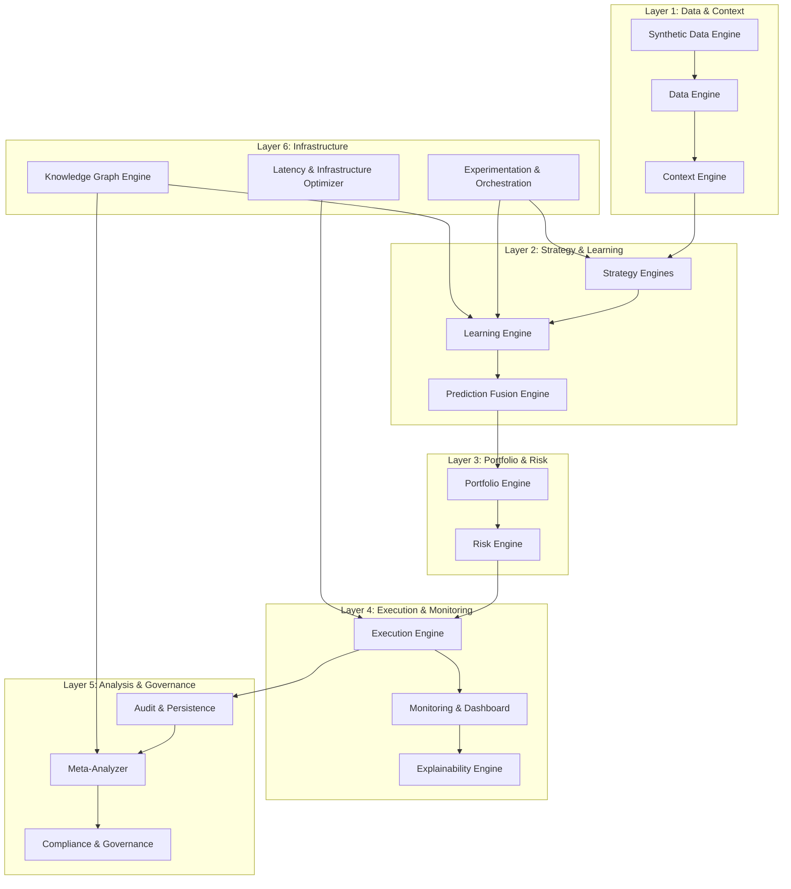
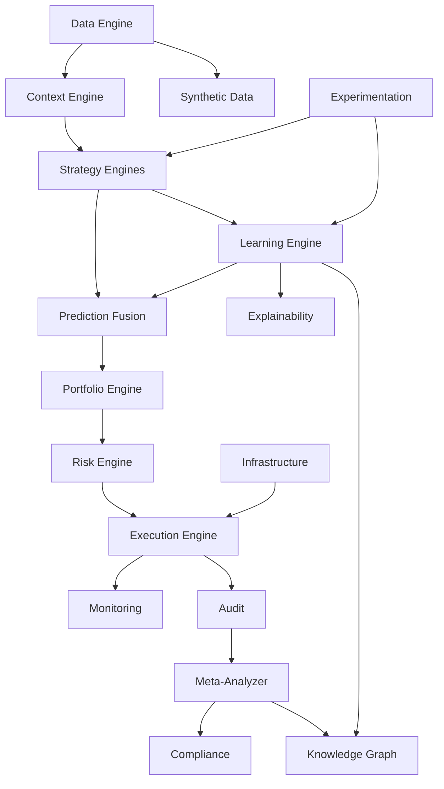
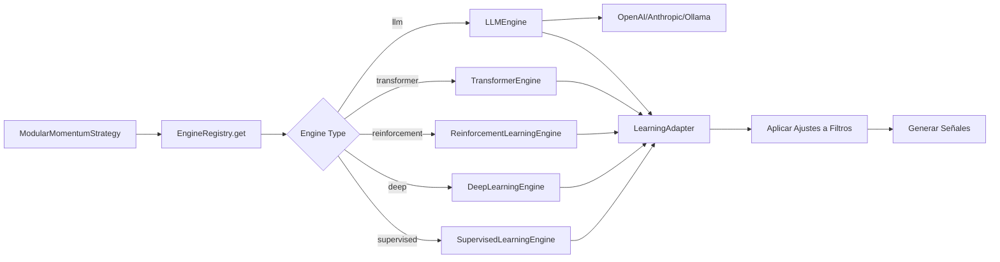

# 🚀 Plan Maestro: AlgoTrading Next Level

## Arquitectura de 17 Módulos Inteligentes

---

## 📊 Estado Actual vs. Objetivo

### Componentes Existentes (Base Sólida)

| Componente Actual                                            | Estado       | Reutilizable para Nuevo Módulo              |
| ------------------------------------------------------------ | ------------ | ------------------------------------------- |
| `app/data/feeds.py`                                          | ✅ Funcional | → Data Engine (40% reutilizable)            |
| `app/services/market_data_service.py`                        | ✅ Funcional | → Data Engine (60% reutilizable)            |
| `app/strategies/momentum_modular/modules/market_analyzer.py` | ✅ Funcional | → Context Engine (70% reutilizable)         |
| `app/strategies/*` (4 estrategias)                           | ✅ Funcional | → Strategy Engines (80% reutilizable)       |
| `app/strategies/momentum_modular/learning/*` (4 engines)     | ✅ Funcional | → Learning Engine (90% reutilizable)        |
| `app/services/portfolio_service.py`                          | ✅ Funcional | → Portfolio Engine (50% reutilizable)       |
| `app/services/portfolio_risk_manager.py`                     | ✅ Funcional | → Risk Engine (70% reutilizable)            |
| `app/backtesting/meta_analyzer/*`                            | ✅ Funcional | → Meta-Analyzer (85% reutilizable)          |
| `app/backtesting/meta_analyzer/audit_trail.py`               | ✅ Funcional | → Audit & Persistence (90% reutilizable)    |
| `app/services/signal_execution_engine.py`                    | ✅ Funcional | → Execution Engine (60% reutilizable)       |
| `app/dashboard/*`                                            | ✅ Funcional | → Monitoring & Dashboard (70% reutilizable) |

**Total Reutilizable**: ~65% de la infraestructura base está lista.

---

## 🎯 Arquitectura de los 17 Módulos



---

## 📅 Fases de Implementación (18 Meses)

### **FASE 1: Fundamentos de Datos y Contexto** (Meses 1-3)

**Objetivo**: Establecer la base de datos limpia y detección de régimen

#### Módulo 1: Data Engine

**Prioridad**: 🔴 CRÍTICA  
**Esfuerzo**: 4 semanas  
**Dependencias**: Ninguna

**Tareas**:

- [x] **1.1** Expandir `app/data/feeds.py` para múltiples fuentes:
  - [x] OHLCV de múltiples brokers (IBKR, Binance, Alpaca, Polygon)
  - [x] Datos fundamentales (Financial Modeling Prep, Alpha Vantage)
  - [x] Datos de sentimiento (Twitter API, Reddit API, News APIs)
  - [x] Datos de opciones (volatility surfaces)
- [x] **1.2** Sistema de normalización unificado:
  - [x] Estandarizar formatos de timestamps, símbolos, precios
  - [x] Manejo de splits, dividendos, corporate actions
  - [x] Cache distribuido (Redis + PostgreSQL) - Implementado con fallback a memoria
- [x] **1.3** Pipeline de limpieza de datos:
  - [x] Detección de outliers (IQR, Z-score, Isolation Forest)
  - [x] Interpolación de gaps (forward fill, backward fill, spline)
  - [x] Validación de calidad (checksums, rangos válidos)
- [x] **1.4** Sistema de versionado de datos:
  - [x] Schema versioning para cambios en estructura
  - [x] Data lineage tracking
  - [x] Rollback capabilities
- [x] **1.5** API unificada de acceso:
  - [x] `DataEngine.get_ohlcv()`, `get_fundamentals()`, `get_sentiment()`
  - [x] Streaming real-time con WebSockets - Implementado
  - [x] Batch loading optimizado

**Stack Tecnológico**:

- **Datos de mercado**: `pandas`, `pandas_ta`, `yfinance`, `ccxt`, `alpha_vantage`, `investpy`
- **NLP para sentimiento**: `transformers` (HuggingFace) para análisis de noticias/Twitter
- **ETL de alto rendimiento**: `polars`, `pyarrow`, `duckdb`
- **Almacenamiento**: `parquet`, `sqlite` o `InfluxDB`

**Entregables**:

- `app/engines/data_engine.py`
- `app/engines/data_engine/sources/` (múltiples proveedores)
- `app/engines/data_engine/normalizers/`
- `app/engines/data_engine/validators/`
- Tests: >90% coverage

---

#### Módulo 2: Context Engine

**Prioridad**: 🔴 CRÍTICA  
**Esfuerzo**: 5 semanas  
**Dependencias**: Data Engine (1.1 completado)

**Tareas**:

- [x] **2.1** Mejorar `MarketAnalyzer` existente:
  - [x] Detección de régimen con HMM (Hidden Markov Models)
  - [x] Clustering de regímenes con KMeans/DBSCAN
  - [x] Análisis de correlaciones dinámicas (rolling correlation, PCA)
- [x] **2.2** Sistema de volatilidad adaptativa:
  - [x] Detección de cambios estructurales (CUSUM, Chow test)
  - [x] Regímenes de volatilidad (high/normal/low) con percentiles
  - [x] Volatility clustering (GARCH models)
- [x] **2.3** Detección de correlaciones:
  - [x] Matrices de correlación rolling window
  - [x] Correlación condicional (DCC-GARCH)
  - [x] Network analysis de correlaciones (Graph Theory)
- [x] **2.4** Contexto macroeconómico:
  - [x] Integración de indicadores macro (VIX, yield curve, GDP)
  - [x] Sector rotation detection
  - [x] Market breadth indicators
- [x] **2.5** API de contexto:
  - [x] `ContextEngine.get_current_regime()`
  - [x] `ContextEngine.get_volatility_regime()`
  - [x] `ContextEngine.get_correlation_matrix()`
  - [x] Cache de resultados (TTL: 1 hora)

**Stack Tecnológico**:

- **Detección de régimen**: `hmmlearn` o `mlfinlab` (GitHub: hudson-and-thames/mlfinlab)
- **Análisis estadístico**: `scikit-learn` (PCA, clustering: KMeans, DBSCAN)
- **Volatilidad y correlación**: `statsmodels` para correlación dinámica y modelos GARCH
- **Indicadores técnicos**: `pandas_ta` para ATR, ADX, etc.

**Entregables**:

- `app/engines/context_engine.py`
- `app/engines/context_engine/regime_detectors/`
- `app/engines/context_engine/volatility_analyzers/`
- `app/engines/context_engine/correlation_analyzers/`
- Tests con datos sintéticos y reales

---

### **FASE 2: Strategy Engines y Learning** (Meses 4-7)

**Objetivo**: Modularizar estrategias y mejorar learning engines

#### Módulo 3: Strategy Engines (Refactor)

**Prioridad**: 🟡 ALTA  
**Esfuerzo**: 6 semanas  
**Dependencias**: Context Engine (2.1 completado)

**Tareas**:

- [x] **3.1** Refactorizar estrategias existentes:
  - [x] Crear `BaseStrategyEngine` abstracta
  - [x] Convertir `MomentumStrategy` → `MomentumStrategyEngine`
  - [x] Convertir `MeanReversionStrategy` → `MeanReversionStrategyEngine`
  - [x] Convertir `PairsTradingStrategy` → `PairsTradingStrategyEngine`
  - [x] Convertir `ModularMomentumStrategy` → `ModularMomentumStrategyEngine`
- [ ] **3.2** Nuevas estrategias base:
  - [ ] `BreakoutStrategyEngine` (soporte/resistencia breaks)
  - [ ] `MeanReversionStrategyEngine` (mejorado con Z-score adaptativo)
  - [ ] `TrendFollowingStrategyEngine` (ADX, MACD)
  - [ ] `ArbitrageStrategyEngine` (spreads, carry trades)
- [ ] **3.3** Sistema de composición de estrategias:
  - [ ] Ensemble de estrategias con pesos dinámicos
  - [ ] Strategy selector basado en régimen de mercado
  - [ ] Meta-strategy que combina múltiples engines
- [ ] **3.4** Integración con Learning Engine:
  - [ ] Cada engine puede recibir ajustes de Learning Engine
  - [ ] Callbacks para aprendizaje continuo
  - [ ] Feature extraction estandarizado
- [ ] **3.5** Testing y validación:
  - [ ] Backtesting unificado para todos los engines
  - [ ] Walk-forward validation
  - [ ] Stress testing con datos sintéticos

**Stack Tecnológico**:

- **Backtesting**: `backtesting.py`, `vectorbt` (GitHub: polakowo/vectorbt)
- **Estrategias cuantitativas**: `mlfinlab` para estrategias avanzadas
- **Indicadores técnicos**: `pandas_ta`
- **Modelos ML**: `scikit-learn` o `PyTorch` según estrategia

**Entregables**:

- `app/engines/strategy_engines/base.py`
- `app/engines/strategy_engines/momentum_engine.py`
- `app/engines/strategy_engines/mean_reversion_engine.py`
- `app/engines/strategy_engines/pairs_engine.py`
- `app/engines/strategy_engines/breakout_engine.py`
- `app/engines/strategy_engines/compositor.py` (ensembles)

---

#### Módulo 4: Learning Engine (Mejora)

**Prioridad**: 🟡 ALTA  
**Esfuerzo**: 8 semanas  
**Dependencias**: Strategy Engines (3.1 completado)

**Tareas**:

- [ ] **4.1** Mejorar engines existentes:
  - [ ] `SupervisedLearningEngine`: Agregar XGBoost, LightGBM, CatBoost
  - [ ] `DeepLearningEngine`: Agregar Transformer, Attention mechanisms
  - [ ] `ReinforcementLearningEngine`: Agregar DQN, TD3, SAC algorithms
  - [ ] `TransformerEngine`: Mejorar con positional encoding mejorado
- [ ] **4.2** Detección de drift y sobreajuste:
  - [ ] Statistical tests para concept drift (KS test, MMD)
  - [ ] Detección de overfitting (train/val gap, learning curves)
  - [ ] Auto-retraining triggers
- [ ] **4.3** Sistema de feature importance:
  - [ ] SHAP values para modelos supervisados
  - [ ] Attention weights para transformers
  - [ ] Feature selection automático
- [ ] **4.4** Transfer Learning:
  - [ ] Pre-trained models para diferentes regímenes
  - [ ] Fine-tuning adaptativo
  - [ ] Knowledge distillation entre modelos
- [x] **4.5** Aprendizaje multi-tarea:
  - [x] Compartir representaciones entre tareas
  - [x] Multi-objective optimization (return, Sharpe, drawdown)
- [x] **4.6** Hyperparameter auto-tuning:
  - [x] Bayesian optimization (Optuna)
  - [x] Early stopping adaptativo
  - [x] Resource-aware tuning (GPU/CPU constraints)

**Stack Tecnológico**:

- **Deep Learning**: `PyTorch` / `PyTorch Lightning`
- **Optimización**: `optuna` o `ray[tune]` para optimización automática
- **Online Learning**: `scikit-multiflow` o `river` para aprendizaje incremental
- **Reinforcement Learning**: `stable-baselines3` (ya en uso)

**Entregables**:

- `app/engines/learning_engine/improvements/drift_detector.py`
- `app/engines/learning_engine/improvements/feature_importance.py`
- `app/engines/learning_engine/improvements/transfer_learning.py`
- `app/engines/learning_engine/hyperparameter_tuner.py`
- Documentación de cada mejora

---

### **FASE 3: Portfolio y Risk** (Meses 8-10)

#### Módulo 5: Portfolio Engine

**Prioridad**: 🟡 ALTA  
**Esfuerzo**: 6 semanas  
**Dependencias**: Strategy Engines (3.3 completado)

**Tareas**:

- [x] **5.1** Refactorizar `PortfolioService`:
  - [x] Extraer lógica de asignación de capital
  - [x] Crear `PortfolioEngine` con interfaz clara
  - [x] Integración con múltiples brokers
- [x] **5.2** Optimización de asignación:
  - [x] Mean-variance optimization (Markowitz)
  - [x] Risk parity allocation
  - [x] Black-Litterman model
  - [x] Kelly Criterion adaptativo
- [x] **5.3** Rebalanceo dinámico:
  - [x] Threshold-based rebalancing
  - [x] Time-based rebalancing (daily, weekly, monthly)
  - [x] Volatility-targeting rebalancing
  - [x] Transaction cost-aware rebalancing
- [x] **5.4** Meta-learning para asignación:
  - [x] Aprender pesos óptimos entre estrategias
  - [x] Reinforcement learning para portfolio management
  - [x] Historical performance-based allocation
- [x] **5.5** Multi-asset portfolio:
  - [x] Stocks, crypto, forex, commodities
  - [ ] Currency hedging automático (pendiente)
  - [ ] Sector/country diversification (pendiente)

**Stack Tecnológico**:

- **Optimización de portfolio**: `cvxpy` o `PyPortfolioOpt` (GitHub: robertmartin8/PyPortfolioOpt)
- **Optimización global**: `optuna` / `ray[tune]`
- **Risk Parity**: `mlfinlab` → Hierarchical Risk Parity (HRP)

**Entregables**:

- `app/engines/portfolio_engine.py`
- `app/engines/portfolio_engine/optimizers/`
- `app/engines/portfolio_engine/rebalancers/`
- `app/engines/portfolio_engine/meta_learners/`

---

#### Módulo 6: Risk Engine

**Prioridad**: 🟡 ALTA  
**Esfuerzo**: 5 semanas  
**Dependencias**: Portfolio Engine (5.1 completado)

**Tareas**:

- [x] **6.1** Expandir `PortfolioRiskManager`:
  - [x] Value at Risk (VaR) histórico, paramétrico, Monte Carlo
  - [x] Conditional VaR (CVaR) / Expected Shortfall
  - [x] Stress testing (scenarios, historical, Monte Carlo)
- [x] **6.2** Control dinámico de drawdowns:
  - [x] Rolling maximum drawdown tracking
  - [x] Circuit breakers por drawdown (por estrategia, global)
  - [x] Recovery protocols después de drawdowns
- [x] **6.3** Gestión de exposición:
  - [x] Exposure limits por activo, sector, estrategia
  - [x] Leverage monitoring
  - [x] Concentration risk (Herfindahl index)
- [x] **6.4** Correlaciones cruzadas:
  - [x] Matrices de correlación en tiempo real
  - [x] Correlation-based position limits
  - [x] Diversification scoring
- [x] **6.5** Risk attribution:
  - [x] Descomponer riesgo por fuente (estrategia, activo, factor)
  - [x] Factor risk models (Fama-French, APT)
- [x] **6.6** Alertas y notificaciones:
  - [x] Threshold-based alerts
  - [x] Email/Slack notifications
  - [x] Dashboard de riesgo en tiempo real

**Stack Tecnológico**:

- **Métricas de riesgo**: `mlfinlab` (risk metrics, bet sizing)
- **Modelos GARCH**: `arch` para modelos de volatilidad
- **Análisis estadístico**: `statsmodels` + `numpy` para métricas
- **Análisis VaR/CVaR**: `riskfolio-lib` para análisis de riesgo avanzado

**Entregables**:

- `app/engines/risk_engine.py`
- `app/engines/risk_engine/var_calculators/`
- `app/engines/risk_engine/stress_testers/`
- `app/engines/risk_engine/exposure_managers/`
- `app/engines/risk_engine/alert_system.py`

---

### **FASE 4: Análisis y Persistencia** (Meses 11-12)

#### Módulo 7: Meta-Analyzer (Mejora)

**Prioridad**: 🟢 MEDIA  
**Esfuerzo**: 4 semanas  
**Dependencias**: Risk Engine (6.1 completado)

**Tareas**:

- [ ] **7.1** Expandir `BacktestMetaAnalyzer` existente:
  - [ ] Agregar más métricas (Omega ratio, Calmar ratio, Ulcer index)
  - [ ] Análisis de estacionalidad
  - [ ] Detección de regímenes óptimos por estrategia
- [ ] **7.2** Clustering avanzado:
  - [ ] Hierarchical clustering de resultados
  - [ ] DBSCAN para outliers
  - [ ] Visualization de clusters (t-SNE, UMAP)
- [ ] **7.3** Análisis de factores:
  - [ ] Factor analysis (PCA, ICA)
  - [ ] Factor attribution de retornos
  - [ ] Exposiciones a factores de riesgo
- [ ] **7.4** Generación de insights:
  - [ ] NLP para generar reportes en lenguaje natural
  - [ ] Auto-recomendaciones basadas en análisis
  - [ ] Pattern recognition en resultados
- [ ] **7.5** Integración con Knowledge Graph:
  - [ ] Almacenar insights en graph database
  - [ ] Búsqueda semántica de resultados

**Stack Tecnológico**:

- **Análisis de datos**: `pandas`, `numpy`
- **Visualización**: `plotly`, `matplotlib`
- **Clustering y análisis**: `scikit-learn` (clustering, PCA)
- **Visualización automática**: `sweetviz`, `autoviz`
- **Tracking de experimentos**: `mlflow` o `wandb`

**Entregables**:

- `app/engines/meta_analyzer/improvements/`
- `app/engines/meta_analyzer/clustering/`
- `app/engines/meta_analyzer/factor_analysis/`
- `app/engines/meta_analyzer/insight_generator.py`

---

#### Módulo 8: Audit & Persistence Engine

**Prioridad**: 🟢 MEDIA  
**Esfuerzo**: 3 semanas  
**Dependencias**: Ninguna (ya existe base)

**Tareas**:

- [ ] **8.1** Expandir `AuditTrail` existente:
  - [ ] Versionado de configuraciones más granular
  - [ ] Dependency tracking más detallado
  - [ ] Integration con Git hooks
- [ ] **8.2** Sistema de versionado de modelos:
  - [ ] Model registry (MLflow-like)
  - [ ] Versionado de pesos con tags
  - [ ] Model lineage tracking
- [ ] **8.3** Trazabilidad completa:
  - [ ] Trace cada decisión desde data → signal → trade
  - [ ] Query interface para traces
  - [ ] Visualización de traces en dashboard
- [ ] **8.4** Reproducibilidad mejorada:
  - [ ] Snapshot completo del entorno (conda/pip freeze)
  - [ ] Docker images versionados
  - [ ] Re-run capabilities desde cualquier punto
- [ ] **8.5** Data governance:
  - [ ] Data quality metrics tracking
  - [ ] Data freshness monitoring
  - [ ] Anomaly detection en datos

**Stack Tecnológico**:

- **Tracking de experimentos**: `mlflow`, `dvc`
- **Versionado**: `gitpython` para integración con Git
- **Bases de datos**: `sqlite` o `postgresql`
- **Integridad**: `hashlib` para hashing y verificación
- **Logging**: `loguru` o `structlog` para logging estructurado

**Entregables**:

- `app/engines/audit_persistence/version_manager.py`
- `app/engines/audit_persistence/model_registry.py`
- `app/engines/audit_persistence/trace_system.py`
- `app/engines/audit_persistence/reproducibility_tools.py`

---

### **FASE 5: Ejecución y Monitoreo** (Meses 13-14)

#### Módulo 9: Execution Engine

**Prioridad**: 🟡 ALTA  
**Esfuerzo**: 6 semanas  
**Dependencias**: Risk Engine (6.2 completado)

**Tareas**:

- [ ] **9.1** Refactorizar `SignalExecutionEngine`:
  - [ ] Separar lógica de ejecución de señal generation
  - [ ] Crear `ExecutionEngine` con múltiples brokers
  - [ ] Unified order management system (OMS)
- [ ] **9.2** Optimización de ejecución:
  - [ ] TWAP (Time-Weighted Average Price) execution
  - [ ] VWAP (Volume-Weighted Average Price) execution
  - [ ] Implementation shortfall optimization
  - [ ] Smart order routing
- [ ] **9.3** Gestión de slippage:
  - [ ] Slippage models (linear, square root)
  - [ ] Pre-trade cost estimation
  - [ ] Post-trade cost analysis
- [ ] **9.4** Latency optimization:
  - [ ] Async order execution
  - [ ] Connection pooling para brokers
  - [ ] Order batching para reducir fees
- [ ] **9.5** Gestión de órdenes:
  - [ ] Order status tracking
  - [ ] Fill detection y reporting
  - [ ] Partial fills handling
- [ ] **9.6** Simulación de ejecución:
  - [ ] Paper trading con slippage realista
  - [ ] Backtesting con execution costs
  - [ ] Simulación de latencia de red

**Stack Tecnológico**:

- **Brokers**: `ccxt` (cripto) / `ib_insync` (Interactive Brokers)
- **Backtesting**: `backtrader` o `vectorbt` en modo simulado
- **Async I/O**: `asyncio`, `aiohttp` para ejecución asíncrona

**Entregables**:

- `app/engines/execution_engine.py`
- `app/engines/execution_engine/brokers/` (múltiples integraciones)
- `app/engines/execution_engine/optimizers/`
- `app/engines/execution_engine/slippage_models/`
- `app/engines/execution_engine/simulators/`

---

#### Módulo 10: Monitoring & Dashboard

**Prioridad**: 🟡 ALTA  
**Esfuerzo**: 5 semanas  
**Dependencias**: Execution Engine (9.1 completado)

**Tareas**:

- [ ] **10.1** Expandir dashboard existente:
  - [ ] Real-time P&L tracking
  - [ ] Position monitoring con updates live
  - [ ] Risk metrics dashboard
- [ ] **10.2** Alertas automáticas:
  - [ ] Configuración de thresholds por métrica
  - [ ] Color-coded indicators (verde/amarillo/rojo)
  - [ ] Email/Slack/Telegram notifications
- [ ] **10.3** Visualizaciones avanzadas:
  - [ ] Interactive charts (Plotly, D3.js)
  - [ ] Heatmaps de correlación
  - [ ] 3D visualizations (strategy space, return/risk)
- [ ] **10.4** Reporting automático:
  - [ ] Daily/weekly/monthly reports
  - [ ] PDF generation con gráficos
  - [ ] Excel exports con múltiples sheets
- [ ] **10.5** Performance attribution:
  - [ ] Descomponer retornos por estrategia, activo, factor
  - [ ] Attribution charts
  - [ ] Benchmark comparison
- [ ] **10.6** Mobile-responsive:
  - [ ] Streamlit mobile optimization
  - [ ] PWA (Progressive Web App) capabilities
  - [ ] Push notifications móviles

**Stack Tecnológico**:

- **Dashboards**: `streamlit`, `dash`, `plotly`, `panel`
- **Alertas**: `apprise`, `discord-webhook`, `telegram` para notificaciones
- **Backend API**: `fastapi` o `flask`

**Entregables**:

- `app/engines/monitoring_dashboard/real_time_tracker.py`
- `app/engines/monitoring_dashboard/alert_engine.py`
- `app/engines/monitoring_dashboard/visualizations/`
- `app/engines/monitoring_dashboard/report_generators/`
- `app/dashboard/next_level/` (nuevo dashboard mejorado)

---

### **FASE 6: Inteligencia Avanzada** (Meses 15-16)

#### Módulo 11: Explainability Engine (XAI)

**Prioridad**: 🟢 MEDIA  
**Esfuerzo**: 4 semanas  
**Dependencias**: Learning Engine (4.3 completado)

**Tareas**:

- [ ] **11.1** SHAP integration:
  - [ ] SHAP values para todos los modelos supervisados
  - [ ] TreeSHAP para XGBoost/LightGBM
  - [ ] DeepSHAP para redes neuronales
- [ ] **11.2** LIME integration:
  - [ ] LIME para explicaciones locales
  - [ ] TabularLIME para features
  - [ ] TimeSeriesLIME para secuencias
- [ ] **11.3** Feature attribution:
  - [ ] Integrated gradients
  - [ ] Gradient-based attribution
  - [ ] Attention visualization para transformers
- [ ] **11.4** Rule extraction:
  - [ ] Extraer reglas de árboles de decisión
  - [ ] LIME explanations → reglas
  - [ ] Validación de reglas extraídas
- [ ] **11.5** Explanation dashboard:
  - [ ] Visualización de feature importance por trade
  - [ ] Why did this trade happen? (explicación en lenguaje natural)
  - [ ] Comparison de explicaciones entre modelos

**Stack Tecnológico**:

- **Explainability**: `shap`, `lime`, `interpret`, `eli5`
- **Integración**: Integración con `PyTorch` y `scikit-learn`
- **Visualización**: `plotly` o `dash`

**Entregables**:

- `app/engines/explainability_engine/shap_integration.py`
- `app/engines/explainability_engine/lime_integration.py`
- `app/engines/explainability_engine/feature_attribution.py`
- `app/engines/explainability_engine/rule_extractor.py`
- `app/dashboard/explainability_tab.py`

---

#### Módulo 12: Synthetic Data Engine

**Prioridad**: 🟢 MEDIA  
**Esfuerzo**: 5 semanas  
**Dependencias**: Data Engine (1.3 completado)

**Tareas**:

- [ ] **12.1** Generadores de datos sintéticos:
  - [ ] GANs para generar OHLCV sintético
  - [ ] Diffusion models para series temporales
  - [ ] VAEs para representaciones latentes
- [ ] **12.2** Data augmentation:
  - [ ] Time warping, magnitude warping
  - [ ] Mixup para series temporales
  - [ ] Noise injection controlado
- [ ] **12.3** Stress testing scenarios:
  - [ ] Black swan event generation
  - [ ] Volatility spike scenarios
  - [ ] Correlation breakdown scenarios
- [ ] **12.4** Validation de datos sintéticos:
  - [ ] Estadísticas comparativas (mean, std, distribution)
  - [ ] Adversarial validation (¿puede un modelo distinguir sintético vs real?)
  - [ ] Visual inspection tools
- [ ] **12.5** Integration con entrenamiento:
  - [ ] Data augmentation en pipeline de training
  - [ ] Synthetic data para rare events
  - [ ] Balanced datasets con oversampling sintético

**Stack Tecnológico**:

- **GANs para series financieras**: `ydata-synthetic`
- **Synthetic Data Vault**: `sdv` para generación de datos sintéticos
- **Deep Generative Models**: `torch` (VAEs, Diffusion Models)

**Entregables**:

- `app/engines/synthetic_data_engine/gans/`
- `app/engines/synthetic_data_engine/diffusion_models/`
- `app/engines/synthetic_data_engine/augmentation/`
- `app/engines/synthetic_data_engine/scenario_generators/`
- `app/engines/synthetic_data_engine/validators/`

---

#### Módulo 13: Prediction Fusion Engine

**Prioridad**: 🟢 MEDIA  
**Esfuerzo**: 4 semanas  
**Dependencias**: Strategy Engines (3.4 completado), Learning Engine (4.1 completado)

**Tareas**:

- [ ] **13.1** Ensemble methods:
  - [ ] Voting (hard, soft)
  - [ ] Stacking con meta-learner
  - [ ] Blending con pesos aprendidos
- [ ] **13.2** Bayesian model averaging:
  - [ ] BMA con prior distributions
  - [ ] Dynamic weights basados en performance reciente
  - [ ] Uncertainty quantification
- [ ] **13.3** Adaptive fusion:
  - [ ] Pesos que cambian según régimen de mercado
  - [ ] Reinforcement learning para seleccionar ensemble
  - [ ] Performance-based model selection
- [ ] **13.4** Diversity metrics:
  - [ ] Medir diversidad entre modelos (correlation de errores)
  - [ ] Maximizar diversidad en ensemble
  - [ ] Pruning de modelos redundantes
- [ ] **13.5** Confidence calibration:
  - [ ] Calibrar probabilidades de ensemble
  - [ ] Temperature scaling
  - [ ] Platt scaling

**Stack Tecnológico**:

- **Ensembles**: `scikit-learn` (VotingClassifier, Stacking)
- **Gradient Boosting**: `xgboost`, `lightgbm`, `catboost`
- **Ensembles en producción**: `mlens` o `blendit`

**Entregables**:

- `app/engines/prediction_fusion_engine/ensembles/`
- `app/engines/prediction_fusion_engine/bayesian_averaging.py`
- `app/engines/prediction_fusion_engine/adaptive_fusion.py`
- `app/engines/prediction_fusion_engine/diversity_metrics.py`
- `app/engines/prediction_fusion_engine/calibration.py`

---

### **FASE 7: Governance e Infraestructura** (Meses 17-18)

#### Módulo 14: Compliance & Governance Engine

**Prioridad**: 🔴 CRÍTICA (si trading real)  
**Esfuerzo**: 6 semanas  
**Dependencias**: Execution Engine (9.1 completado)

**Tareas**:

- [ ] **14.1** Framework de reglas de compliance:
  - [ ] MiFID II compliance (best execution, transaction reporting)
  - [ ] SEC regulations (Pattern Day Trader, short sale restrictions)
  - [ ] ESMA regulations (leverage limits, position limits)
- [ ] **14.2** Pre-trade compliance checks:
  - [ ] Validación de órdenes antes de ejecutar
  - [ ] Position limits checking
  - [ ] Wash sale detection
- [ ] **14.3** Post-trade reporting:
  - [ ] Transaction reporting automático
  - [ ] Trade surveillance
  - [ ] Audit logs para regulators
- [ ] **14.4** Blockchain integration (opcional):
  - [ ] Immutable audit trail en blockchain
  - [ ] Smart contracts para compliance rules
- [ ] **14.5** Regulatory reporting:
  - [ ] Generate reports en formatos regulatorios
  - [ ] Automated submission (si aplica)

**Stack Tecnológico**:

- **Blockchain**: `blockchain-python` o `hyperledger-fabric-sdk-py` para hashes inmutables
- **Reporting**: `pandas` + `reportlab` / `docx` para generación de reportes
- **Validación de reglas**: `cerberus` o `pydantic` para validación de compliance

**Entregables**:

- `app/engines/compliance_governance/rule_engine.py`
- `app/engines/compliance_governance/mifid_compliance.py`
- `app/engines/compliance_governance/sec_compliance.py`
- `app/engines/compliance_governance/pre_trade_checker.py`
- `app/engines/compliance_governance/reporting/`

---

#### Módulo 15: Knowledge Graph Engine

**Prioridad**: 🟢 MEDIA  
**Esfuerzo**: 6 semanas  
**Dependencias**: Meta-Analyzer (7.1 completado)

**Tareas**:

- [ ] **15.1** Graph database setup:
  - [ ] Neo4j o ArangoDB integration
  - [ ] Schema design para trading knowledge
  - [ ] Entity-relationship modeling
- [ ] **15.2** Knowledge extraction:
  - [ ] Extraer relaciones de backtest results
  - [ ] Conectar estrategias con contextos exitosos
  - [ ] Modelar dependencias entre decisiones
- [ ] **15.3** Graph Neural Networks:
  - [ ] GCN (Graph Convolutional Networks)
  - [ ] GAT (Graph Attention Networks)
  - [ ] Link prediction en el graph
- [ ] **15.4** Semantic search:
  - [ ] Vector embeddings de conocimientos
  - [ ] Similarity search (¿qué estrategias funcionaron en contextos similares?)
  - [ ] Recommendation system basado en graph
- [ ] **15.5** Memory a largo plazo:
  - [ ] Almacenar patrones exitosos/fallidos
  - [ ] Retrieval-augmented learning
  - [ ] Long-term strategy performance tracking

**Stack Tecnológico**:

- **Graph databases**: `networkx`, `neo4j`, `graph-tool`
- **Embeddings semánticos**: `sentence-transformers` o `OpenAI embeddings` para grafo semántico
- **Vector DB**: `faiss`, `weaviate`, o `chromadb` como vector database

**Entregables**:

- `app/engines/knowledge_graph_engine/graph_db.py`
- `app/engines/knowledge_graph_engine/extractors/`
- `app/engines/knowledge_graph_engine/gnn_models/`
- `app/engines/knowledge_graph_engine/semantic_search.py`
- `app/engines/knowledge_graph_engine/memory_system.py`

---

#### Módulo 16: Experimentation & Orchestration Engine

**Prioridad**: 🟡 ALTA  
**Esfuerzo**: 5 semanas  
**Dependencias**: Learning Engine (4.6 completado)

**Tareas**:

- [ ] **16.1** MLflow integration:
  - [ ] Tracking de experimentos
  - [ ] Model registry
  - [ ] Experiment comparison
- [ ] **16.2** Workflow orchestration:
  - [ ] Prefect o Airflow para pipelines
  - [ ] DAG definition para backtests
  - [ ] Dependency management
- [ ] **16.3** Automated experimentation:
  - [ ] Grid search automatizado
  - [ ] Hyperparameter sweeps
  - [ ] Multi-objective optimization
- [ ] **16.4** Version control para experiments:
  - [ ] Git integration
  - [ ] Code snapshots
  - [ ] Configuration versioning
- [ ] **16.5** Experiment analysis:
  - [ ] Compare múltiples runs
  - [ ] Statistical significance testing
  - [ ] Best experiment selection

**Stack Tecnológico**:

- **Experiment tracking**: `mlflow`, `prefect`, `airflow`
- **Orquestación moderna**: `dagster` para orquestación de pipelines
- **Ejecución distribuida**: `docker`, `ray` para ejecución distribuida

**Entregables**:

- `app/engines/experimentation_orchestration/mlflow_integration.py`
- `app/engines/experimentation_orchestration/workflow_manager.py`
- `app/engines/experimentation_orchestration/automated_experiments.py`
- `app/engines/experimentation_orchestration/analysis_tools.py`

---

#### Módulo 17: Latency & Infrastructure Optimizer

**Prioridad**: 🟢 MEDIA  
**Esfuerzo**: 4 semanas  
**Dependencias**: Execution Engine (9.4 completado)

**Tareas**:

- [ ] **17.1** Profiling system:
  - [ ] Code profiling (cProfile, py-spy)
  - [ ] Memory profiling
  - [ ] Network latency monitoring
- [ ] **17.2** GPU/CPU optimization:
  - [ ] GPU utilization monitoring
  - [ ] Batch size optimization
  - [ ] Mixed precision training
- [ ] **17.3** Async I/O optimization:
  - [ ] Async data loading
  - [ ] Concurrent API calls
  - [ ] Connection pooling
- [ ] **17.4** Caching strategies:
  - [ ] Multi-level caching (memory, Redis, disk)
  - [ ] Cache invalidation policies
  - [ ] Cache hit rate monitoring
- [ ] **17.5** Distributed computing (opcional):
  - [ ] Ray para distributed training
  - [ ] Dask para distributed data processing
  - [ ] Celery para task distribution

**Stack Tecnológico**:

- **Computación distribuida**: `ray`, `dask`, `numba`, `cupy` (GPU acceleration)
- **Monitoreo**: `psutil`, `prometheus_client`, `grafana`
- **Baja latencia**: `asyncio`, `uvloop` para optimización de I/O

**Entregables**:

- `app/engines/infrastructure_optimizer/profiler.py`
- `app/engines/infrastructure_optimizer/gpu_monitor.py`
- `app/engines/infrastructure_optimizer/async_optimizer.py`
- `app/engines/infrastructure_optimizer/cache_manager.py`
- `app/engines/infrastructure_optimizer/distributed_setup.py`

---

## 📊 Matriz de Dependencias



## 🎯 Priorización por Impacto vs. Esfuerzo

| Módulo                   | Impacto   | Esfuerzo | Prioridad | Fase |
| ------------------------ | --------- | -------- | --------- | ---- |
| Data Engine              | 🔴 Alto   | 🟡 Medio | P0        | 1    |
| Context Engine           | 🔴 Alto   | 🟡 Medio | P0        | 1    |
| Strategy Engines         | 🔴 Alto   | 🟠 Alto  | P0        | 2    |
| Learning Engine          | 🔴 Alto   | 🟠 Alto  | P0        | 2    |
| Portfolio Engine         | 🔴 Alto   | 🟡 Medio | P0        | 3    |
| Risk Engine              | 🔴 Alto   | 🟡 Medio | P0        | 3    |
| Execution Engine         | 🟡 Medio  | 🟡 Medio | P1        | 5    |
| Monitoring & Dashboard   | 🟡 Medio  | 🟡 Medio | P1        | 5    |
| Meta-Analyzer            | 🟡 Medio  | 🟢 Bajo  | P1        | 4    |
| Audit & Persistence      | 🟢 Bajo   | 🟢 Bajo  | P2        | 4    |
| Prediction Fusion        | 🟡 Medio  | 🟢 Bajo  | P2        | 6    |
| Explainability Engine    | 🟢 Bajo   | 🟡 Medio | P2        | 6    |
| Synthetic Data           | 🟢 Bajo   | 🟡 Medio | P2        | 6    |
| Compliance & Governance  | 🔴 Alto\* | 🟠 Alto  | P0\*      | 7    |
| Knowledge Graph          | 🟡 Medio  | 🟠 Alto  | P3        | 7    |
| Experimentation          | 🟡 Medio  | 🟡 Medio | P1        | 7    |
| Infrastructure Optimizer | 🟢 Bajo   | 🟢 Bajo  | P3        | 7    |

\*Solo si hay trading real

---

## 🏗️ Arquitectura Propuesta

### Estructura de Directorios

```
app/
├── engines/                    # NUEVO: Todos los engines
│   ├── data_engine/
│   │   ├── __init__.py
│   │   ├── data_engine.py      # Clase principal
│   │   ├── sources/            # Proveedores de datos
│   │   │   ├── ibkr_source.py
│   │   │   ├── binance_source.py
│   │   │   ├── alpaca_source.py
│   │   │   ├── polygon_source.py
│   │   │   └── fundamentals_source.py
│   │   ├── normalizers/        # Normalización
│   │   ├── validators/         # Validación
│   │   └── cache/              # Sistema de cache
│   ├── context_engine/
│   ├── strategy_engines/
│   ├── learning_engine/        # Mejoras sobre existente
│   ├── portfolio_engine/
│   ├── risk_engine/
│   ├── execution_engine/
│   ├── monitoring_dashboard/
│   ├── explainability_engine/
│   ├── synthetic_data_engine/
│   ├── prediction_fusion_engine/
│   ├── compliance_governance/
│   ├── knowledge_graph_engine/
│   ├── experimentation_orchestration/
│   └── infrastructure_optimizer/
├── strategies/                 # EXISTENTE: Refactorizar a engines
├── services/                   # EXISTENTE: Algunos → engines
├── backtesting/                # EXISTENTE: Mantener
└── dashboard/                  # EXISTENTE: Expandir
```

### Patrón de Diseño: Engine Pattern

```python
class BaseEngine(ABC):
    """Clase base para todos los engines."""

    def __init__(self, config: Dict[str, Any]):
        self.config = config
        self.enabled = config.get('enabled', True)
        self.logger = logging.getLogger(self.__class__.__name__)

    @abstractmethod
    def initialize(self) -> None:
        """Inicializar el engine."""
        pass

    @abstractmethod
    def process(self, input_data: Any) -> Any:
        """Procesar datos de entrada."""
        pass

    def health_check(self) -> Dict[str, Any]:
        """Verificar salud del engine."""
        return {
            'status': 'healthy',
            'enabled': self.enabled,
            'uptime': self._get_uptime()
        }
```

---

## 📋 Checklist de Implementación por Fase

### Fase 1: Fundamentos (Meses 1-3)

- [ ] Data Engine completamente funcional
- [ ] Context Engine detectando regímenes correctamente
- [ ] Tests de integración Data → Context
- [ ] Documentación completa

### Fase 2: Strategy & Learning (Meses 4-7)

- [ ] Strategy Engines refactorizados
- [ ] Learning Engines mejorados con drift detection
- [ ] Tests de end-to-end: Context → Strategy → Learning
- [ ] Performance benchmarks

### Fase 3: Portfolio & Risk (Meses 8-10)

- [ ] Portfolio Engine optimizando asignación
- [ ] Risk Engine calculando VaR, CVaR
- [ ] Integration tests completos
- [ ] Stress testing

### Fase 4: Analysis & Persistence (Meses 11-12)

- [ ] Meta-Analyzer generando insights
- [ ] Audit & Persistence con trazabilidad completa
- [ ] Reproducibilidad verificada
- [ ] Documentación de procesos

### Fase 5: Execution & Monitoring (Meses 13-14)

- [ ] Execution Engine con múltiples brokers
- [ ] Dashboard en tiempo real
- [ ] Alertas funcionando
- [ ] Paper trading end-to-end

### Fase 6: Inteligencia Avanzada (Meses 15-16)

- [ ] XAI explicando decisiones
- [ ] Synthetic Data generando escenarios
- [ ] Prediction Fusion mejorando señales
- [ ] Tests de robustez

### Fase 7: Governance & Infrastructure (Meses 17-18)

- [ ] Compliance Engine validando órdenes
- [ ] Knowledge Graph almacenando conocimiento
- [ ] Experimentation pipeline automatizado
- [ ] Infrastructure optimizada
- [ ] Sistema completo funcionando

---

## 🔧 Stack Tecnológico Recomendado

### Data & Processing

- **Time Series DB**: TimescaleDB (PostgreSQL extension)
- **Vector DB**: Pinecone, Weaviate, o Qdrant (para embeddings)
- **Graph DB**: Neo4j o ArangoDB
- **Cache**: Redis Cluster
- **Message Queue**: RabbitMQ o Apache Kafka

### ML/AI Frameworks

- **Deep Learning**: PyTorch 2.0+ (ya en uso)
- **Supervised ML**: scikit-learn, XGBoost, LightGBM
- **RL**: stable-baselines3 (ya en uso)
- **NLP**: transformers (Hugging Face)
- **Explainability**: SHAP, LIME, Captum

### Infrastructure

- **Orchestration**: Prefect o Apache Airflow
- **Experiment Tracking**: MLflow
- **Distributed Computing**: Ray (opcional)
- **Monitoring**: Prometheus + Grafana
- **Logging**: ELK Stack (Elasticsearch, Logstash, Kibana)

### Frontend

- **Dashboard**: Streamlit (actual) + React (futuro)
- **Visualizations**: Plotly, D3.js
- **Real-time**: WebSockets (FastAPI)

---

## 📈 Métricas de Éxito

### Técnicas

- **Latencia**: <100ms desde señal hasta orden enviada
- **Throughput**: >1000 señales/segundo procesadas
- **Accuracy**: >60% win rate en backtests
- **Sharpe Ratio**: >1.5 en producción
- **Max Drawdown**: <15% en producción
- **Uptime**: >99.9% de disponibilidad

### Funcionales

- **Reproducibilidad**: 100% de backtests reproducibles
- **Trazabilidad**: Cada trade tiene trace completo
- **Compliance**: 0 violaciones de reglas regulatorias
- **Explainability**: 100% de trades tienen explicación

---

## 🚨 Riesgos y Mitigaciones

| Riesgo                    | Impacto | Probabilidad | Mitigación                                  |
| ------------------------- | ------- | ------------ | ------------------------------------------- |
| Complejidad excesiva      | Alto    | Media        | Implementación incremental, tests continuos |
| Performance issues        | Alto    | Media        | Profiling temprano, optimización continua   |
| Dependencias rotas        | Medio   | Baja         | Version pinning, dependency management      |
| Data quality issues       | Alto    | Media        | Validación robusta, múltiples fuentes       |
| Regulatory changes        | Alto    | Baja         | Compliance engine flexible                  |
| Costos de infraestructura | Medio   | Media        | Cloud optimization, autoscaling             |

---

## 💰 Estimación de Costos (Mensual)

### Infraestructura

- **Cloud (AWS/GCP)**: $200-500/mes (inicial), $1000-2000/mes (producción)
- **Databases**: $100-300/mes
- **API subscriptions** (datos): $200-500/mes
- **Monitoring tools**: $50-100/mes

### Total Estimado: $550-1400/mes (inicial), $1350-2900/mes (producción)

---

## 🎓 Recursos Necesarios

### Equipo

- **1 Data Engineer**: Para Data Engine, Synthetic Data
- **1 ML Engineer**: Para Learning Engine, XAI, Fusion
- **1 Quant Developer**: Para Strategy Engines, Portfolio, Risk
- **1 DevOps**: Para Infrastructure, Orchestration
- **1 Frontend Developer**: Para Dashboard (opcional, puede usar Streamlit)

### Conocimientos Requeridos

- Time series analysis
- Machine Learning / Deep Learning
- Quantitative finance
- Software architecture
- DevOps / MLOps

---

## 📚 Documentación Adicional Necesaria

Por cada módulo se debe crear:

1. **Design Document**: Arquitectura, interfaces, flujo de datos
2. **API Documentation**: Endpoints, métodos, parámetros
3. **User Guide**: Cómo usar el módulo
4. **Testing Guide**: Cómo probar el módulo
5. **Deployment Guide**: Cómo desplegar

---

## ✅ Próximos Pasos Inmediatos

1. **Revisar y aprobar este plan**
2. **Priorizar Fase 1** (Data Engine + Context Engine)
3. **Crear issues/tickets** para cada tarea de Fase 1
4. **Setup de infraestructura** (TimescaleDB, Redis, etc.)
5. **Kickoff de Fase 1** con sprint de 2 semanas

---

---

## 📦 Resumen de Stack Tecnológico por Categoría

### Datos y Fuentes de Mercado

- `pandas`, `pandas_ta`, `yfinance`, `ccxt`, `alpha_vantage`, `investpy`
- `polars`, `pyarrow`, `duckdb` (ETL de alto rendimiento)
- `parquet`, `sqlite`, `InfluxDB` (almacenamiento)

### Machine Learning y Deep Learning

- `scikit-learn`, `PyTorch`, `PyTorch Lightning`
- `xgboost`, `lightgbm`, `catboost`
- `stable-baselines3` (Reinforcement Learning)
- `optuna`, `ray[tune]` (optimización)
- `scikit-multiflow`, `river` (online learning)

### Backtesting y Estrategias

- `backtesting.py`, `vectorbt`
- `mlfinlab` (estrategias cuantitativas avanzadas)
- `backtrader`

### Análisis Estadístico y Regime Detection

- `statsmodels`, `arch` (GARCH)
- `hmmlearn` (Hidden Markov Models)
- `scikit-learn` (PCA, clustering: KMeans, DBSCAN)

### Portfolio y Risk Management

- `cvxpy`, `PyPortfolioOpt`
- `mlfinlab` (risk metrics, HRP)
- `riskfolio-lib` (VaR, CVaR)

### NLP y Sentimiento

- `transformers` (HuggingFace)

### Explainability (XAI)

- `shap`, `lime`, `interpret`, `eli5`

### Synthetic Data

- `ydata-synthetic` (GANs)
- `sdv` (Synthetic Data Vault)
- `torch` (VAEs, Diffusion Models)

### Experimentation y Orchestration

- `mlflow`, `wandb` (experiment tracking)
- `prefect`, `airflow`, `dagster` (orquestación)
- `dvc` (data versioning)
- `gitpython`

### Graph y Vector Databases

- `networkx`, `neo4j`, `graph-tool`
- `faiss`, `weaviate`, `chromadb`
- `sentence-transformers` (embeddings)

### Dashboards y Visualización

- `streamlit`, `dash`, `plotly`, `panel`, `matplotlib`
- `sweetviz`, `autoviz`

### Alertas y Notificaciones

- `apprise`, `discord-webhook`, `telegram`

### Execution y Brokers

- `ccxt` (cripto)
- `ib_insync` (Interactive Brokers)
- `asyncio`, `aiohttp`

### Infraestructura y Performance

- `ray`, `dask`, `numba`, `cupy`
- `psutil`, `prometheus_client`, `grafana`
- `uvloop`

### Compliance y Reporting

- `blockchain-python`, `hyperledger-fabric-sdk-py`
- `reportlab`, `docx`
- `cerberus`, `pydantic`

### Logging y Persistencia

- `loguru`, `structlog`
- `hashlib`

---

## 🏗️ Mejoras Arquitectónicas Avanzadas

### Plug-and-Play Architecture para LLMs y Motores Inteligentes

El diseño actual permite integrar fácilmente cualquier motor de inteligencia (LLMs, modelos avanzados, etc.) gracias a una arquitectura plug-and-play. Estas mejoras arquitectónicas aseguran que el sistema sea extensible sin tocar el código base.

#### 1. BaseLearningEngine Universal (Interfaz Plug-and-Play)

**Propósito**: Define una interfaz común que todos los engines (supervised, deep, RL, transformer, LLM) implementan.

**Interfaz estándar**:

```python
class BaseLearningEngine(ABC):
    """
    Interfaz común para cualquier motor de aprendizaje (incluye LLMs).
    """

    @abstractmethod
    def train(self, data: Dict[str, Any]) -> Dict[str, float]:
        """Entrenar el modelo."""
        pass

    @abstractmethod
    def predict(self, features: Dict[str, Any]) -> Dict[str, Any]:
        """
        Output estándar:
        {
            'success_probability': float,  # 0-1
            'confidence': float,  # 0-1
            'filter_adjustments': Dict[str, Dict[str, float]],
            'recommended_action': str  # 'BUY', 'SELL', 'HOLD'
        }
        """
        pass

    def explain(self, features: Dict[str, Any]) -> str:
        """
        Retorna una explicación textual o generada por LLM.
        """
        return "No explanation available."
```

**Beneficio**: Cualquier engine (numérico, LLM, híbrido) puede enchufarse sin cambiar el resto del sistema.

---

#### 2. EngineRegistry Centralizado

**Propósito**: Registro dinámico donde se "enchufan" los engines sin tocar código base.

**Implementación**:

```python
class EngineRegistry:
    _registry = {}

    @classmethod
    def register(cls, name: str, engine_cls):
        """Registrar un engine."""
        cls._registry[name] = engine_cls

    @classmethod
    def get(cls, name: str, config: Dict) -> BaseLearningEngine:
        """Obtener instancia de un engine."""
        if name not in cls._registry:
            raise ValueError(f"Engine '{name}' no registrado")
        return cls._registry[name](config)

    @classmethod
    def list_available(cls) -> List[str]:
        """Listar engines disponibles."""
        return list(cls._registry.keys())
```

**Uso en configuración**:

```yaml
# config/strategies/momentum_modular.yaml
learning_engine:
  active: "llm" # Cambiar aquí sin tocar código
  llm:
    provider: "openai" # o "anthropic", "ollama"
    model: "gpt-4"
    api_key: "${OPENAI_API_KEY}"
```

**Beneficio**: Cambiar de motor de IA editando solo el YAML, sin tocar código.

---

#### 3. LLMEngine: Integración Semántica Pura

**Propósito**: Motor que usa LLMs (GPT, Claude, Ollama local) para razonamiento sobre señales y contexto.

**Implementación**:

```python
class LLMEngine(BaseLearningEngine):
    """
    Motor que usa un LLM para razonamiento sobre señales y contexto.
    """

    def __init__(self, config: Dict):
        super().__init__("llm", config)
        provider = config.get("provider", "openai")

        if provider == "openai":
            from openai import OpenAI
            self.llm = OpenAI(api_key=config.get("api_key"))
        elif provider == "anthropic":
            from anthropic import Anthropic
            self.llm = Anthropic(api_key=config.get("api_key"))
        elif provider == "ollama":
            # LLM local sin API key
            self.llm = OllamaClient(model=config.get("model", "llama2"))
        else:
            raise ValueError(f"Provider '{provider}' no soportado")

    def predict(self, features: Dict[str, Any]) -> Dict[str, Any]:
        prompt = f"""
        Eres un analista cuantitativo experto. Analiza los siguientes indicadores:

        {json.dumps(features, indent=2)}

        Devuelve una predicción estructurada JSON con:
        - success_probability (0-1): Probabilidad de que la operación sea exitosa
        - confidence (0-1): Confianza en tu predicción
        - filter_adjustments (opcional): Ajustes sugeridos a thresholds de filtros
        - recommended_action: 'BUY', 'SELL', o 'HOLD'
        - reasoning: Breve explicación del razonamiento
        """

        response = self.llm.chat.completions.create(
            model=self.config.get("model", "gpt-4"),
            messages=[{"role": "user", "content": prompt}],
            response_format={"type": "json_object"}
        )

        return json.loads(response.choices[0].message.content)

    def explain(self, features: Dict[str, Any]) -> str:
        prompt = f"""
        Explica de forma breve y clara por qué se tomó esta decisión de trading:
        {json.dumps(features, indent=2)}

        Incluye:
        1. Qué indicadores fueron más influyentes
        2. Por qué la acción recomendada es la óptima
        3. Qué riesgos se identificaron
        """
        response = self.llm.chat.completions.create(...)
        return response.choices[0].message.content
```

**Capacidades del LLMEngine**:

- ✅ **Ajustar thresholds**: Analizar contexto y sugerir ajustes dinámicos a filtros
- ✅ **Predecir acción sugerida**: Razón semánticamente sobre señales
- ✅ **Explicar decisiones**: Generar explicaciones auditables en lenguaje natural
- ✅ **Sintetizar reglas nuevas**: Aprender patrones y proponer mejoras a estrategias

---

#### 4. LearningAdapter: Capa de Adaptación

**Propósito**: Mantener compatibilidad entre filtros y learning engines, permitiendo que diferentes tipos de engines ajusten filtros de forma unificada.

**Implementación**:

```python
class LearningAdapter:
    """
    Adaptador entre filtros y learning engine.
    Mantiene modularidad total.
    """

    def __init__(self, engine: BaseLearningEngine):
        self.engine = engine

    def adapt_filters(
        self,
        filters: Dict[str, BaseFilter],
        features: Dict[str, Any]
    ) -> Dict[str, Dict[str, float]]:
        """
        Obtener predicción del engine y aplicar ajustes a filtros.

        Returns:
            Dict con los ajustes aplicados a cada filtro
        """
        if not self.engine.is_ready():
            return {}

        prediction = self.engine.predict(features)
        adjustments = prediction.get('filter_adjustments', {})

        applied = {}
        for filter_name, adj_params in adjustments.items():
            if filter_name in filters:
                filters[filter_name].adjust_thresholds(adj_params)
                applied[filter_name] = adj_params

        return applied

    def get_explanation(self, features: Dict[str, Any]) -> str:
        """Obtener explicación de la decisión."""
        return self.engine.explain(features)
```

**Beneficio**: `ModularMomentumStrategy` no necesita saber si la predicción viene de un modelo estadístico o una LLM.

---

### Matriz de Componentes Arquitectónicos

| Componente             | Propósito                      | Beneficio Clave                                             |
| ---------------------- | ------------------------------ | ----------------------------------------------------------- |
| **BaseLearningEngine** | Define API común               | Estandariza integración, permite cualquier tipo de motor    |
| **EngineRegistry**     | Registro central de motores    | Cambiar motor sin tocar código, configuración via YAML      |
| **LLMEngine**          | Motor de razonamiento con LLM  | Predice, ajusta y explica usando semántica natural          |
| **LearningAdapter**    | Interfaz entre filtros y motor | Mantiene modularidad total, desacopla engines de estrategia |

---

### Flujo de Integración Completo



---

### Ejemplo de Configuración Completa

```yaml
# config/strategies/momentum_modular.yaml
learning_engine:
  # Cambiar 'active' para usar diferentes engines sin tocar código
  active: "llm" # Opciones: supervised, deep, reinforcement, transformer, llm

  llm:
    enabled: true
    provider: "openai" # openai, anthropic, ollama
    model: "gpt-4"
    api_key: "${OPENAI_API_KEY}"
    temperature: 0.3 # Baja temperatura para respuestas más deterministas
    max_tokens: 500

  supervised:
    enabled: true
    algorithm: "xgboost"
    # ... config existente

  deep:
    enabled: true
    # ... config existente
```

---

### Beneficios Clave de esta Arquitectura

1. **Desacoplamiento Total**: Los engines pueden cambiarse sin afectar la estrategia
2. **Extensibilidad**: Nuevos engines (LLMs, modelos híbridos) se añaden fácilmente
3. **Configuración Declarativa**: Todo se controla vía YAML, sin tocar código
4. **Auditabilidad**: Todos los engines proporcionan explicaciones estándar
5. **Testabilidad**: Cada engine puede testearse independientemente
6. **Producción-Ready**: La arquitectura soporta deployment de cualquier motor

---

### Próximos Pasos para Implementación

1. **Fase 1 (Semana 1)**: Expandir `BaseLearningEngine` con `explain()` y formato estándar
2. **Fase 2 (Semana 2)**: Implementar `EngineRegistry` centralizado
3. **Fase 3 (Semana 3)**: Crear `LLMEngine` con soporte para OpenAI/Anthropic/Ollama
4. **Fase 4 (Semana 4)**: Implementar `LearningAdapter` y refactorizar estrategia
5. **Fase 5 (Semana 5)**: Testing, documentación y validación end-to-end

---

**Fecha de Creación**: 2025-11-02  
**Última Actualización**: 2025-11-02  
**Versión**: 1.2
