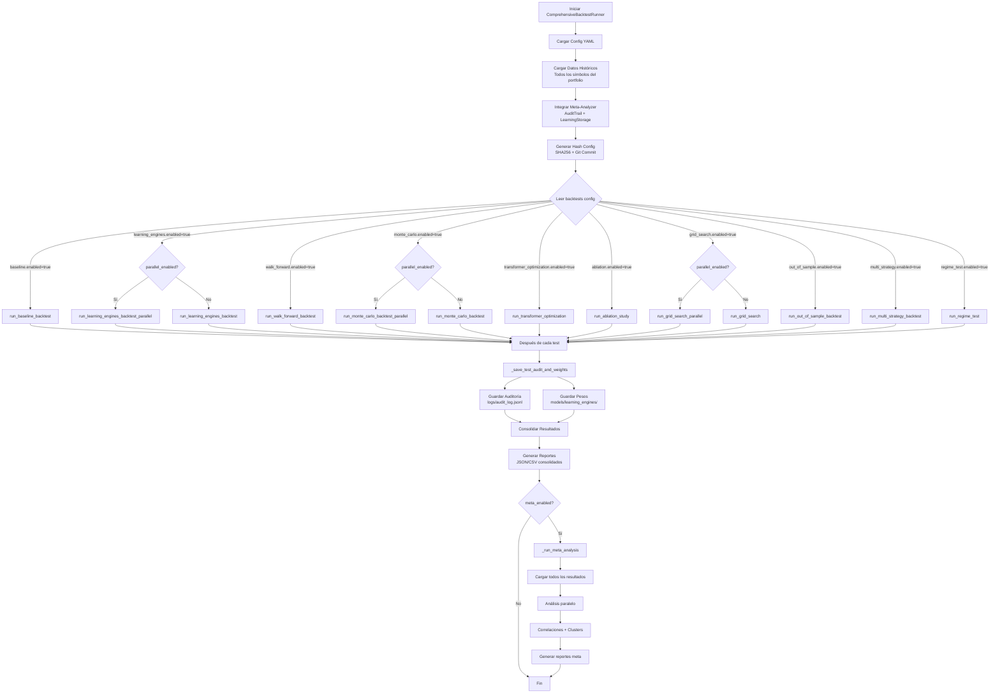

# 📊 Proceso Completo de Backtesting - Documentación Técnica

**Última actualización:** 2025-10-31  
**Versión:** 2.0

---

## 📋 Índice

1. [Visión General](#visión-general)
2. [Arquitectura del Sistema](#arquitectura-del-sistema)
3. [Tipos de Backtests](#tipos-de-backtests)
4. [Flujo de Ejecución](#flujo-de-ejecución)
5. [Componentes y Responsabilidades](#componentes-y-responsabilidades)
6. [Proceso Detallado por Test](#proceso-detallado-por-test)
7. [Análisis Matemáticos y Estadísticos](#análisis-matemáticos-y-estadísticos)
   - [Métricas de Rendimiento](#métricas-de-rendimiento)
   - [Análisis Estadístico Descriptivo](#análisis-estadístico-descriptivo)
   - [Análisis de Correlación](#análisis-de-correlación)
   - [Clustering con KMeans](#clustering-con-kmeans)
   - [Score Compuesto para Sugerencias](#score-compuesto-para-sugerencias)
   - [Índices de Métricas](#índices-de-métricas)
8. [Configuración y Control](#configuración-y-control)

---

## 🎯 Visión General

El sistema de backtesting es un **pipeline automatizado y configurable** que ejecuta múltiples tipos de pruebas sobre estrategias de trading para validar y optimizar su desempeño.

### Características Principales

- ✅ **10 tipos diferentes de backtests** (cada uno evaluando aspectos distintos)
- ✅ **Completamente configurable** mediante YAML
- ✅ **Ejecución automática** de múltiples tests en secuencia
- ✅ **Reportes consolidados** con métricas estándar
- ✅ **Soporte para múltiples estrategias** y learning engines
- ✅ **Reentrenamiento automático** durante backtests

### Objetivo Principal

Validar la robustez, optimizar parámetros y medir el desempeño de estrategias bajo diferentes condiciones de mercado y configuraciones.

---

## 🏗️ Arquitectura del Sistema

### Diagrama de Componentes Principales

```
┌─────────────────────────────────────────────────────────────┐
│                  ComprehensiveBacktestRunner                  │
│              (Orquestador Principal)                          │
│                                                               │
│  • Lee configuración YAML                                     │
│  • Carga datos históricos                                     │
│  • Coordina ejecución de todos los tests                      │
│  • Consolida resultados                                       │
└─────────────────────────────────────────────────────────────┘
                            │
                            ▼
        ┌───────────────────────────────────────┐
        │                                       │
        ▼                                       ▼
┌───────────────┐                    ┌──────────────────┐
│ SimpleBacktester                    │ MultiStrategyBacktester │
│ (Estrategia Única)                  │ (Múltiples Estrategias) │
│                                     │                        │
│ • Ejecuta señales                  │ • Divide capital       │
│ • Gestiona trades                  │ • Alloca dinámicamente│
│ • Calcula métricas                 │ • Compara estrategias │
└───────────────┘                    └──────────────────┘
        │                                       │
        ▼                                       ▼
┌──────────────────────────────────────────────────────────────┐
│              ModularMomentumStrategy                         │
│                                                               │
│  • Genera señales (BUY/SELL/HOLD)                            │
│  • Evalúa filtros modulares                                  │
│  • Usa learning engines para ajustar                         │
│  • Integra reentrenamiento automático                        │
└──────────────────────────────────────────────────────────────┘
        │
        ▼
┌──────────────────────────────────────────────────────────────┐
│           Learning Engines (Opcional)                        │
│                                                               │
│  • SupervisedLearningEngine                                   │
│  • DeepLearningEngine                                         │
│  • ReinforcementLearningEngine                                │
│  • TransformerEngine                                          │
│                                                               │
│  └─> LearningEngineUpdater (Reentrenamiento automático)       │
└──────────────────────────────────────────────────────────────┘
```

### Responsabilidades por Capa

#### 1. **Capa de Orquestación** (`ComprehensiveBacktestRunner`)

- **Responsabilidad:** Coordinar ejecución de todos los tests
- **Archivo:** `app/backtesting/comprehensive_backtest_runner.py`
- **Tareas:**
  - Cargar configuración desde YAML
  - Cargar datos históricos de mercado (todos los símbolos del portfolio)
  - Crear configuraciones de estrategia según tipo de test
  - Ejecutar cada test según `enabled: true/false` en configuración
  - Consolidar y guardar resultados

#### 2. **Capa de Ejecución** (`SimpleBacktester` / `MultiStrategyBacktester`)

- **Responsabilidad:** Ejecutar señales y simular trading
- **Archivo:** `app/backtesting/engine.py` / `app/backtesting/multi_strategy_engine.py`
- **Tareas:**
  - Procesar señales BUY/SELL/HOLD
  - Ejecutar trades con slippage y comisiones
  - Gestionar posiciones y capital
  - Calcular métricas (PnL, Sharpe, drawdown, etc.)
  - Integrar reentrenamiento durante ejecución

#### 3. **Capa de Estrategia** (`ModularMomentumStrategy`)

- **Responsabilidad:** Generar señales de trading
- **Archivo:** `app/strategies/momentum_modular/strategy.py`
- **Tareas:**
  - Calcular indicadores técnicos (RSI, EMA, Momentum, etc.)
  - Evaluar filtros modulares (EMA, RSI, StochRSI, Momentum, Volume, ATR)
  - Detectar contexto de mercado (tendencia, volatilidad, rango)
  - Consultar learning engines para ajustes
  - Generar señales con confianza y fuerza

#### 4. **Capa de Aprendizaje** (`LearningEngineUpdater` + Engines)

- **Responsabilidad:** Aprender de trades históricos y ajustar estrategia
- **Archivos:**
  - `app/strategies/momentum_modular/learning/learning_updater.py`
  - `app/strategies/momentum_modular/learning/supervised_learning_engine.py`
  - `app/strategies/momentum_modular/learning/deep_learning_engine.py`
  - etc.
- **Tareas:**
  - Reentrenar modelos periódicamente
  - Predecir probabilidad de éxito de trades
  - Ajustar thresholds dinámicamente
  - Manejar errores graciosamente (nunca interrumpe backtest)

---

## 📊 Tipos de Backtests

### ✅ Tests Implementados y Habilitados

#### 1️⃣ **Baseline Backtest**

- **Propósito:** Medir performance base sin optimización
- **Configuración:** Todos los módulos activos, sin learning engine
- **Archivo método:** `run_baseline_backtest()`
- **Cuándo se ejecuta:** `backtests.baseline.enabled: true`

#### 2️⃣ **Learning Engines Test**

- **Propósito:** Probar cada learning engine individualmente
- **Configuración:** Ejecuta 3-4 tests (supervised, deep, reinforcement, transformer)
- **Archivo método:** `run_learning_engines_backtest()`
- **Cuándo se ejecuta:** `backtests.learning_engines.enabled: true`

#### 3️⃣ **Walk-Forward Backtest**

- **Propósito:** Validar optimización por ventana temporal
- **Configuración:** Ventanas de entrenamiento/test que se mueven en el tiempo
- **Archivo método:** `run_walk_forward_backtest()`
- **Cuándo se ejecuta:** `backtests.walk_forward.enabled: true`

#### 4️⃣ **Monte Carlo Backtest**

- **Propósito:** Test de robustez con simulaciones aleatorias
- **Configuración:** N simulaciones con volatilidad/precios alterados
- **Archivo método:** `run_monte_carlo_backtest()`
- **Cuándo se ejecuta:** `backtests.monte_carlo.enabled: true`

#### 5️⃣ **Transformer Optimization**

- **Propósito:** Optimización iterativa de parámetros usando Transformer
- **Configuración:** Optimización hasta convergencia o max_iterations
- **Archivo método:** `run_transformer_optimization()`
- **Cuándo se ejecuta:** `backtests.transformer_optimization.enabled: true`
- **Nota:** Si Transformer no disponible, usa Grid Search mejorado

#### 6️⃣ **Ablation Study**

- **Propósito:** Medir impacto individual de cada módulo
- **Configuración:** Desactiva un módulo a la vez, compara con baseline
- **Archivo método:** `run_ablation_study()`
- **Cuándo se ejecuta:** `backtests.ablation.enabled: true`

#### 7️⃣ **Grid Search**

- **Propósito:** Encontrar combinaciones óptimas de parámetros
- **Configuración:** Busca en espacio paramétrico (grid o random)
- **Archivo método:** `run_grid_search()`
- **Cuándo se ejecuta:** `backtests.grid_search.enabled: true`

#### 8️⃣ **Out-of-Sample Test**

- **Propósito:** Validar robustez en datos no vistos
- **Configuración:** 70% train, 30% test (configurable)
- **Archivo método:** `run_out_of_sample_backtest()`
- **Cuándo se ejecuta:** `backtests.out_of_sample.enabled: true`

#### 9️⃣ **Multi-Strategy Backtest**

- **Propósito:** Probar múltiples estrategias simultáneamente
- **Configuración:** Momentum + Mean Reversion + Pairs Trading
- **Archivo método:** `run_multi_strategy_backtest()`
- **Cuándo se ejecuta:** `backtests.multi_strategy.enabled: true`
- **Motor:** Usa `MultiStrategyBacktester` (no `SimpleBacktester`)

#### 🔟 **Regime Test**

- **Propósito:** Evaluar desempeño según régimen de mercado
- **Configuración:** Bull market, Bear market, Sideways market
- **Archivo método:** `run_regime_test()`
- **Cuándo se ejecuta:** `backtests.regime_test.enabled: true`

### ❌ Tests No Implementados (Futuros)

- **Stress Testing Extremo:** Simulaciones de crashes o eventos extremos
- **Cross-Asset Validation:** Probar en múltiples clases de activos
- **Transaction Cost Analysis:** Análisis detallado de costos de transacción
- **Regulatory Compliance Tests:** Validación de límites regulatorios

---

## 🔄 Flujo de Ejecución

### Flujo Principal (run_all)



### Flujo de Ejecución de un Backtest Individual

```
1. ComprehensiveBacktestRunner - Inicialización
   ├─> Lee configuración del test específico
   ├─> Integra Meta-Analyzer (si meta_analysis.enabled: true)
   │   ├─> AuditTrail: Genera hash SHA256 (config + código + fecha)
   │   ├─> LearningEngineStorage: Listo para guardar/cargar pesos
   │   └─> Hash guardado: runner.audit_hash
   ├─> Verifica paralelización (parallelization.enabled: true)
   └─> Carga datos históricos (todos los símbolos del portfolio)

2. ComprehensiveBacktestRunner - Preparación del Test
   ├─> Crea configuración de estrategia (_create_strategy_config)
   └─> _train_learning_engine_if_needed() [NUEVO]
       ├─> Si enable_incremental_learning: true
       │   ├─> Intenta cargar pesos guardados (latest=True)
       │   ├─> Si encuentra pesos:
       │   │   ├─> Carga en modelo (PyTorch/TensorFlow/sklearn)
       │   │   └─> ✅ Listo (puede omitir entrenamiento inicial)
       │   └─> Si no encuentra: entrena desde cero
       └─> Entrena learning engine (desde cero o fine-tuning)

3. ModularMomentumStrategy
   ├─> Inicializa módulos (EMA, RSI, StochRSI, Momentum, Volume, ATR)
   ├─> Inicializa learning engine (si está configurado)
   │   └─> Ya entrenado o se entrenará durante backtest
   └─> Inicializa LearningEngineUpdater (si hay learning engine)

4. SimpleBacktester / MultiStrategyBacktester
   ├─> Inicializa capital y posiciones
   └─> Itera sobre quotes históricos:
       │
       ├─> ModularMomentumStrategy.generate_signals(quote)
       │   ├─> Calcula indicadores técnicos
       │   ├─> Evalúa filtros modulares
       │   ├─> Detecta contexto de mercado
       │   ├─> Consulta learning engine (si está entrenado)
       │   └─> Genera Signal(s) con confianza
       │
       ├─> SimpleBacktester._process_signal(signal, market_data)
       │   ├─> Valida riesgo (RiskEnvelopeValidator)
       │   ├─> Ejecuta BUY/SELL
       │   │   ├─> Calcula tamaño de posición
       │   │   ├─> Aplica slippage y comisiones
       │   │   └─> Actualiza capital y posiciones
       │   └─> Registra Trade
       │
       └─> LearningEngineUpdater.retrain_if_needed()
           ├─> Verifica si debe reentrenar (frecuencia + trades suficientes)
           ├─> Verifica dependencias (_can_train)
           ├─> Prepara datos de entrenamiento
           ├─> Entrena learning engine
           └─> Si falla: continúa silenciosamente (no interrumpe)

5. SimpleBacktester.run_backtest()
   └─> Retorna BacktestResult con:
       ├─> trades: List[Trade]
       ├─> equity_curve: List[Tuple[datetime, Decimal]]
       └─> Métricas calculadas

6. ComprehensiveBacktestRunner - Después del Test [NUEVO]
   ├─> Calcula métricas consistentes (_calculate_consistent_metrics)
   ├─> Guarda resultados en self.results
   └─> _save_test_audit_and_weights() [NUEVO - Después de CADA test]
       ├─> Si meta_enabled y audit_trail:
       │   ├─> Guarda auditoría en logs/audit_log.jsonl
       │   ├─> Hash SHA256 + Git commit + metadatos completos
       │   └─> Timestamp + resultados + configuración
       └─> Si meta_enabled y learning_storage y strategy tiene engine:
           ├─> Extrae pesos del modelo (state_dict/get_weights/modelo completo)
           ├─> Guarda en models/learning_engines/{engine}/{test_id}.pt
           └─> Guarda metadatos en .metadata.json

7. ComprehensiveBacktestRunner - Al Finalizar Todos los Tests
   ├─> _consolidate_results(): Consolida todos los resultados
   ├─> _save_reports(): Guarda reportes consolidados
   │   ├─> CSV: comprehensive_backtest_results_{timestamp}.csv
   │   ├─> JSON: comprehensive_backtest_results_{timestamp}.json
   │   └─> Summary: summary_{timestamp}.txt
   └─> _run_meta_analysis() [NUEVO - Si meta_enabled]
       ├─> Carga todos los resultados JSON/CSV
       ├─> Ejecuta análisis paralelo (correlaciones, clusters)
       ├─> Genera visualizaciones (si matplotlib disponible)
       └─> Exporta reportes meta en reports/comprehensive_backtest/meta/
```

---

## 👥 Componentes y Responsabilidades

### ComprehensiveBacktestRunner

**Archivo:** `app/backtesting/comprehensive_backtest_runner.py`

**Responsabilidades:**

1. **Carga de Datos**

   - `_load_config()`: Lee configuración YAML
   - `_load_market_data()`: Carga todos los símbolos del portfolio
   - `_load_portfolio_market_data()`: Usa PortfolioBuilder para obtener quotes

2. **Integración Meta-Analyzer** [NUEVO]

   - `__init__()`: Integra automáticamente si `meta_analysis.enabled: true`
     - `AuditTrail`: Genera hash SHA256 único (config + código + fecha + Git)
     - `LearningEngineStorage`: Guarda/carga pesos de modelos
     - `audit_hash`: Hash único de la ejecución
   - Verifica `parallelization.enabled`: Habilita/deshabilita paralelización

3. **Configuración de Estrategias**

   - `_create_strategy_config()`: Crea configuración según tipo de test
   - `_create_multi_strategy_setup()`: Configura múltiples estrategias
   - `_get_strategy_name()`: Obtiene nombre identificador

4. **Preparación de Learning Engines** [MEJORADO]

   - `_prepare_learning_training_data()`: Prepara datos para entrenar
   - `_train_learning_engine_if_needed()`: [NUEVO] Intenta cargar pesos guardados primero
     - Si `enable_incremental_learning: true`:
       - Carga pesos más recientes desde `LearningEngineStorage`
       - Si encuentra: carga en modelo y omite entrenamiento inicial
       - Si no encuentra: entrena desde cero
     - Soporta PyTorch (.pt), TensorFlow (.pkl), scikit-learn (.pkl)

5. **Ejecución de Tests**

   - `run_baseline_backtest()`: Baseline
   - `run_learning_engines_backtest()`: Learning engines (secuencial)
   - `run_learning_engines_backtest_parallel()`: [NUEVO] Learning engines (paralelo)
   - `run_walk_forward_backtest()`: Walk-forward
   - `run_monte_carlo_backtest()`: Monte Carlo (secuencial)
   - `run_monte_carlo_backtest_parallel()`: [NUEVO] Monte Carlo (paralelo, hasta 70% más rápido)
   - `run_transformer_optimization()`: Transformer optimization
   - `run_ablation_study()`: Ablation
   - `run_grid_search()`: Grid search (secuencial)
   - `run_grid_search_parallel()`: [NUEVO] Grid search (paralelo, hasta 65% más rápido)
   - `run_out_of_sample_backtest()`: Out-of-sample
   - `run_multi_strategy_backtest()`: Multi-strategy
   - `run_regime_test()`: Regime test

6. **Persistencia y Auditoría** [NUEVO]

   - `_save_test_audit_and_weights()`: Guarda después de cada test
     - Auditoría: `logs/audit_log.jsonl` (hash, git commit, metadatos, resultados)
     - Pesos: `models/learning_engines/{engine}/{test_id}.pt` (para aprendizaje incremental)
   - `_run_meta_analysis()`: Análisis meta al finalizar todos los tests
     - Carga todos los resultados
     - Ejecuta análisis paralelo (correlaciones, clusters, sugerencias)
     - Exporta reportes en `reports/comprehensive_backtest/meta/`

7. **Consolidación**
   - `run_all()`: Ejecuta todos los tests habilitados (con paralelización si está habilitada)
   - `_calculate_consistent_metrics()`: Calcula métricas estándar
   - `_save_reports()`: Guarda reportes consolidados (JSON/CSV/summary)

---

### SimpleBacktester

**Archivo:** `app/backtesting/engine.py`

**Responsabilidades:**

1. **Ejecución de Trades**

   - `run_backtest()`: Loop principal sobre quotes
   - `_process_signal()`: Procesa señal BUY/SELL/HOLD
   - `_execute_buy_signal()`: Ejecuta compra
   - `_execute_sell_signal()`: Ejecuta venta
   - `_close_position()`: Cierra posición existente

2. **Gestión de Capital**

   - `_calculate_position_size()`: Calcula tamaño según confianza
   - `_update_equity_curve()`: Actualiza curva de equity
   - `_calculate_drawdown()`: Calcula drawdown

3. **Validación de Riesgo**

   - Integración con `RiskEnvelopeValidator`
   - Validación antes de ejecutar señales

4. **Integración con Learning Engine**

   - Crea `LearningEngineUpdater` si estrategia tiene learning engine
   - Agrega market data al historial en cada quote
   - Llama `retrain_if_needed()` periódicamente
   - Registra trades en historial para reentrenamiento

5. **Cálculo de Métricas**
   - `_calculate_metrics()`: Calcula Sharpe, Sortino, win rate, etc.
   - Retorna `BacktestResult` con todas las métricas

---

### MultiStrategyBacktester

**Archivo:** `app/backtesting/multi_strategy_engine.py`

**Responsabilidades:**

1. **Gestión de Múltiples Estrategias**

   - Divide capital inicial entre estrategias
   - Ejecuta cada estrategia independientemente
   - Consolida resultados

2. **Reasignación Dinámica de Capital**

   - Integración con `DynamicCapitalReallocationEngine`
   - Reasigna capital según performance
   - Actualiza pesos de estrategias

3. **Ejecución Paralela**
   - Ejecuta todas las estrategias sobre los mismos datos
   - Agrega trades de todas las estrategias
   - Calcula métricas consolidadas

---

### ModularMomentumStrategy

**Archivo:** `app/strategies/momentum_modular/strategy.py`

**Responsabilidades:**

1. **Generación de Señales**

   - `generate_signals()`: Método principal
   - Calcula indicadores técnicos
   - Evalúa filtros modulares
   - Detecta contexto de mercado
   - Consulta learning engines
   - Genera Signal con confianza y fuerza

2. **Módulos de Filtros**

   - `EMAFilter`: Filtro de medias móviles exponenciales
   - `RSIFilter`: Filtro de RSI
   - `StochRSIFilter`: Filtro de Stochastic RSI
   - `MomentumFilter`: Filtro de momentum
   - `VolumeFilter`: Filtro de volumen
   - `ATRFilter`: Filtro de ATR (volatilidad)

3. **Detección de Mercado**

   - `MarketAnalyzer`: Detecta tendencia, volatilidad, rango

4. **Integración con Learning Engines**
   - Consulta `learning_engine.predict()` si está entrenado
   - Filtra señales con baja probabilidad de éxito
   - Aplica ajustes sugeridos por learning engine

---

### LearningEngineUpdater

**Archivo:** `app/strategies/momentum_modular/learning/learning_updater.py`

**Responsabilidades:**

1. **Reentrenamiento Automático**

   - `retrain_if_needed()`: Método principal (nunca falla)
   - Verifica frecuencia y número de trades
   - Prepara datos desde historial
   - Verifica dependencias antes de entrenar
   - Maneja errores graciosamente

2. **Gestión de Historial**

   - `add_trade_result()`: Registra trades
   - `add_market_data()`: Registra market data
   - `_clean_old_history()`: Limpia datos antiguos

3. **Preparación de Datos**

   - `_prepare_training_data_from_history()`: Prepara según tipo de engine
   - `_convert_trade_history_to_trades()`: Convierte formato
   - `_is_training_data_empty()`: Valida datos

4. **Verificación de Dependencias**
   - `_can_train()`: Verifica si sklearn/PyTorch/etc. están disponibles
   - Nunca lanza excepciones, retorna False si no puede entrenar

---

### Meta-Analyzer (NUEVO)

**Archivo:** `app/backtesting/meta_analyzer/`

**Componentes:**

1. **AuditTrail**

   - **Archivo:** `app/backtesting/meta_analyzer/audit_trail.py`
   - **Responsabilidades:**
     - `generate_hash()`: Genera hash SHA256 único (config YAML + código + fecha + Git commit)
     - `save_audit_record_sync()`: Guarda registro en `logs/audit_log.jsonl` (JSONL formato)
     - `verify_reproducibility()`: Verifica si una ejecución es reproducible
     - `_get_git_info()`: Obtiene información de Git (commit, branch, dirty state)

2. **LearningEngineStorage**

   - **Archivo:** `app/backtesting/meta_analyzer/learning_storage.py`
   - **Responsabilidades:**
     - `save_weights()`: Guarda pesos de modelos en `models/learning_engines/{engine}/{test_id}.pt`
     - `load_weights()`: Carga pesos guardados (latest o por test_id)
     - `list_available_weights()`: Lista pesos disponibles
     - `delete_weights()`: Elimina pesos antiguos
     - Soporta PyTorch (.pt), TensorFlow/Keras (.pkl), scikit-learn (.pkl)

3. **BacktestMetaAnalyzer**

   - **Archivo:** `app/backtesting/meta_analyzer/meta_analyzer.py`
   - **Responsabilidades:**
     - `load_results()`: Carga todos los resultados JSON/CSV
     - `analyze_performance()`: Calcula métricas agregadas
     - `detect_clusters()`: Detecta clusters de rendimiento (KMeans)
     - `suggest_optimal_combinations()`: Sugiere top N combinaciones óptimas
     - `run_parallel_analysis()`: Ejecuta análisis en paralelo (asyncio + ThreadPoolExecutor)
     - `export_report()`: Exporta reportes en JSON/CSV

4. **Integration Helpers**
   - **Archivo:** `app/backtesting/meta_analyzer/integration.py`
   - **Responsabilidades:**
     - `integrate_meta_analyzer_with_runner()`: Integra componentes con ComprehensiveBacktestRunner
     - Configura AuditTrail, LearningEngineStorage y BacktestMetaAnalyzer

---

## 🔍 Proceso Detallado por Test

### 1️⃣ Baseline Backtest

**Objetivo:** Medir performance base sin optimización

**Proceso:**

1. `run_baseline_backtest()` se llama si `backtests.baseline.enabled: true`
2. Crea estrategia con todos los módulos activos, sin learning engine
3. Usa thresholds por defecto (`use_default_thresholds: true`)
4. Genera señales para todos los quotes
5. Ejecuta backtest con `SimpleBacktester`
6. Calcula métricas y guarda resultados

**Métricas:** PnL, Sharpe, Win Rate, Drawdown, Total Trades, etc.

---

### 2️⃣ Learning Engines Test

**Objetivo:** Probar cada learning engine individualmente

**Proceso:**

1. Si `parallelization.enabled: true`:
   - `run_learning_engines_backtest_parallel()`: [NUEVO] Ejecuta tests en paralelo
   - Usa ThreadPoolExecutor para paralelizar cada engine (hasta 60% más rápido)
2. Si `parallelization.enabled: false`:
   - `run_learning_engines_backtest()`: Ejecuta tests secuencialmente
3. Itera sobre learning engines habilitados:
   - SupervisedLearningEngine
   - DeepLearningEngine
   - ReinforcementLearningEngine
   - TransformerEngine (si disponible)
4. Para cada engine (en paralelo si está habilitado):
   - **Intenta cargar pesos guardados** (si enable_incremental_learning: true)
   - Si encuentra: carga y hace fine-tuning
   - Si no encuentra: prepara datos de entrenamiento y entrena desde cero
   - Crea estrategia con ese engine
   - Ejecuta backtest
   - **Guardar auditoría y pesos** después de cada test
5. Opcionalmente ejecuta multi-strategy para comparación

**Métricas:** Compara performance con/sin cada learning engine

**Paralelización:** ✅ Hasta 60% más rápido con múltiples engines

---

### 3️⃣ Walk-Forward Backtest

**Objetivo:** Validar optimización por ventana temporal

**Proceso:**

1. `run_walk_forward_backtest()` divide datos en ventanas
2. Para cada ventana:
   - **Train Window:** Entrena learning engine (si configurado)
   - **Test Window:** Ejecuta backtest en datos futuros
   - Avanza ventana según `step_size_days`
3. Consolida resultados de todas las ventanas

**Parámetros:** `window_size_days`, `step_size_days`, `learning_engine`

**Métricas:** Performance por ventana, estabilidad temporal

---

### 4️⃣ Monte Carlo Backtest

**Objetivo:** Test de robustez con simulaciones aleatorias

**Proceso:**

1. Si `parallelization.enabled: true`:
   - `run_monte_carlo_backtest_parallel()`: [NUEVO] Ejecuta simulaciones en paralelo
   - Usa ThreadPoolExecutor para paralelizar (hasta 70% más rápido)
   - Cada worker ejecuta una simulación independiente
2. Si `parallelization.enabled: false`:
   - `run_monte_carlo_backtest()`: Ejecuta simulaciones secuencialmente
3. Para cada simulación:
   - Alterar volatilidad (`volatility_multiplier`)
   - Aplicar shocks de precio (`price_shock_percentage`)
   - Ejecutar backtest con datos alterados
   - **Guardar auditoría y pesos** después de cada simulación
4. Analiza distribución de resultados

**Parámetros:** `num_simulations`, `volatility_multiplier`, `price_shock_percentage`

**Métricas:** Distribución de Sharpe, PnL, percentiles (5%, 95%)

**Paralelización:** ✅ Hasta 70% más rápido con múltiples cores

---

### 5️⃣ Transformer Optimization

**Objetivo:** Optimización iterativa de parámetros

**Proceso:**

1. `run_transformer_optimization()` optimiza parámetros iterativamente
2. Si Transformer disponible:
   - Usa Transformer para sugerir mejoras
   - Entrena modelo con parámetros sugeridos
   - Evalúa performance
   - Itera hasta convergencia
3. Si Transformer no disponible:
   - Usa Grid Search mejorado como fallback

**Parámetros:** `max_iterations`, `convergence_threshold`

**Métricas:** Parámetros óptimos encontrados, evolución de Sharpe

---

### 6️⃣ Ablation Study

**Objetivo:** Medir impacto individual de cada módulo

**Proceso:**

1. `run_ablation_study()` ejecuta baseline primero
2. Para cada módulo en `modules_to_test`:
   - Desactiva ese módulo
   - Ejecuta backtest
   - Compara con baseline
3. Calcula impacto de cada módulo

**Parámetros:** `modules_to_test` (lista de módulos a probar)

**Métricas:** Impacto en Sharpe/PnL al desactivar cada módulo

---

### 7️⃣ Grid Search

**Objetivo:** Encontrar combinaciones óptimas de parámetros

**Proceso:**

1. Si `parallelization.enabled: true`:
   - `run_grid_search_parallel()`: [NUEVO] Ejecuta combinaciones en paralelo
   - Usa ThreadPoolExecutor para paralelizar (hasta 65% más rápido)
   - Cada worker prueba una combinación independiente
2. Si `parallelization.enabled: false`:
   - `run_grid_search()`: Ejecuta combinaciones secuencialmente
3. Genera combinaciones de parámetros:
   - Método `random`: Genera combinaciones aleatorias
   - Método `grid`: Genera todas las combinaciones posibles
4. Para cada combinación (en paralelo si está habilitado):
   - Crea estrategia con esos parámetros
   - Intenta cargar pesos guardados (si enable_incremental_learning)
   - Ejecuta backtest
   - Evalúa según métrica (`optimize_metric`)
   - **Guardar auditoría y pesos** después de cada combinación
5. Selecciona mejor combinación

**Parámetros:** `search_method`, `num_combinations`, `optimize_metric`, `parameters_to_optimize`

**Métricas:** Mejor combinación de parámetros, ranking de combinaciones

**Paralelización:** ✅ Hasta 65% más rápido con múltiples cores

---

### 8️⃣ Out-of-Sample Test

**Objetivo:** Validar robustez en datos no vistos

**Proceso:**

1. `run_out_of_sample_backtest()` divide datos en train/test
2. **Train Split:**
   - Entrena learning engine (si configurado)
   - Opcionalmente usa parámetros de grid_search
3. **Test Split:**
   - Ejecuta backtest solo en test data
   - No reentrena en test data (forward performance)
4. Compara train vs test performance

**Parámetros:** `train_split` (0.7 = 70% train, 30% test)

**Métricas:** Performance en train vs test, validación de overfitting

---

### 9️⃣ Multi-Strategy Backtest

**Objetivo:** Probar múltiples estrategias simultáneamente

**Proceso:**

1. `run_multi_strategy_backtest()` crea múltiples estrategias:
   - MomentumStrategy
   - MeanReversionStrategy
   - PairsTradingStrategy
2. Usa `MultiStrategyBacktester` (no `SimpleBacktester`)
3. Divide capital inicial entre estrategias
4. Si `enable_dynamic_reallocation: true`:
   - Reasigna capital según performance
   - Actualiza pesos periódicamente
5. Ejecuta todas las estrategias sobre mismos datos
6. Consolida resultados

**Parámetros:** `strategies`, `enable_dynamic_reallocation`, `reallocation_frequency_days`

**Métricas:** Performance individual y combinada, allocation por estrategia

---

### 🔟 Regime Test

**Objetivo:** Evaluar desempeño según régimen de mercado

**Proceso:**

1. `run_regime_test()` detecta régimen de mercado por timestamp
2. Para cada régimen configurado:
   - Filtra quotes que cumplen condiciones del régimen
   - Ejecuta backtest solo en esos datos
3. Compara performance por régimen

**Parámetros:** `regimes` (lista con condiciones: trend_direction, volatility_regime, in_range)

**Métricas:** Performance por régimen (bull/bear/sideways), adaptabilidad

---

## ⚙️ Configuración y Control

### Archivo de Configuración

**Ubicación:** `config/backtesting/comprehensive_backtest.yaml`

**Estructura:**

```yaml
input:
  symbol: "SNOW" # No se usa actualmente (se usa portfolio completo)
  start_date: "2023-01-01"
  end_date: "2024-01-01"
  initial_capital: 100000.0

modules:
  filters:
    ema_filter:
      enabled: true
      parameters: { ... }
    # ... más filtros

learning_engines:
  supervised:
    enabled: true
    parameters: { ... }
  # ... más engines

backtests:
  baseline:
    enabled: true # ✅ Se ejecuta si true
  learning_engines:
    enabled: true
  # ... más backtests

# Meta-Analysis y Auditoría [NUEVO]
meta_analysis:
  enabled: true # ✅ Habilitar meta-analyzer
  enable_audit: true # ✅ Guardar auditoría (hash + git + metadatos)
  enable_storage: true # ✅ Guardar pesos de modelos
  enable_analysis: true # ✅ Ejecutar análisis meta al finalizar
  enable_incremental_learning: true # ✅ Cargar pesos guardados antes de entrenar

# Paralelización [NUEVO]
parallelization:
  enabled: true # ✅ Habilitar paralelización
  max_workers: null # null = auto (CPU count), o especificar número
  # Tests paralelizables: monte_carlo, grid_search, learning_engines
  # Reducción estimada de tiempo: hasta 70% con múltiples cores

# Umbrales para colores dinámicos en dashboard [NUEVO]
thresholds:
  sharpe:
    bad: 0.0
    warn: 0.8
    good: 1.5
  drawdown:
    bad: 15.0
    warn: 10.0
    good: 5.0
  winrate:
    bad: 0.4
    warn: 0.55
    good: 0.65
  return_pct:
    bad: 0.0
    warn: 10.0
    good: 25.0

reporting:
  output_directory: "reports/comprehensive_backtest"
  output_format: ["csv", "json"]
```

### Control de Ejecución

**Script principal:** `scripts/run_comprehensive_backtest.py`

**Uso:**

```bash
# Ejecutar todos los tests habilitados
python scripts/run_comprehensive_backtest.py

# Ejecutar tests específicos
python scripts/run_comprehensive_backtest.py baseline ablation grid_search
```

**Flujo interno:**

1. Lee `config/backtesting/comprehensive_backtest.yaml`
2. Crea `ComprehensiveBacktestRunner` con esa configuración
3. Llama `runner.run_all()`
4. `run_all()` itera sobre `backtests` en configuración
5. Para cada test con `enabled: true`, ejecuta el método correspondiente
6. Consolida resultados y genera reportes

### Qué se Ejecuta y Qué No

**Se Ejecuta:**

- ✅ Todos los tests con `enabled: true` en configuración
- ✅ Tests en orden secuencial (pero algunos se paralelizan internamente)
- ✅ Cada test es independiente (puede fallar sin afectar otros)
- ✅ **Paralelización automática** para Monte Carlo, Grid Search, Learning Engines (si `parallelization.enabled: true`)
- ✅ **Auditoría después de cada test** (si `meta_analysis.enabled: true`)
  - Hash SHA256 único guardado en `logs/audit_log.jsonl`
  - Metadatos completos (configuración, resultados, Git commit)
- ✅ **Pesos guardados después de cada test** con learning engine (si `enable_storage: true`)
  - Guardado en `models/learning_engines/{engine}/{test_id}.pt`
- ✅ **Análisis meta al finalizar** (si `enable_analysis: true`)
  - Carga todos los resultados
  - Análisis paralelo (correlaciones, clusters, sugerencias)
  - Exporta reportes en `reports/comprehensive_backtest/meta/`

**No se Ejecuta:**

- ❌ Tests con `enabled: false` en configuración
- ❌ Tests que requieren dependencias no disponibles (pero no falla, solo omite)
- ❌ Reentrenamiento si dependencias faltan (continúa sin reentrenar)
- ❌ Paralelización si `parallelization.enabled: false` (usa versiones secuenciales)

---

## 📈 Métricas Calculadas

### Métricas Estándar (Todos los Tests)

- **Total PnL:** Ganancia/pérdida total
- **Return %:** Retorno porcentual
- **Sharpe Ratio:** Retorno ajustado por riesgo
- **Sortino Ratio:** Similar a Sharpe, solo penaliza pérdidas
- **Win Rate:** Porcentaje de trades ganadores
- **Max Drawdown:** Mayor caída desde peak
- **Total Trades:** Número total de trades ejecutados
- **Avg Trade PnL:** PnL promedio por trade
- **Profit Factor:** Ratio ganancias/pérdidas
- **Calmar Ratio:** Return anualizado / Max Drawdown

### Métricas Específicas por Test

- **Walk-Forward:** Métricas por ventana, estabilidad temporal
- **Monte Carlo:** Percentiles, distribución de resultados
- **Grid Search:** Ranking de combinaciones de parámetros
- **Multi-Strategy:** Allocation por estrategia, performance individual
- **Regime Test:** Métricas por régimen de mercado

---

## 🔬 Análisis Matemáticos y Estadísticos

El sistema realiza múltiples análisis matemáticos y estadísticos tanto durante la ejecución de backtests como en el análisis posterior. Esta sección documenta todas las fórmulas y métodos utilizados.

### Métricas de Rendimiento

#### 1. **Sharpe Ratio**

**Fórmula:**

```
Sharpe = (R_p - R_f) / σ_p

Donde:
- R_p = Retorno anualizado del portfolio
- R_f = Tasa libre de riesgo anual (default: 2%)
- σ_p = Desviación estándar anualizada de retornos

Implementación:
1. Calcula retornos diarios desde trades: daily_return = trade_pnl / capital_actual
2. Annualiza retorno: annual_return = mean(daily_returns) × 252 (días trading)
3. Annualiza volatilidad: annual_std = std(daily_returns) × √252
4. Sharpe = (annual_return - risk_free_rate) / annual_std
```

**Interpretación:**

- Sharpe > 1.5: Excelente
- Sharpe 0.8 - 1.5: Bueno
- Sharpe < 0.8: Necesita mejora

**Archivo:** `app/backtesting/metrics.py` → `_calculate_sharpe_ratio()`

---

#### 2. **Sortino Ratio**

**Fórmula:**

```
Sortino = (R_p - R_f) / σ_d

Donde:
- R_p = Retorno anualizado del portfolio
- R_f = Tasa libre de riesgo anual
- σ_d = Desviación estándar de retornos a la baja (downside deviation)

Implementación:
1. Filtra solo retornos negativos: downside_returns = [r for r in returns if r < 0]
2. Calcula desviación estándar de downside: downside_std = std(downside_returns)
3. Annualiza: annual_downside_std = downside_std × √252
4. Sortino = (annual_return - risk_free_rate) / annual_downside_std
```

**Ventaja sobre Sharpe:** Solo penaliza volatilidad de pérdidas, no de ganancias.

**Archivo:** `app/backtesting/metrics.py` → `_calculate_sortino_ratio()`

---

#### 3. **Maximum Drawdown**

**Fórmula:**

```
Max Drawdown = min(Peak - Equity_t) para todo t

Donde:
- Peak = Máximo valor histórico de equity
- Equity_t = Valor de equity en tiempo t

Implementación:
1. Construye curva de equity: equity_curve = [initial_capital, ...]
2. Para cada punto en el tiempo:
   - Si equity > peak: peak = equity
   - drawdown = equity - peak
   - max_dd = min(max_dd, drawdown)
3. Retorna max_dd (siempre ≤ 0)
```

**Archivo:** `app/backtesting/metrics.py` → `_calculate_max_drawdown()`

---

#### 4. **Profit Factor**

**Fórmula:**

```
Profit Factor = |Gross Profit| / |Gross Loss|

Donde:
- Gross Profit = Suma de PnL de trades ganadores
- Gross Loss = Suma de PnL de trades perdedores (valor absoluto)

Interpretación:
- Profit Factor > 2.0: Excelente
- Profit Factor 1.5 - 2.0: Bueno
- Profit Factor < 1.5: Necesita mejora
```

**Archivo:** `app/backtesting/metrics.py` → Calculado en `calculate_all_metrics()`

---

#### 5. **Risk/Reward Ratio**

**Fórmula:**

```
Risk/Reward = Average Win / |Average Loss|

Donde:
- Average Win = Promedio de trades ganadores
- Average Loss = Promedio de trades perdedores (valor absoluto)

Target: ≥ 1:3 (por cada $1 arriesgado, se espera $3 de ganancia)
```

**Archivo:** `app/backtesting/metrics.py` → `_calculate_risk_reward_ratio()`

---

#### 6. **Calmar Ratio**

**Fórmula:**

```
Calmar Ratio = Annual Return / |Max Drawdown|

Donde:
- Annual Return = Retorno anualizado (%)
- Max Drawdown = Drawdown máximo (%)

Interpretación:
- Calmar > 3: Excelente
- Calmar 1-3: Bueno
- Calmar < 1: Riesgoso
```

**Archivo:** Calculado en `_calculate_consistent_metrics()` (comprehensive_backtest_runner.py)

---

### Análisis Estadístico Descriptivo

#### Estadísticas Calculadas para Cada Métrica

El `BacktestMetaAnalyzer` calcula las siguientes estadísticas descriptivas para cada métrica:

```python
Para cada métrica m:
- mean: Media aritmética
  mean = Σ(x_i) / n

- median: Mediana (percentil 50)
  median = valor en posición n/2 (datos ordenados)

- std: Desviación estándar
  std = √(Σ(x_i - mean)² / n)

- min: Mínimo valor observado
- max: Máximo valor observado

- q25: Percentil 25 (cuartil inferior)
  q25 = valor en posición n × 0.25

- q75: Percentil 75 (cuartil superior)
  q75 = valor en posición n × 0.75
```

**Métricas analizadas:**

- `total_pnl`, `return_pct`, `sharpe_ratio`, `sortino_ratio`
- `max_drawdown`, `win_rate`, `total_trades`, `avg_trade_pnl`
- `profit_factor`, `calmar_ratio`

**Archivo:** `app/backtesting/meta_analyzer/meta_analyzer.py` → `analyze_performance()`

---

### Análisis de Correlación

#### Matriz de Correlación de Pearson

**Fórmula:**

```
Correlación Pearson entre métricas X e Y:

r = Σ((X_i - X̄)(Y_i - Ȳ)) / (n × σ_X × σ_Y)

Donde:
- X̄ = Media de X
- Ȳ = Media de Y
- σ_X = Desviación estándar de X
- σ_Y = Desviación estándar de Y
- n = Número de observaciones

Rango: [-1, 1]
- r = 1: Correlación perfecta positiva
- r = 0: Sin correlación
- r = -1: Correlación perfecta negativa
```

**Uso:**

- Identifica métricas relacionadas (ej: Sharpe y Sortino suelen estar correlacionados)
- Detecta redundancia en métricas
- Encuentra patrones ocultos entre estrategias y engines

**Implementación:**

```python
numeric_df = df_results[metrics].select_dtypes(include=[np.number])
correlation_matrix = numeric_df.corr()  # pandas usa Pearson por defecto
```

**Archivo:** `app/backtesting/meta_analyzer/meta_analyzer.py` → `analyze_performance()`

---

### Clustering con KMeans

#### Algoritmo KMeans

**Propósito:** Agrupar resultados de backtests similares para identificar patrones.

**Proceso:**

1. **Selección de Features:**

   ```
   Features por defecto:
   - sharpe_ratio, total_pnl, max_drawdown
   - win_rate, return_pct, total_trades
   ```

2. **Normalización (Z-score):**

   ```
   X_normalized = (X - μ) / σ

   Donde:
   - μ = Media de la feature
   - σ = Desviación estándar de la feature
   ```

3. **KMeans Clustering:**

   ```
   Algoritmo:
   1. Inicializa k centroides aleatorios
   2. Asigna cada punto al centroide más cercano
   3. Recalcula centroides como media de puntos asignados
   4. Repite pasos 2-3 hasta convergencia

   Función objetivo (minimizar):
   Inertia = Σ Σ ||x_i - c_j||²

   Donde:
   - x_i = Punto i
   - c_j = Centroide del cluster j
   ```

4. **Análisis de Clusters:**
   ```python
   Para cada cluster:
   - size: Número de resultados en el cluster
   - characteristics: Media y desviación estándar de cada feature
   - indices: Índices de resultados en el cluster
   ```

**Parámetros:**

- `n_clusters`: Número de clusters (default: 3)
- `random_state`: 42 (para reproducibilidad)
- `n_init`: 10 (número de inicializaciones)

**Archivo:** `app/backtesting/meta_analyzer/meta_analyzer.py` → `detect_clusters()`

---

### Score Compuesto para Sugerencias

#### Cálculo de Score para Combinaciones Óptimas

**Fórmula:**

```
Score = Σ(w_i × normalized_i)

Donde:
- w_i = Peso de la métrica i
- normalized_i = Valor normalizado de la métrica i

Normalización:
Para métricas a maximizar (weight > 0):
  normalized = value / max_value

Para métricas a minimizar (weight < 0):
  normalized = value / |min_value|
```

**Criterios por defecto:**

```python
criteria = {
    'sharpe_ratio': 0.4,      # Maximizar
    'total_pnl': 0.3,         # Maximizar
    'win_rate': 0.2,          # Maximizar
    'max_drawdown': -0.1       # Minimizar (peso negativo)
}
```

**Proceso:**

1. Normaliza cada métrica al rango [0, 1]
2. Multiplica por peso (absoluto)
3. Suma todos los scores
4. Ordena resultados por score descendente
5. Retorna top N combinaciones

**Archivo:** `app/backtesting/meta_analyzer/meta_analyzer.py` → `suggest_optimal_combinations()`

---

### Índices de Métricas

#### Tabla de Índices y Fórmulas

| Índice              | Fórmula                                     | Unidad       | Rango Óptimo       | Archivo                            |
| ------------------- | ------------------------------------------- | ------------ | ------------------ | ---------------------------------- |
| **Sharpe Ratio**    | `(R_p - R_f) / σ_p`                         | Adimensional | > 1.5              | `metrics.py`                       |
| **Sortino Ratio**   | `(R_p - R_f) / σ_d`                         | Adimensional | > 1.5              | `metrics.py`                       |
| **Max Drawdown**    | `min(Peak - Equity_t)`                      | Decimal      | < -10%             | `metrics.py`                       |
| **Profit Factor**   | `\|Gross Profit\| / \|Gross Loss\|`         | Adimensional | > 2.0              | `metrics.py`                       |
| **Risk/Reward**     | `Avg Win / \|Avg Loss\|`                    | Ratio        | ≥ 1:3              | `metrics.py`                       |
| **Calmar Ratio**    | `Annual Return / \|Max DD\|`                | Adimensional | > 3.0              | `comprehensive_backtest_runner.py` |
| **Win Rate**        | `(Winning Trades / Total Trades) × 100`     | %            | > 55%              | `metrics.py`                       |
| **Return %**        | `(Final Capital - Initial) / Initial × 100` | %            | > 10%              | `metrics.py`                       |
| **Total PnL**       | `Σ(trade_pnl)`                              | Decimal      | > 0                | `metrics.py`                       |
| **Avg Trade PnL**   | `Total PnL / Total Trades`                  | Decimal      | > 0                | `metrics.py`                       |
| **Correlación**     | `Pearson correlation`                       | [-1, 1]      | Ver interpretación | `meta_analyzer.py`                 |
| **Cluster Inertia** | `Σ Σ \|\|x_i - c_j\|\|²`                    | Distancia²   | Minimizar          | `meta_analyzer.py`                 |

#### Interpretación de Rangos

**Sharpe Ratio:**

- **Excelente:** > 1.5
- **Bueno:** 0.8 - 1.5
- **Aceptable:** 0.5 - 0.8
- **Malo:** < 0.5

**Sortino Ratio:**

- Similar a Sharpe, pero más estricto (solo penaliza pérdidas)
- Generalmente más alto que Sharpe para estrategias con asimetría positiva

**Max Drawdown:**

- **Excelente:** < -5%
- **Bueno:** -5% a -10%
- **Aceptable:** -10% a -15%
- **Riesgoso:** > -15%

**Profit Factor:**

- **Excelente:** > 2.0
- **Bueno:** 1.5 - 2.0
- **Aceptable:** 1.2 - 1.5
- **Insuficiente:** < 1.2

**Win Rate:**

- **Excelente:** > 65%
- **Bueno:** 55% - 65%
- **Aceptable:** 45% - 55%
- **Bajo:** < 45%

---

### Visualizaciones Generadas

El sistema puede generar visualizaciones cuando `matplotlib` está disponible:

1. **Matriz de Correlación (Heatmap):**

   - Muestra correlaciones entre todas las métricas
   - Colores: Rojo (negativo) → Blanco (neutral) → Azul (positivo)

2. **Scatter Plot con Clusters:**
   - Eje X: Sharpe Ratio
   - Eje Y: Total PnL
   - Colores: Asignados por cluster

**Archivo:** `app/backtesting/meta_analyzer/meta_analyzer.py` → `_generate_visualizations()`

---

### Análisis por Categoría

El sistema agrupa resultados por categorías y calcula estadísticas:

**Categorías analizadas:**

- `test_type`: Tipo de backtest (baseline, learning_engines, etc.)
- `strategy_name`: Nombre de la estrategia
- `learning_engine`: Tipo de learning engine (supervised, deep, etc.)

**Estadísticas por categoría:**

```python
Para cada categoría c y métrica m:
  mean_m = mean(métrica m en categoría c)
  count = número de resultados en categoría c
```

**Uso:** Identificar qué tipo de test, estrategia o engine tiene mejor rendimiento promedio.

**Archivo:** `app/backtesting/meta_analyzer/meta_analyzer.py` → `_analyze_by_category()`

---

## 📈 Métricas Calculadas

### Métricas Estándar (Todos los Tests)

- **Total PnL:** Ganancia/pérdida total
- **Return %:** Retorno porcentual
- **Sharpe Ratio:** Retorno ajustado por riesgo
- **Sortino Ratio:** Similar a Sharpe, solo penaliza pérdidas
- **Win Rate:** Porcentaje de trades ganadores
- **Max Drawdown:** Mayor caída desde peak
- **Total Trades:** Número total de trades ejecutados
- **Avg Trade PnL:** PnL promedio por trade
- **Profit Factor:** Ratio ganancias/pérdidas
- **Calmar Ratio:** Return anualizado / Max Drawdown

### Métricas Específicas por Test

- **Walk-Forward:** Métricas por ventana, estabilidad temporal
- **Monte Carlo:** Percentiles, distribución de resultados
- **Grid Search:** Ranking de combinaciones de parámetros
- **Multi-Strategy:** Allocation por estrategia, performance individual
- **Regime Test:** Métricas por régimen de mercado

---

## 🔄 Reentrenamiento Durante Backtests

### Proceso de Reentrenamiento

Durante la ejecución de un backtest, si la estrategia tiene un learning engine habilitado:

1. **SimpleBacktester** crea `LearningEngineUpdater` automáticamente
2. En cada quote procesado:
   - Agrega market data al historial (`add_market_data()`)
   - Llama `retrain_if_needed()` periódicamente
3. **LearningEngineUpdater**:
   - Verifica si debe reentrenar (frecuencia + trades suficientes)
   - Verifica dependencias (`_can_train()`)
   - Prepara datos desde historial
   - Entrena learning engine
   - **Si falla:** Continúa silenciosamente (no interrumpe backtest)

### Características Clave

- ✅ **Nunca falla:** Si hay error, continúa sin reentrenar
- ✅ **Verificación previa:** Verifica dependencias antes de intentar
- ✅ **No bloqueante:** No interrumpe ejecución del backtest
- ✅ **Automático:** No requiere intervención manual

---

## 📝 Resumen Ejecutivo

### Flujo de Alto Nivel

```
1. Usuario ejecuta: python scripts/run_comprehensive_backtest.py
   │
   ├─> Lee config/backtesting/comprehensive_backtest.yaml
   │
   ├─> ComprehensiveBacktestRunner.__init__()
   │   │
   │   ├─> Integra Meta-Analyzer (si meta_analysis.enabled: true)
   │   │   ├─> AuditTrail: Genera hash SHA256 (config + código + Git)
   │   │   ├─> LearningEngineStorage: Listo para guardar/cargar pesos
   │   │   └─> BacktestMetaAnalyzer: Listo para análisis posterior
   │   │
   │   └─> Verifica paralelización (parallelization.enabled)
   │
   ├─> ComprehensiveBacktestRunner.run_all()
   │   │
   │   ├─> Para cada test con enabled=true:
   │   │   │
   │   │   ├─> _train_learning_engine_if_needed()
   │   │   │   ├─> Si enable_incremental_learning: true
   │   │   │   │   ├─> Intenta cargar pesos guardados (latest)
   │   │   │   │   ├─> Si encuentra: ✅ Carga y está listo
   │   │   │   │   └─> Si no: 🎓 Entrena desde cero
   │   │   │   └─> Entrena (desde cero o fine-tuning)
   │   │   │
   │   │   ├─> Crea configuración de estrategia
   │   │   │
   │   │   ├─> Crea ModularMomentumStrategy
   │   │   │   ├─> Inicializa módulos (filtros)
   │   │   │   ├─> Inicializa learning engine (si configurado, ya entrenado)
   │   │   │   └─> Inicializa LearningEngineUpdater
   │   │   │
   │   │   ├─> Crea SimpleBacktester / MultiStrategyBacktester
   │   │   │
   │   │   ├─> Ejecuta backtest (paralelo si es monte_carlo/grid_search/learning_engines y parallel_enabled)
   │   │   │   ├─> Para cada quote:
   │   │   │   │   ├─> ModularMomentumStrategy.generate_signals()
   │   │   │   │   ├─> SimpleBacktester._process_signal()
   │   │   │   │   └─> LearningEngineUpdater.retrain_if_needed()
   │   │   │   │
   │   │   │   └─> Retorna BacktestResult
   │   │   │
   │   │   └─> _save_test_audit_and_weights()
   │   │       ├─> Guarda auditoría: logs/audit_log.jsonl
   │   │       └─> Guarda pesos: models/learning_engines/{engine}/{test_id}.pt
   │   │
   │   ├─> _consolidate_results(): Consolida todos los resultados
   │   │
   │   ├─> _save_reports(): Guarda reportes consolidados (JSON/CSV)
   │   │
   │   └─> _run_meta_analysis() (si meta_enabled)
   │       ├─> Carga todos los resultados
   │       ├─> Análisis paralelo (correlaciones, clusters, sugerencias)
   │       └─> Exporta reportes meta
```

### Componentes Clave

| Componente                        | Responsabilidad Principal                                 |
| --------------------------------- | --------------------------------------------------------- |
| **ComprehensiveBacktestRunner**   | Orquestar ejecución de todos los tests                    |
| **SimpleBacktester**              | Ejecutar trades y calcular métricas                       |
| **MultiStrategyBacktester**       | Gestionar múltiples estrategias simultáneamente           |
| **ModularMomentumStrategy**       | Generar señales de trading                                |
| **LearningEngineUpdater**         | Reentrenar modelos automáticamente (nunca falla)          |
| **AuditTrail** [NUEVO]            | Guardar auditoría completa (hash + Git + metadatos)       |
| **LearningEngineStorage** [NUEVO] | Guardar/cargar pesos de modelos (aprendizaje incremental) |
| **BacktestMetaAnalyzer** [NUEVO]  | Análisis meta de resultados (correlaciones, clusters)     |
| **ParallelExecutor** [NUEVO]      | Ejecutar tests en paralelo (Monte Carlo, Grid Search)     |

### Tests Disponibles

1. ✅ Baseline
2. ✅ Learning Engines
3. ✅ Walk-Forward
4. ✅ Monte Carlo
5. ✅ Transformer Optimization
6. ✅ Ablation Study
7. ✅ Grid Search
8. ✅ Out-of-Sample
9. ✅ Multi-Strategy
10. ✅ Regime Test

### Control

- **Habilitación:** `enabled: true/false` en YAML
- **Dependencias:** Verificadas antes de ejecutar
- **Errores:** No críticos, no interrumpen otros tests
- **Reentrenamiento:** Automático y resiliente

---

## 🆕 Nuevas Características Implementadas

### 1. Meta-Analyzer y Auditoría

**Implementación completa:**

- ✅ Hash SHA256 único por ejecución (config + código + fecha + Git commit)
- ✅ Auditoría guardada después de cada test en `logs/audit_log.jsonl`
- ✅ Reproducibilidad total: cualquier ejecución puede reproducirse
- ✅ Integración automática si `meta_analysis.enabled: true`

**Componentes:**

- `AuditTrail`: Generación de hash y guardado de auditoría
- `LearningEngineStorage`: Persistencia de pesos de modelos
- `BacktestMetaAnalyzer`: Análisis meta de resultados

### 2. Paralelización

**Tests paralelizables:**

- ✅ Monte Carlo: Hasta 70% más rápido con 8 cores
- ✅ Grid Search: Hasta 65% más rápido con 8 cores
- ✅ Learning Engines: Hasta 60% más rápido con múltiples engines

**Implementación:**

- Usa `ThreadPoolExecutor` (compatible con acceso a self)
- Configurable: `parallelization.enabled: true/false`
- Auto-detecta número de CPUs: `max_workers: null`
- Logs de progreso en tiempo real

### 3. Aprendizaje Incremental

**Características:**

- ✅ Carga automática de pesos guardados antes de entrenar
- ✅ Fine-tuning si se cargaron pesos, entrenamiento desde cero si no
- ✅ Guardado automático después de cada test
- ✅ Organizado por engine y test_id

**Flujo:**

```
Primera ejecución:
  → Entrena desde cero
  → Guarda pesos: models/learning_engines/supervised/baseline_20251031_153000.pt

Segunda ejecución:
  → Carga pesos: baseline_20251031_153000.pt
  → Fine-tuning con nuevos datos
  → Guarda nuevos pesos: baseline_20251031_160000.pt

Tercera ejecución:
  → Carga pesos más recientes: baseline_20251031_160000.pt
  → Fine-tuning adicional
  → Y así sucesivamente...
```

### 4. Guardado Automático

**Después de cada test:**

- ✅ Auditoría completa en `logs/audit_log.jsonl`
  - Hash único
  - Git commit y branch
  - Metadatos completos (resultados, configuración)
  - Timestamp
- ✅ Pesos de modelos en `models/learning_engines/{engine}/{test_id}.pt`
  - Soporta PyTorch (.pt), TensorFlow (.pkl), scikit-learn (.pkl)
  - Metadatos en archivos separados

**Al finalizar todos los tests:**

- ✅ Reportes consolidados (JSON + CSV)
- ✅ Análisis meta (si `enable_analysis: true`)
  - Correlaciones entre métricas
  - Clusters de rendimiento
  - Top 10 combinaciones óptimas
  - Visualizaciones (si matplotlib disponible)

### 5. Dashboard Mejorado

**Dashboard Principal:**

- ✅ Detecta comprehensive backtests disponibles
- ✅ Muestra estadísticas en sidebar

**Meta Dashboard:**

- ✅ Carga todos los resultados de comprehensive backtests
- ✅ Alert Engine con colores dinámicos (según umbrales)
- ✅ Performance Matrix (heatmap estrategia × engine)
- ✅ Indicadores avanzados (Stability Index, Profit Consistency, etc.)
- ✅ Drilldown Panel (detalles por test)
- ✅ Volatility Context (overlay de volatilidad)

---

## 📊 Flujo Completo con Nuevas Características

```
INICIALIZACIÓN
├─> Cargar configuración YAML
├─> Integrar Meta-Analyzer (si enabled)
│   ├─> AuditTrail: Hash SHA256 único
│   ├─> LearningEngineStorage: Listo para guardar/cargar
│   └─> BacktestMetaAnalyzer: Listo para análisis posterior
└─> Verificar paralelización

PARA CADA TEST (si enabled: true):
├─> Preparar Test
│   ├─> _train_learning_engine_if_needed()
│   │   ├─> Cargar pesos guardados (si enable_incremental_learning)
│   │   ├─> Si encuentra: ✅ Carga (puede omitir entrenamiento)
│   │   └─> Si no: 🎓 Entrena desde cero
│   └─> Crear estrategia y backtester
│
├─> Ejecutar Test
│   ├─> Si parallel_enabled y test es paralelizable:
│   │   └─> Ejecutar versión paralela (hasta 70% más rápido)
│   └─> Si no:
│       └─> Ejecutar versión secuencial
│
└─> Guardar Después del Test
    ├─> _save_test_audit_and_weights()
    │   ├─> Auditoría: logs/audit_log.jsonl
    │   └─> Pesos: models/learning_engines/{engine}/{test_id}.pt
    └─> Continuar al siguiente test

AL FINALIZAR TODOS LOS TESTS:
├─> _consolidate_results()
├─> _save_reports() (JSON + CSV consolidados)
└─> _run_meta_analysis() (si meta_enabled)
    ├─> Carga todos los resultados
    ├─> Análisis paralelo (correlaciones, clusters)
    └─> Exporta reportes meta
```

---

**Fin del Documento**
