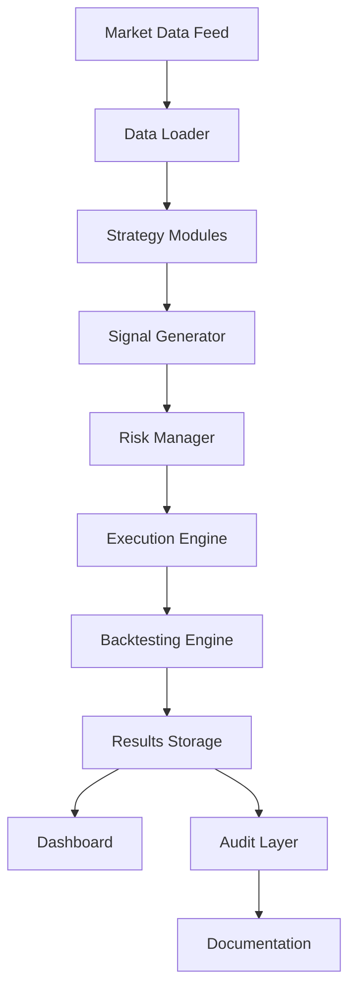

# System Overview - AlgoTrading Platform

## Architecture



## Components

### 1. Backtesting Engine (`app/backtesting/engine.py`)

**Purpose**: Simulate historical trading strategies

**Key Functions**:

- `run_backtest()`: Executes complete backtest simulation
- `_execute_buy_signal()`: Processes buy orders
- `_execute_sell_signal()`: Processes sell orders
- `_build_trade_reason()`: Extracts decision rationale

**Dependencies**:

- `pydantic`: Model validation
- `decimal`: Financial calculations
- `datetime`: Timestamp handling

**Storage**:

- Local: `/data/results/`
- AWS: `s3://algo-trading-docs/{run_id}/`

### 2. Dashboard (`app/dashboard/main.py`)

**Purpose**: Interactive visualization and module comparison

**Features**:

- Module selector (Momentum, Mean Reversion, Technical Analysis)
- Configuration presets (Conservative, Moderate, Aggressive)
- Real-time backtest execution
- Equity curve visualization
- Trade log with decision reasons
- Multi-configuration comparison
- Export (JSON/CSV)

**Technology**: Streamlit, Plotly, Pandas

### 3. Storage Layer

**Local Structure**:

```
/docs
  /BACKTEST_RESULTS
    /momentum
      - config_moderate_report.md
      - trade_log_moderate.csv
      - metrics_moderate.json
      - equity_curve_moderate.png
```

**Naming Convention**: `{module}_{config}_{timestamp}.{ext}`

**AWS Synchronization**:

- Auto-sync on completion
- S3 bucket: `s3://algo-trading-docs/`
- Path: `{run_id}/{module}/{config}/`

### 4. Audit Layer

**Components**:

- SHA256 hashing of code files
- Commit tracking (git rev-parse HEAD)
- Dependency versioning (requirements.txt)
- Execution logs with timestamps
- Integrity verification

**Files**:

- `system_audit.md`: System-wide audit report
- `integrity_checks.json`: Hash verification results
- `reproducibility_tests.md`: Reproduction instructions

## Version Control

**Current Status**:

```bash
git rev-parse HEAD  # Returns current commit SHA
```

**Key Files**:

- `requirements.txt`: Dependency versions
- `.git/config`: Repository configuration
- `app/backtesting/`: Core backtesting logic

**Tracking**:

- Every backtest records:
  - Commit SHA
  - Git branch
  - Execution timestamp
  - Environment (local/AWS)
  - Python version

## Data Flow

### Execution Flow

1. **User Input** (Dashboard)

   - Select module
   - Select configuration
   - Set symbol, dates, capital

2. **Data Loading**

   - Load historical data from CSV
   - Format: `data/historical/{SYMBOL}.csv`
   - Columns: timestamp, open, high, low, close, volume

3. **Signal Generation**

   - Strategy module generates signals
   - Each signal includes:
     - Type (BUY/SELL/HOLD)
     - Strength
     - Confidence
     - Metadata (reason)

4. **Backtest Execution**

   - Execute signals with slippage/commission
   - Track positions and equity
   - Record all trades with reasons

5. **Results Storage**

   - Save metrics
   - Save equity curve
   - Save trade log
   - Generate audit trail

6. **Visualization**
   - Display metrics cards
   - Plot equity curve
   - Show trade log table
   - Enable export

### Audit Flow

1. **Pre-Execution**

   - Record system state
   - Hash critical files
   - Note dependencies

2. **During Execution**

   - Log parameter values
   - Track data lineage
   - Monitor performance

3. **Post-Execution**
   - Generate hashes of results
   - Create audit report
   - Verify integrity
   - Store artifacts

## Integration Points

### Local → AWS Migration

**Current**: All storage local in `/docs/`

**Future**: Automatic S3 sync on execution complete

**Code Path**:

```python
# Detect environment
import os
is_aws = os.getenv("AWS_EXECUTION_ENV")

if is_aws:
    upload_to_s3(results)
else:
    save_to_docs(results)
```

### Reproducibility

**Key Elements**:

- Exact parameter values
- Random seeds (if applicable)
- Data source and version
- Code version (commit SHA)
- Environment details

**Verification**:

- Compare result hashes
- Re-run with same inputs
- Validate outputs match

## Security & Integrity

**Hashing**:

- SHA256 of all code files
- SHA256 of result files
- Verification on load

**Access Control**:

- Local: File system permissions
- AWS: IAM roles and policies

**Audit Trail**:

- Who executed (user/system)
- When executed (timestamp)
- What was executed (parameters)
- Results (hashes)

## Future Enhancements

1. Live trading module integration
2. Real-time data feeds
3. Advanced risk analytics
4. ML model integration
5. Portfolio optimization
