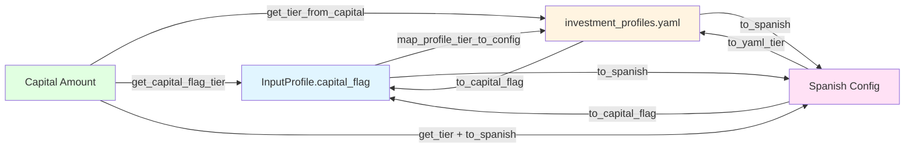

# Tier Mapping Architecture

## Overview

The algorithmic trading system uses **three different tier classification systems** that evolved independently for different purposes. The `TierMapper` module (`/app/core/tier_mapper.py`) provides a unified interface for converting between these systems, ensuring consistency across the codebase.

### Why Three Tier Systems Exist

Each tier system serves a specific purpose in the system architecture:

1. **InputProfile.capital_flag** (3 tiers, English)
   - Used for user input validation and account classification
   - Simple, business-friendly naming (small, medium, large)
   - Direct property of `InputProfile` model
   - Used for quick gating and feature enablement decisions

2. **investment_profiles.yaml** (4 tiers, English)
   - Used for strategy parameter configuration
   - More granular with a dedicated "micro" tier for very small accounts
   - Supports capital-based parameter selection
   - Used by `ProfileGenerator` and `ProfileConfigLoader`

3. **Config Spanish Tiers** (3 tiers, Spanish)
   - Used in Spanish residency configuration and tax contexts
   - Aligns with Spanish financial terminology (bajo, medio, alto)
   - Used in `spain_residency_config.yaml` for tax brackets and allocation profiles

### The Problem

Without unified mapping, developers must manually convert between tier systems, leading to:

- **Inconsistency bugs**: "small" in one context meaning something different in another
- **Maintenance burden**: Changes to thresholds require updates in multiple places
- **Confusion**: New contributors don't understand which tier system to use where
- **Mapping errors**: Incorrect conversions causing wrong parameter selection

### The Solution

The `TierMapper` class provides:

- **Centralized mapping**: Single source of truth for all tier conversions
- **Auto-detection**: Automatically detects source tier system
- **Validation**: Ensures tier names are valid before conversion
- **Capital-based calculation**: Determines tier from capital amount
- **Consistency checking**: Validates mappings are bidirectional and conflict-free

## Tier Systems Explained

### System 1: InputProfile.capital_flag

**Location**: `/app/core/models/input_profile.py`

**Purpose**: User-facing account classification for gating and validation

**Tiers**:
- `small`: Capital < €50,000
- `medium`: Capital €50,000 - €250,000
- `large`: Capital >= €250,000

**Example**:
```python
from app.core.models.input_profile import InputProfile

profile = InputProfile(
    capital_initial=100000,
    objetivo_inversion="maximizar_capital",
    risk_tolerance="medio",
    investment_horizon=12
)

print(profile.capital_flag)  # "medium"
```

**Used By**:
- `ExpensiveModuleGate`: Decides which modules to enable
- `DeploymentDecisionOrchestrator`: Determines deployment complexity
- `ValidationEngine`: Sets validation strictness
- Feature flags and gating logic

### System 2: investment_profiles.yaml

**Location**: `/config/investment_profiles.yaml`

**Purpose**: Strategy parameter selection by capital and objective

**Tiers**:
- `micro`: Capital < €15,000
- `small`: Capital €15,000 - €50,000
- `medium`: Capital €50,000 - €250,000
- `large`: Capital >= €250,000

**Example Structure**:
```yaml
profiles:
  maximizar_capital:
    micro:
      risk_profile: 2
      leverage: 0
      enabled_modules:
        - momentum_modular
    small:
      risk_profile: 3
      leverage: 0.5
      enabled_modules:
        - momentum_modular
        - mean_reversion_modular
```

**Used By**:
- `ProfileGenerator`: Loads strategy parameters
- `ProfileConfigLoader`: Applies tier-specific overrides
- `ModuleParametrizer`: Configures module parameters
- `PortfolioConstructor`: Sets position sizing limits

### System 3: Config Spanish Tiers

**Location**: `/config/spain_residency_config.yaml`

**Purpose**: Spanish tax residency and allocation configuration

**Tiers**:
- `bajo`: Low capital (< €50,000 equivalent)
- `medio`: Medium capital (€50,000 - €250,000)
- `alto`: High capital (>= €250,000)

**Example Context**:
```yaml
optimized_allocation:
  default:  # Perfil medio
    europe_stocks: 0.40
    spain_stocks: 0.15
    us_stocks: 0.25

  conservative:  # Perfil bajo
    europe_stocks: 0.35
    spain_dividends: 0.25
    bonds: 0.15

  aggressive:  # Perfil alto
    europe_growth: 0.25
    us_tech: 0.30
    crypto: 0.20
```

**Used By**:
- Tax calculations and withholding logic
- Spanish residency configuration
- Allocation optimization for EU investors
- Currency hedging decisions

## Visual Mapping Diagram

### Capital Range Mappings

```
Capital Amount (EUR)
    │
    │  < €15k    €15k-€50k   €50k-€250k   >= €250k
    │    │          │           │            │
    │    │          │           │            │
    ├────┼──────────┼───────────┼────────────┤
    │    │          │           │            │
    │    │          │           │            │
YAML Tier    micro      small       medium      large
    │    │          │           │            │
    │    │          │           │            │
Capital Flag   small      small       medium      large
    │    │          │           │            │
    │    │          │           │            │
Spanish Tier   bajo       bajo        medio       alto
    │    │          │           │            │
    └────┴──────────┴───────────┴────────────┘
```

### System Conversion Flow



## API Reference

### TierMapper Class

Main class for tier mapping operations.

#### Class Methods

##### `get_tier_from_capital(capital: Decimal) -> str`

Determine tier from capital amount using 4-tier YAML system.

**Parameters**:
- `capital`: Capital amount in EUR (Decimal)

**Returns**: Tier name ("micro", "small", "medium", or "large")

**Example**:
```python
from decimal import Decimal
from app.core.tier_mapper import TierMapper

tier = TierMapper.get_tier_from_capital(Decimal("30000"))
print(tier)  # "small"

tier = TierMapper.get_tier_from_capital(Decimal("100000"))
print(tier)  # "medium"
```

##### `get_capital_flag_tier(capital: Decimal) -> str`

Determine tier using InputProfile.capital_flag logic (3-tier system).

**Parameters**:
- `capital`: Capital amount in EUR (Decimal)

**Returns**: Tier name ("small", "medium", or "large")

**Example**:
```python
tier = TierMapper.get_capital_flag_tier(Decimal("30000"))
print(tier)  # "small" (caps <€50k all map to small)
```

##### `to_yaml_tier(tier: str, source_system: Optional[TierSystem] = None) -> str`

Convert tier to YAML format (4-tier system).

**Parameters**:
- `tier`: Tier name in any supported system
- `source_system`: Optional source system (auto-detected if None)

**Returns**: Tier name in YAML format

**Raises**: `ValueError` if tier is invalid

**Example**:
```python
# From Spanish
yaml_tier = TierMapper.to_yaml_tier("bajo")
print(yaml_tier)  # "small"

# From capital_flag
yaml_tier = TierMapper.to_yaml_tier("medium")
print(yaml_tier)  # "medium"
```

##### `to_spanish(tier: str, source_system: Optional[TierSystem] = None) -> str`

Convert tier to Spanish format (3-tier system).

**Parameters**:
- `tier`: Tier name in any supported system
- `source_system`: Optional source system (auto-detected if None)

**Returns**: Tier name in Spanish format

**Raises**: `ValueError` if tier is invalid

**Example**:
```python
# From YAML
spanish = TierMapper.to_spanish("micro")
print(spanish)  # "bajo"

spanish = TierMapper.to_spanish("large")
print(spanish)  # "alto"
```

##### `to_capital_flag(tier: str, source_system: Optional[TierSystem] = None) -> str`

Convert tier to capital_flag format (3-tier system).

**Parameters**:
- `tier`: Tier name in any supported system
- `source_system`: Optional source system (auto-detected if None)

**Returns**: Tier name in capital_flag format

**Example**:
```python
# From YAML
flag = TierMapper.to_capital_flag("micro")
print(flag)  # "small"

# From Spanish
flag = TierMapper.to_capital_flag("medio")
print(flag)  # "medium"
```

##### `detect_system(tier: str) -> TierSystem`

Detect which tier system a tier name belongs to.

**Parameters**:
- `tier`: Tier name to detect

**Returns**: Detected `TierSystem` enum

**Raises**: `ValueError` if tier is not recognized

**Example**:
```python
from app.core.tier_mapper import TierSystem

system = TierMapper.detect_system("bajo")
print(system)  # TierSystem.SPANISH

system = TierMapper.detect_system("micro")
print(system)  # TierSystem.YAML
```

##### `is_valid_tier(tier: str, system: Optional[TierSystem] = None) -> bool`

Check if a tier name is valid.

**Parameters**:
- `tier`: Tier name to validate
- `system`: Optional specific system to check against

**Returns**: True if tier is valid

**Example**:
```python
TierMapper.is_valid_tier("bajo")  # True
TierMapper.is_valid_tier("invalid")  # False
TierMapper.is_valid_tier("small", TierSystem.YAML)  # True
```

##### `validate_consistency() -> Tuple[bool, list[str]]`

Validate tier mapping consistency across all systems.

**Returns**: Tuple of (is_valid, list_of_warnings)

**Example**:
```python
is_valid, warnings = TierMapper.validate_consistency()
if not is_valid:
    for warning in warnings:
        print(warning)
```

### Convenience Functions

Top-level functions for common operations.

#### `get_tier(capital: Decimal, system: TierSystem = TierSystem.YAML) -> str`

Get tier from capital amount for a specific system.

**Parameters**:
- `capital`: Capital amount in EUR
- `system`: Target tier system (default: YAML)

**Returns**: Tier name in the requested system

**Example**:
```python
from decimal import Decimal
from app.core.tier_mapper import get_tier, TierSystem

# Get YAML tier
tier = get_tier(Decimal("30000"))
print(tier)  # "small"

# Get Spanish tier
tier = get_tier(Decimal("30000"), TierSystem.SPANISH)
print(tier)  # "bajo"
```

#### `normalize_tier(tier: str, target_system: TierSystem = TierSystem.YAML) -> str`

Normalize a tier name to a specific system.

Auto-detects the source system and converts to target system.

**Parameters**:
- `tier`: Tier name in any supported system
- `target_system`: Target tier system (default: YAML)

**Returns**: Normalized tier name

**Example**:
```python
from app.core.tier_mapper import normalize_tier, TierSystem

# Convert to YAML
normalized = normalize_tier("bajo")
print(normalized)  # "small"

# Convert to Spanish
normalized = normalize_tier("small", TierSystem.SPANISH)
print(normalized)  # "bajo"
```

#### `map_profile_tier_to_config(capital_flag: str, target_format: str = "yaml") -> str`

Map from InputProfile.capital_flag to config tier format.

This is the primary function to use when converting from `InputProfile.capital_flag` to config lookups.

**Parameters**:
- `capital_flag`: Value from `InputProfile.capital_flag` property
- `target_format`: Target format ("yaml" or "spanish")

**Returns**: Tier name in target format

**Example**:
```python
from app.core.models.input_profile import InputProfile
from app.core.tier_mapper import map_profile_tier_to_config

profile = InputProfile(
    capital_initial=100000,
    objetivo_inversion="maximizar_capital",
    risk_tolerance="medio",
    investment_horizon=12
)

# Convert to YAML tier for config lookup
yaml_tier = map_profile_tier_to_config(profile.capital_flag, "yaml")
print(yaml_tier)  # "medium"

# Convert to Spanish tier
spanish_tier = map_profile_tier_to_config(profile.capital_flag, "spanish")
print(spanish_tier)  # "medio"
```

#### `validate_tier_mapping() -> Tuple[bool, list[str]]`

Validate tier mapping consistency and log warnings.

Convenience wrapper around `TierMapper.validate_consistency()` that also logs results.

**Returns**: Tuple of (is_valid, list_of_warnings)

**Example**:
```python
from app.core.tier_mapper import validate_tier_mapping

is_valid, warnings = validate_tier_mapping()
if not is_valid:
    print("Mapping issues found:")
    for warning in warnings:
        print(f"  - {warning}")
```

### Enums

#### `TierSystem`

Enum representing different tier naming systems.

**Values**:
- `CAPITAL_FLAG`: InputProfile.capital_flag system (small, medium, large)
- `YAML`: investment_profiles.yaml system (micro, small, medium, large)
- `SPANISH`: Spanish config system (bajo, medio, alto)
- `STANDARD`: Internal standard (micro, small, medium, large)

**Example**:
```python
from app.core.tier_mapper import TierSystem

system = TierSystem.YAML
print(system.value)  # "yaml"
```

## Integration Points

### Where Each Tier System Is Used

#### InputProfile.capital_flag (3-tier, English)

**Primary Use Cases**:

1. **Module Gating** (`app/services/expensive_module_gate.py`)
   ```python
   if profile.capital_flag == "small":
       # Disable expensive modules like DeepLearningEngine
       enabled_modules = [m for m in modules if m not in EXPENSIVE_MODULES]
   ```

2. **Deployment Decisions** (`app/services/deployment_decision_orchestrator.py`)
   ```python
   if profile.capital_flag == "large":
       # Enable advanced deployment features
       enable_multi_market_trading()
       enable_advanced_risk_management()
   ```

3. **Validation Strictness** (`app/services/validation_engine/`)
   ```python
   if profile.capital_flag == "small":
       validation_tolerance = TOLERANCE_LOOSE
   else:
       validation_tolerance = TOLERANCE_STRICT
   ```

4. **Feature Flags**
   ```python
   if profile.capital_flag == "large":
       enable_ml_ensemble = True
   ```

#### investment_profiles.yaml (4-tier, English)

**Primary Use Cases**:

1. **Profile Generation** (`app/services/profile_generator/profile_generator.py`)
   ```python
   # Load tier-specific strategy parameters
   tier = TierMapper.get_tier_from_capital(profile.capital_initial)
   params = self.profile_templates[objective][tier]

   # Apply configuration
   leverage = params["leverage"]
   enabled_modules = params["enabled_modules"]
   ```

2. **Module Parametrization** (`app/services/module_parametrizer/`)
   ```python
   # Get tier-specific module parameters
   tier = get_tier(capital, TierSystem.YAML)
   module_params = config_loader.get_module_params(module_name, tier)
   ```

3. **Portfolio Construction** (`app/services/portfolio_constructor/`)
   ```python
   # Determine position sizing by tier
   tier = get_tier_from_capital(capital)
   max_position_size = config["profiles"][objective][tier]["max_position_size"]
   ```

4. **Backtesting Configuration** (`app/backtesting/`)
   ```python
   # Apply tier-specific backtesting parameters
   tier = get_tier(capital)
   config = load_backtest_config(objective, tier)
   ```

#### Spanish Config Tiers (3-tier, Spanish)

**Primary Use Cases**:

1. **Tax Configuration** (`config/spain_residency_config.yaml`)
   ```python
   # Apply allocation by risk profile
   if risk_profile == "bajo":
       allocation = config["optimized_allocation"]["conservative"]
   elif risk_profile == "medio":
       allocation = config["optimized_allocation"]["default"]
   elif risk_profile == "alto":
       allocation = config["optimized_allocation"]["aggressive"]
   ```

2. **Currency Hedging** (`app/services/forex_risk/hedging_engine.py`)
   ```python
   # Determine hedging requirements
   spanish_tier = to_spanish(capital_flag)
   if spanish_tier == "alto":
       # Apply full hedging for large accounts
       enable_currency_hedging(threshold=0.15)
   ```

3. **Spanish Tax Engine** (`app/services/tax_efficiency/engines/spain_tax_engine.py`)
   ```python
   # Map capital to tax bracket
   spanish_tier = to_spanish(yaml_tier)
   tax_params = spain_config["tax_rates"][spanish_tier]
   ```

### How to Convert Between Systems

#### From InputProfile to YAML Config

When you have an `InputProfile` and need to look up parameters in `investment_profiles.yaml`:

```python
from app.core.models.input_profile import InputProfile
from app.core.tier_mapper import map_profile_tier_to_config, TierSystem

# Get profile from user input
profile = InputProfile(
    capital_initial=75000,
    objetivo_inversion="maximizar_capital",
    risk_tolerance="medio",
    investment_horizon=24
)

# Convert to YAML tier for config lookup
yaml_tier = map_profile_tier_to_config(profile.capital_flag, "yaml")
print(yaml_tier)  # "medium"

# Use in config lookup
import yaml
with open("config/investment_profiles.yaml") as f:
    config = yaml.safe_load(f)
    params = config["profiles"][profile.objetivo_inversion][yaml_tier]
```

#### From YAML to Spanish Config

When you have a YAML tier and need Spanish config values:

```python
from app.core.tier_mapper import to_spanish

# Convert from YAML tier
yaml_tier = "medium"  # From investment_profiles.yaml
spanish_tier = to_spanish(yaml_tier)
print(spanish_tier)  # "medio"

# Use in Spanish config lookup
import yaml
with open("config/spain_residency_config.yaml") as f:
    config = yaml.safe_load(f)
    allocation = config["optimized_allocation"][spanish_tier]
```

#### From Capital Amount to Any System

When starting with a capital amount:

```python
from decimal import Decimal
from app.core.tier_mapper import get_tier, TierSystem

capital = Decimal("100000")

# Get tier in any system
yaml_tier = get_tier(capital, TierSystem.YAML)        # "medium"
spanish_tier = get_tier(capital, TierSystem.SPANISH)   # "medio"
capital_flag = get_tier(capital, TierSystem.CAPITAL_FLAG)  # "medium"
```

### Best Practices

#### 1. Always Use TierMapper for Conversions

**Don't**:
```python
# Hardcoded mapping (bad practice)
if capital_flag == "small":
    yaml_tier = "small"  # What about micro?
```

**Do**:
```python
# Use TierMapper (good practice)
from app.core.tier_mapper import to_yaml_tier
yaml_tier = to_yaml_tier(capital_flag, TierSystem.CAPITAL_FLAG)
```

#### 2. Validate Tier Names

**Don't**:
```python
# Assume tier is valid
config["profiles"][objective][tier]  # Could fail with KeyError
```

**Do**:
```python
# Validate before use
from app.core.tier_mapper import TierMapper

if not TierMapper.is_valid_tier(tier, TierSystem.YAML):
    raise ValueError(f"Invalid tier: {tier}")
```

#### 3. Use System-Specific Constants

**Don't**:
```python
# Magic strings
tier = "medium"
```

**Do**:
```python
# Use enums for clarity
from app.core.tier_mapper import TierSystem, get_tier

tier = get_tier(capital, TierSystem.YAML)
```

#### 4. Handle the "Micro" Tier Gracefully

**Don't**:
```python
# Assume 3-tier system
if capital < 50000:
    tier = "small"  # Misses micro tier distinction
```

**Do**:
```python
# Use 4-tier system when needed
from app.core.tier_mapper import get_tier, TierSystem

# Get proper 4-tier classification
yaml_tier = get_tier(capital, TierSystem.YAML)  # Returns "micro" if <€15k

# Convert to 3-tier if needed
capital_flag = to_capital_flag(yaml_tier)  # "micro" -> "small"
```

#### 5. Log Tier Conversions for Debugging

```python
import logging
from app.core.tier_mapper import normalize_tier, TierSystem

logger = logging.getLogger(__name__)

original_tier = "bajo"
target_system = TierSystem.YAML

converted = normalize_tier(original_tier, target_system)
logger.debug(
    f"Converted tier: {original_tier} -> {converted} "
    f"(system: {target_system.value})"
)
```

## Migration Guide

### Adding New Tier Systems

If you need to add a new tier system (e.g., for a new market or regulation):

#### Step 1: Define the New System

Add to `TierSystem` enum in `/app/core/tier_mapper.py`:

```python
class TierSystem(str, Enum):
    CAPITAL_FLAG = "capital_flag"
    YAML = "yaml"
    SPANISH = "spanish"
    STANDARD = "standard"
    # Add new system
    NEW_SYSTEM = "new_system"  # e.g., "german" for German tax tiers
```

#### Step 2: Define Valid Tiers

Add to `VALID_TIERS` dictionary:

```python
class TierMapper:
    VALID_TIERS: Dict[TierSystem, Tuple[str, ...]] = {
        TierSystem.CAPITAL_FLAG: ("small", "medium", "large"),
        TierSystem.YAML: ("micro", "small", "medium", "large"),
        TierSystem.SPANISH: ("bajo", "medio", "alto"),
        TierSystem.STANDARD: ("micro", "small", "medium", "large"),
        # Add new tiers
        TierSystem.NEW_SYSTEM: ("low", "medium", "high", "very_high"),
    }
```

#### Step 3: Define Mapping Dictionaries

Add bidirectional mappings between new system and existing systems:

```python
class TierMapper:
    # Mapping from new system to YAML
    NEW_SYSTEM_TO_YAML: Dict[str, str] = {
        "low": "micro",
        "medium": "small",
        "high": "medium",
        "very_high": "large",
    }

    # Mapping from YAML to new system
    YAML_TO_NEW_SYSTEM: Dict[str, str] = {
        "micro": "low",
        "small": "medium",
        "medium": "high",
        "large": "very_high",
    }
```

#### Step 4: Add Conversion Methods

Add conversion methods to `TierMapper` class:

```python
@classmethod
def to_new_system(cls, tier: str, source_system: Optional[TierSystem] = None) -> str:
    """
    Convert tier to new system format.

    Args:
        tier: Tier name in any supported system
        source_system: Optional source system (auto-detected if None)

    Returns:
        Tier name in new system format

    Raises:
        ValueError: If tier is invalid or conversion not possible
    """
    if source_system is None:
        source_system = cls.detect_system(tier)

    if source_system == TierSystem.NEW_SYSTEM:
        return tier

    # Convert via YAML
    yaml_tier = cls.to_yaml_tier(tier, source_system)
    return cls.YAML_TO_NEW_SYSTEM.get(yaml_tier, tier)

@classmethod
def from_new_system(cls, tier: str, target_system: TierSystem) -> str:
    """
    Convert from new system to target system.

    Args:
        tier: Tier name in new system
        target_system: Target tier system

    Returns:
        Tier name in target system
    """
    yaml_tier = cls.NEW_SYSTEM_TO_YAML.get(tier, tier)

    if target_system == TierSystem.YAML:
        return yaml_tier
    elif target_system == TierSystem.SPANISH:
        return cls.to_spanish(yaml_tier, TierSystem.YAML)
    elif target_system == TierSystem.CAPITAL_FLAG:
        return cls.to_capital_flag(yaml_tier, TierSystem.YAML)
    else:
        return tier
```

#### Step 5: Update Validation

Add consistency checks in `validate_consistency`:

```python
@classmethod
def validate_consistency(cls) -> Tuple[bool, list[str]]:
    warnings = []

    # Existing checks...

    # Check new system mappings
    for new_tier, yaml_tier in cls.NEW_SYSTEM_TO_YAML.items():
        if cls.YAML_TO_NEW_SYSTEM.get(yaml_tier) != new_tier:
            warnings.append(
                f"New system mapping inconsistency: "
                f"{new_tier} -> {yaml_tier} but "
                f"{yaml_tier} -> {cls.YAML_TO_NEW_SYSTEM.get(yaml_tier)}"
            )

    is_valid = len(warnings) == 0
    return is_valid, warnings
```

#### Step 6: Add Convenience Function

Add a top-level convenience function:

```python
def map_to_new_system(tier: str) -> str:
    """
    Map tier from any system to new system.

    Args:
        tier: Tier name in any supported system

    Returns:
        Tier name in new system
    """
    return TierMapper.to_new_system(tier)
```

#### Step 7: Update Tests

Add comprehensive tests for the new system:

```python
# tests/unit/core/test_tier_mapper.py

def test_new_system_conversion():
    """Test conversion to/from new system."""
    # Test to new system
    assert TierMapper.to_new_system("micro") == "low"
    assert TierMapper.to_new_system("small") == "medium"

    # Test from new system
    assert TierMapper.from_new_system("low", TierSystem.YAML) == "micro"
    assert TierMapper.from_new_system("medium", TierSystem.SPANISH) == "bajo"

    # Test auto-detection
    system = TierMapper.detect_system("low")
    assert system == TierSystem.NEW_SYSTEM
```

#### Step 8: Update Documentation

Update this document with:
- New tier system description
- Mapping diagrams
- Usage examples
- Integration points

### Updating Existing Mappings

If tier thresholds or mappings need to change:

#### Step 1: Update Thresholds

Modify `THRESHOLDS` in `TierMapper`:

```python
class TierMapper:
    THRESHOLDS = {
        "micro": Decimal("20000"),    # Changed from €15k to €20k
        "small": Decimal("60000"),    # Changed from €50k to €60k
        "medium": Decimal("300000"),  # Changed from €250k to €300k
    }
```

#### Step 2: Update Mapping Tables

If mappings between systems change:

```python
class TierMapper:
    YAML_TO_SPANISH: Dict[str, str] = {
        "micro": "bajo",
        "small": "bajo",
        "medium": "medio",
        "large": "alto",
        # Updated mapping
        "mega": "muy_alto",  # New tier
    }
```

#### Step 3: Run Validation

Always run validation after changes:

```python
from app.core.tier_mapper import validate_tier_mapping

is_valid, warnings = validate_tier_mapping()
if not is_valid:
    print("WARNING: Tier mapping issues detected:")
    for warning in warnings:
        print(f"  - {warning}")
```

#### Step 4: Check Impact

Search codebase for usage of affected tiers:

```bash
# Find all uses of tier mappings
grep -r "capital_flag" app/
grep -r "micro.*small.*medium" app/
grep -r "bajo.*medio.*alto" app/
```

#### Step 5: Update Tests

Ensure all tests pass with new mappings:

```bash
pytest tests/unit/core/test_tier_mapper.py -v
```

## Complete Usage Examples

### Example 1: End-to-End Profile Processing

```python
from decimal import Decimal
from app.core.models.input_profile import InputProfile, InputProcessor
from app.core.tier_mapper import (
    get_tier,
    map_profile_tier_to_config,
    TierSystem,
)
from app.services.profile_generator import ProfileGenerator

# 1. Process user input
processor = InputProcessor()
profile = processor.process_input({
    "capital_initial": 75000,
    "objetivo_inversion": "maximizar_capital",
    "risk_tolerance": "medio",
    "investment_horizon": 24,
})

print(f"Capital flag: {profile.capital_flag}")  # "medium"

# 2. Convert to YAML tier for profile generation
yaml_tier = map_profile_tier_to_config(profile.capital_flag, "yaml")
print(f"YAML tier: {yaml_tier}")  # "medium"

# 3. Generate investment profile
generator = ProfileGenerator()
investment_profile = generator.generate_profile(
    capital=profile.capital_initial,
    objective=profile.objetivo_inversion,
    tier=yaml_tier,
)

print(f"Leverage: {investment_profile.leverage}")  # 1.5
print(f"Modules: {investment_profile.enabled_modules}")
# ['momentum_modular', 'mean_reversion_modular', 'pairs_trading_modular', ...]

# 4. Convert to Spanish for tax configuration
spanish_tier = map_profile_tier_to_config(profile.capital_flag, "spanish")
print(f"Spanish tier: {spanish_tier}")  # "medio"

# 5. Load Spanish allocation config
import yaml
with open("config/spain_residency_config.yaml") as f:
    spain_config = yaml.safe_load(f)
    allocation = spain_config["optimized_allocation"][spanish_tier]
    print(f"Allocation: {allocation}")
```

### Example 2: Cross-System Tier Detection

```python
from app.core.tier_mapper import TierMapper, TierSystem, normalize_tier

# Various tier names from different contexts
tier_names = ["small", "micro", "bajo", "medium", "medio", "large", "alto"]

for tier in tier_names:
    # Detect which system it belongs to
    system = TierMapper.detect_system(tier)
    print(f"{tier:10s} -> {system.value}")

    # Normalize all to YAML system
    normalized = normalize_tier(tier, TierSystem.YAML)
    print(f"  Normalized to YAML: {normalized}")

    # Normalize all to Spanish system
    spanish = normalize_tier(tier, TierSystem.SPANISH)
    print(f"  Normalized to Spanish: {spanish}")
```

**Output**:
```
small      -> capital_flag
  Normalized to YAML: small
  Normalized to Spanish: bajo
micro      -> yaml
  Normalized to YAML: micro
  Normalized to Spanish: bajo
bajo       -> spanish
  Normalized to YAML: small
  Normalized to Spanish: bajo
medium     -> capital_flag
  Normalized to YAML: medium
  Normalized to Spanish: medio
medio      -> spanish
  Normalized to YAML: medium
  Normalized to Spanish: medio
large      -> capital_flag
  Normalized to YAML: large
  Normalized to Spanish: alto
alto       -> spanish
  Normalized to YAML: large
  Normalized to Spanish: alto
```

### Example 3: Capital-Based Tier Determination

```python
from decimal import Decimal
from app.core.tier_mapper import TierMapper, get_tier, TierSystem

# Test various capital amounts
capitals = [
    Decimal("10000"),   # €10k
    Decimal("30000"),   # €30k
    Decimal("75000"),   # €75k
    Decimal("300000"),  # €300k
]

print("Capital Amount (EUR) | YAML Tier | Capital Flag | Spanish Tier")
print("-" * 65)

for capital in capitals:
    yaml_tier = get_tier(capital, TierSystem.YAML)
    capital_flag = get_tier(capital, TierSystem.CAPITAL_FLAG)
    spanish_tier = get_tier(capital, TierSystem.SPANISH)

    print(f"€{str(capital):>18,} | {yaml_tier:9s} | {capital_flag:13s} | {spanish_tier:12s}")
```

**Output**:
```
Capital Amount (EUR) | YAML Tier | Capital Flag | Spanish Tier
─────────────────────────────────────────────────────────────────────────
€            10,000 | micro     | small        | bajo
€            30,000 | small     | small        | bajo
€            75,000 | medium    | medium       | medio
€           300,000 | large     | large        | alto
```

### Example 4: Validation and Error Handling

```python
from app.core.tier_mapper import TierMapper, normalize_tier, TierSystem

# Validate tier names
valid_tiers = ["small", "medium", "large", "micro", "bajo", "medio", "alto"]
invalid_tiers = ["tiny", "huge", "pequeño", "grand"]

print("Valid tiers:")
for tier in valid_tiers:
    is_valid = TierMapper.is_valid_tier(tier)
    system = TierMapper.detect_system(tier) if is_valid else None
    print(f"  {tier:10s}: {is_valid} (system: {system.value if system else 'N/A'})")

print("\nInvalid tiers:")
for tier in invalid_tiers:
    is_valid = TierMapper.is_valid_tier(tier)
    print(f"  {tier:10s}: {is_valid}")

# Handle conversion errors
try:
    result = normalize_tier("invalid_tier", TierSystem.YAML)
except ValueError as e:
    print(f"\nConversion error: {e}")
```

### Example 5: Consistency Checking

```python
from app.core.tier_mapper import TierMapper, validate_tier_mapping

# Check mapping consistency
is_valid, warnings = TierMapper.validate_consistency()

if is_valid:
    print("✅ All tier mappings are consistent")
else:
    print("⚠️  Tier mapping issues detected:")
    for warning in warnings:
        print(f"  - {warning}")

# Check with logging
print("\nRunning validation with logging:")
validate_tier_mapping()
```

### Example 6: Module Gating Based on Tier

```python
from decimal import Decimal
from app.core.tier_mapper import get_tier, TierSystem
from app.services.expensive_module_gate import ExpensiveModuleGate

# Determine which modules to enable based on capital
capital = Decimal("75000")
yaml_tier = get_tier(capital, TierSystem.YAML)

print(f"Capital: €{capital:,}")
print(f"Tier: {yaml_tier}")

# Check module eligibility
all_modules = [
    "momentum_modular",
    "mean_reversion_modular",
    "deep_learning_engine",
    "transformer_engine",
    "reinforcement_learning_engine",
]

gate = ExpensiveModuleGate()
enabled_modules = []
disabled_modules = []

for module in all_modules:
    if gate.is_module_enabled(module, capital):
        enabled_modules.append(module)
    else:
        disabled_modules.append(module)

print("\nEnabled modules:")
for module in enabled_modules:
    print(f"  ✅ {module}")

print("\nDisabled modules (too expensive for this capital level):")
for module in disabled_modules:
    print(f"  ❌ {module}")
```

## Testing

### Unit Tests

Location: `/tests/unit/core/test_tier_mapper.py`

```python
import pytest
from decimal import Decimal
from app.core.tier_mapper import (
    TierMapper,
    TierSystem,
    get_tier,
    normalize_tier,
    map_profile_tier_to_config,
)

class TestTierMapper:
    """Test tier mapping functionality."""

    def test_get_tier_from_capital(self):
        """Test tier determination from capital amount."""
        assert TierMapper.get_tier_from_capital(Decimal("10000")) == "micro"
        assert TierMapper.get_tier_from_capital(Decimal("30000")) == "small"
        assert TierMapper.get_tier_from_capital(Decimal("100000")) == "medium"
        assert TierMapper.get_tier_from_capital(Decimal("500000")) == "large"

    def test_to_yaml_tier(self):
        """Test conversion to YAML tier format."""
        assert TierMapper.to_yaml_tier("small") == "small"
        assert TierMapper.to_yaml_tier("bajo") == "small"
        assert TierMapper.to_yaml_tier("medium") == "medium"

    def test_to_spanish(self):
        """Test conversion to Spanish tier format."""
        assert TierMapper.to_spanish("micro") == "bajo"
        assert TierMapper.to_spanish("small") == "bajo"
        assert TierMapper.to_spanish("medium") == "medio"
        assert TierMapper.to_spanish("large") == "alto"

    def test_detect_system(self):
        """Test tier system detection."""
        assert TierMapper.detect_system("bajo") == TierSystem.SPANISH
        assert TierMapper.detect_system("micro") == TierSystem.YAML
        assert TierMapper.detect_system("small") == TierSystem.CAPITAL_FLAG

    def test_is_valid_tier(self):
        """Test tier validation."""
        assert TierMapper.is_valid_tier("bajo") is True
        assert TierMapper.is_valid_tier("invalid") is False

    def test_validate_consistency(self):
        """Test mapping consistency validation."""
        is_valid, warnings = TierMapper.validate_consistency()
        assert is_valid is True
        assert len(warnings) == 0

    def test_normalize_tier(self):
        """Test tier normalization."""
        assert normalize_tier("bajo") == "small"
        assert normalize_tier("small", TierSystem.SPANISH) == "bajo"

    def test_map_profile_tier_to_config(self):
        """Test profile tier to config mapping."""
        assert map_profile_tier_to_config("small", "spanish") == "bajo"
        assert map_profile_tier_to_config("medium", "yaml") == "medium"
        assert map_profile_tier_to_config("large", "spanish") == "alto"
```

### Integration Tests

Location: `/tests/integration/test_tier_mapping_integration.py`

```python
import pytest
from decimal import Decimal
from app.core.models.input_profile import InputProfile
from app.core.tier_mapper import (
    get_tier,
    map_profile_tier_to_config,
    TierSystem,
)
from app.services.profile_generator import ProfileGenerator

class TestTierMappingIntegration:
    """Test tier mapping in real workflows."""

    def test_profile_to_config_workflow(self):
        """Test complete workflow from InputProfile to config lookup."""
        # Create profile
        profile = InputProfile(
            capital_initial=100000,
            objetivo_inversion="maximizar_capital",
            risk_tolerance="medio",
            investment_horizon=24,
        )

        # Convert to YAML tier
        yaml_tier = map_profile_tier_to_config(profile.capital_flag, "yaml")
        assert yaml_tier == "medium"

        # Generate profile
        generator = ProfileGenerator()
        investment_profile = generator.generate_profile(
            capital=profile.capital_initial,
            objective=profile.objetivo_inversion,
            tier=yaml_tier,
        )

        # Verify parameters
        assert investment_profile.leverage > 0
        assert len(investment_profile.enabled_modules) > 0

    def test_cross_system_consistency(self):
        """Test that all systems remain consistent."""
        capitals = [Decimal("10000"), Decimal("50000"), Decimal("100000"), Decimal("500000")]

        for capital in capitals:
            yaml_tier = get_tier(capital, TierSystem.YAML)
            capital_flag = get_tier(capital, TierSystem.CAPITAL_FLAG)
            spanish_tier = get_tier(capital, TierSystem.SPANISH)

            # Verify bidirectional mappings
            assert TierMapper.to_capital_flag(yaml_tier) == capital_flag
            assert TierMapper.to_spanish(yaml_tier) == spanish_tier
            assert TierMapper.to_yaml_tier(spanish_tier) == yaml_tier
```

## Troubleshooting

### Common Issues and Solutions

#### Issue 1: "Tier not recognized" Error

**Symptom**:
```
ValueError: Tier 'pequeño' not recognized in any system.
```

**Cause**: Invalid tier name or typo

**Solution**:
```python
from app.core.tier_mapper import TierMapper

# List all valid tiers
valid_tiers = TierMapper.list_all_valid_tiers()
print("Valid tiers by system:")
for system, tiers in valid_tiers.items():
    print(f"  {system}: {tiers}")

# Use correct tier name
# Wrong: "pequeño" (Spanish word not in system)
# Correct: "bajo" (Spanish tier in system)
```

#### Issue 2: Inconsistent Tier Mappings

**Symptom**: Different parts of system use different tier values for same capital

**Solution**:
```python
from app.core.tier_mapper import validate_tier_mapping

# Check mapping consistency
is_valid, warnings = validate_tier_mapping()

if not is_valid:
    print("Mapping issues found:")
    for warning in warnings:
        print(f"  - {warning}")
```

#### Issue 3: Wrong Tier Selected for Capital

**Symptom**: Tier doesn't match expected capital range

**Solution**:
```python
from decimal import Decimal
from app.core.tier_mapper import TierMapper

# Check thresholds
print("Capital thresholds:")
for tier, threshold in TierMapper.THRESHOLDS.items():
    print(f"  {tier}: €{threshold:,}")

# Test tier determination
capital = Decimal("75000")
tier = TierMapper.get_tier_from_capital(capital)
print(f"\nCapital €{capital:,} -> tier: {tier}")

# Verify expected tier
expected_tier = "medium"
if tier != expected_tier:
    print(f"WARNING: Expected {expected_tier}, got {tier}")
```

#### Issue 4: Import Errors

**Symptom**:
```
ImportError: cannot import name 'TierMapper' from 'app.core.tier_mapper'
```

**Solution**:
```python
# Correct import
from app.core.tier_mapper import TierMapper, get_tier, normalize_tier

# NOT:
# from app.core.tier_mapper import TierMapper
# (unless file path is correct)
```

## References

### Related Files

- `/app/core/tier_mapper.py` - Main tier mapping implementation
- `/app/core/models/input_profile.py` - InputProfile.capital_flag definition
- `/config/investment_profiles.yaml` - YAML tier configuration
- `/config/spain_residency_config.yaml` - Spanish tier configuration
- `/app/services/profile_generator/profile_generator.py` - Profile generation using tiers
- `/app/services/expensive_module_gate.py` - Module gating by tier

### Related Documentation

- `/docs/ARCHITECTURE.md` - Overall system architecture
- `/docs/PRODUCTION_CONFIG_QUICK_START.md` - Configuration management
- `/app/services/profile_driven_trading/PROFILE_STRATEGY_MAPPER_README.md` - Profile-to-strategy mapping

### Tier Threshold Reference

| YAML Tier | Capital Range | Capital Flag | Spanish Tier |
|-----------|---------------|--------------|--------------|
| micro | < €15,000 | small | bajo |
| small | €15,000 - €50,000 | small | bajo |
| medium | €50,000 - €250,000 | medium | medio |
| large | >= €250,000 | large | alto |

### Code Examples Repository

All examples in this document are available in:
- `/examples/tier_mapping_usage.py`
- `/tests/unit/core/test_tier_mapper.py`
- `/tests/integration/test_tier_mapping_integration.py`

## Changelog

### Version 1.0.0 (Current)
- Initial release of unified tier mapping system
- Support for 3 tier systems: capital_flag, YAML, Spanish
- Auto-detection of tier systems
- Comprehensive validation and consistency checking
- Full API reference and documentation

## Support

For questions or issues related to tier mapping:

1. Check this documentation first
2. Review unit tests in `/tests/unit/core/test_tier_mapper.py`
3. Check integration tests in `/tests/integration/test_tier_mapping_integration.py`
4. Review code examples in `/examples/tier_mapping_usage.py`

---

**Last Updated**: 2026-01-26
**Document Version**: 1.0.0
**Maintainer**: Algorithmic Trading System Team
